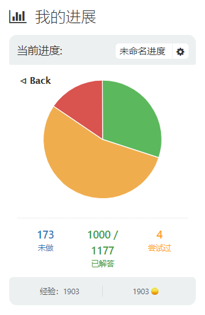
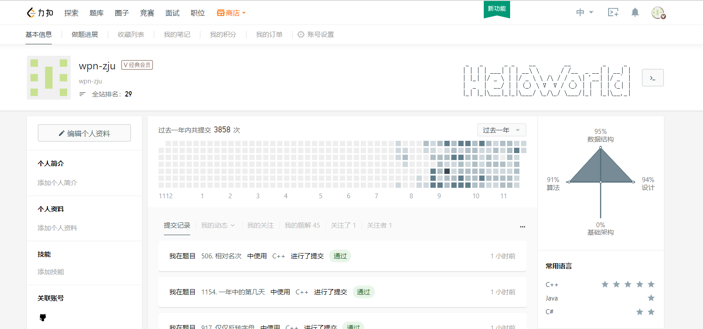

    
    
    
    

<h3 align="center">My leetcode solutions</h3>

    <b>Language: C, C++, C#, Go, Java, MySQL, Python3</b>
     
    <b>Last updated: 2023-04-19</b>
      

<!--请保留下面这行信息，让更多用户了解到这个小爬虫，衷心感谢您的支持-->

The source code is fetched using the tool <a href="https://github.com/wpn-zju/Leetcode-Dumper">LeetCode-Dumper</a>.

| # | Problems | Solutions | Difficulty | Acceptance | Tags | Paid-Only
|:--:|:-----:|:---------:|:----:|:----:|:----:|:----:|
|1|[two-sum](https://leetcode.cn/problems/two-sum/)|[C++](./dump-cn/1.two-sum.cpp)|EASY|52.88%|Array \| Hash Table||
|2|[add-two-numbers](https://leetcode.cn/problems/add-two-numbers/)|[C++](./dump-cn/2.add-two-numbers.cpp)|MEDIUM|42.36%|Recursion \| Linked List \| Math||
|3|[longest-substring-without-repeating-characters](https://leetcode.cn/problems/longest-substring-without-repeating-characters/)|[C++](./dump-cn/3.longest-substring-without-repeating-characters.cpp)|MEDIUM|39.09%|Hash Table \| String \| Sliding Window||
|4|[median-of-two-sorted-arrays](https://leetcode.cn/problems/median-of-two-sorted-arrays/)|[C++](./dump-cn/4.median-of-two-sorted-arrays.cpp)|HARD|41.63%|Array \| Binary Search \| Divide and Conquer||
|5|[longest-palindromic-substring](https://leetcode.cn/problems/longest-palindromic-substring/)|[C++](./dump-cn/5.longest-palindromic-substring.cpp)|MEDIUM|37.51%|String \| Dynamic Programming||
|6|[zigzag-conversion](https://leetcode.cn/problems/zigzag-conversion/)|[C++](./dump-cn/6.zigzag-conversion.cpp)|MEDIUM|52.04%|String||
|7|[reverse-integer](https://leetcode.cn/problems/reverse-integer/)|[C++](./dump-cn/7.reverse-integer.cpp)|MEDIUM|35.39%|Math||
|8|[string-to-integer-atoi](https://leetcode.cn/problems/string-to-integer-atoi/)|[C](./dump-cn/8.string-to-integer-atoi.c)|MEDIUM|21.30%|String||
|9|[palindrome-number](https://leetcode.cn/problems/palindrome-number/)|[C++](./dump-cn/9.palindrome-number.cpp)|EASY|56.08%|Math||
|10|[regular-expression-matching](https://leetcode.cn/problems/regular-expression-matching/)|[C++](./dump-cn/10.regular-expression-matching.cpp)|HARD|30.83%|Recursion \| String \| Dynamic Programming||
|11|[container-with-most-water](https://leetcode.cn/problems/container-with-most-water/)|[C++](./dump-cn/11.container-with-most-water.cpp)|MEDIUM|60.34%|Greedy \| Array \| Two Pointers||
|12|[integer-to-roman](https://leetcode.cn/problems/integer-to-roman/)|[C++](./dump-cn/12.integer-to-roman.cpp)|MEDIUM|66.14%|Hash Table \| Math \| String||
|13|[roman-to-integer](https://leetcode.cn/problems/roman-to-integer/)|[C++](./dump-cn/13.roman-to-integer.cpp)|EASY|62.09%|Hash Table \| Math \| String||
|14|[longest-common-prefix](https://leetcode.cn/problems/longest-common-prefix/)|[C++](./dump-cn/14.longest-common-prefix.cpp)|EASY|43.25%|Trie \| String||
|15|[3sum](https://leetcode.cn/problems/3sum/)|[C++](./dump-cn/15.3sum.cpp)|MEDIUM|36.91%|Array \| Two Pointers \| Sorting||
|16|[3sum-closest](https://leetcode.cn/problems/3sum-closest/)|[C++](./dump-cn/16.3sum-closest.cpp)|MEDIUM|44.94%|Array \| Two Pointers \| Sorting||
|17|[letter-combinations-of-a-phone-number](https://leetcode.cn/problems/letter-combinations-of-a-phone-number/)|[C++](./dump-cn/17.letter-combinations-of-a-phone-number.cpp)|MEDIUM|58.05%|Hash Table \| String \| Backtracking||
|18|[4sum](https://leetcode.cn/problems/4sum/)|[C++](./dump-cn/18.4sum.cpp)|MEDIUM|37.05%|Array \| Two Pointers \| Sorting||
|19|[remove-nth-node-from-end-of-list](https://leetcode.cn/problems/remove-nth-node-from-end-of-list/)|[C#](./dump-cn/19.remove-nth-node-from-end-of-list.cs)|MEDIUM|45.43%|Linked List \| Two Pointers||
|20|[valid-parentheses](https://leetcode.cn/problems/valid-parentheses/)|[C++](./dump-cn/20.valid-parentheses.cpp) [C#](./dump-cn/20.valid-parentheses.cs)|EASY|44.12%|Stack \| String||
|21|[merge-two-sorted-lists](https://leetcode.cn/problems/merge-two-sorted-lists/)|[C++](./dump-cn/21.merge-two-sorted-lists.cpp)|EASY|66.30%|Recursion \| Linked List||
|22|[generate-parentheses](https://leetcode.cn/problems/generate-parentheses/)|[C++](./dump-cn/22.generate-parentheses.cpp)|MEDIUM|77.49%|String \| Dynamic Programming \| Backtracking||
|23|[merge-k-sorted-lists](https://leetcode.cn/problems/merge-k-sorted-lists/)|[C++](./dump-cn/23.merge-k-sorted-lists.cpp)|HARD|57.71%|Linked List \| Divide and Conquer \| Heap (Priority Queue) \| Merge Sort||
|24|[swap-nodes-in-pairs](https://leetcode.cn/problems/swap-nodes-in-pairs/)|[C++](./dump-cn/24.swap-nodes-in-pairs.cpp)|MEDIUM|71.29%|Recursion \| Linked List||
|25|[reverse-nodes-in-k-group](https://leetcode.cn/problems/reverse-nodes-in-k-group/)|[C#](./dump-cn/25.reverse-nodes-in-k-group.cs)|HARD|67.70%|Recursion \| Linked List||
|26|[remove-duplicates-from-sorted-array](https://leetcode.cn/problems/remove-duplicates-from-sorted-array/)|[C#](./dump-cn/26.remove-duplicates-from-sorted-array.cs)|EASY|54.70%|Array \| Two Pointers||
|27|[remove-element](https://leetcode.cn/problems/remove-element/)|[C#](./dump-cn/27.remove-element.cs)|EASY|59.25%|Array \| Two Pointers||
|28|[find-the-index-of-the-first-occurrence-in-a-string](https://leetcode.cn/problems/find-the-index-of-the-first-occurrence-in-a-string/)|[Java](./dump-cn/28.find-the-index-of-the-first-occurrence-in-a-string.java) [C#](./dump-cn/28.find-the-index-of-the-first-occurrence-in-a-string.cs)|MEDIUM|42.28%|Two Pointers \| String \| String Matching||
|29|[divide-two-integers](https://leetcode.cn/problems/divide-two-integers/)|[C++](./dump-cn/29.divide-two-integers.cpp)|MEDIUM|22.17%|Bit Manipulation \| Math||
|30|[substring-with-concatenation-of-all-words](https://leetcode.cn/problems/substring-with-concatenation-of-all-words/)|[C#](./dump-cn/30.substring-with-concatenation-of-all-words.cs)|HARD|39.57%|Hash Table \| String \| Sliding Window||
|31|[next-permutation](https://leetcode.cn/problems/next-permutation/)|[C++](./dump-cn/31.next-permutation.cpp)|MEDIUM|38.25%|Array \| Two Pointers||
|32|[longest-valid-parentheses](https://leetcode.cn/problems/longest-valid-parentheses/)|[C#](./dump-cn/32.longest-valid-parentheses.cs)|HARD|37.13%|Stack \| String \| Dynamic Programming||
|33|[search-in-rotated-sorted-array](https://leetcode.cn/problems/search-in-rotated-sorted-array/)|[C++](./dump-cn/33.search-in-rotated-sorted-array.cpp)|MEDIUM|43.79%|Array \| Binary Search||
|34|[find-first-and-last-position-of-element-in-sorted-array](https://leetcode.cn/problems/find-first-and-last-position-of-element-in-sorted-array/)|[C++](./dump-cn/34.find-first-and-last-position-of-element-in-sorted-array.cpp)|MEDIUM|42.34%|Array \| Binary Search||
|35|[search-insert-position](https://leetcode.cn/problems/search-insert-position/)|[C++](./dump-cn/35.search-insert-position.cpp)|EASY|45.00%|Array \| Binary Search||
|36|[valid-sudoku](https://leetcode.cn/problems/valid-sudoku/)|[C++](./dump-cn/36.valid-sudoku.cpp)|MEDIUM|63.09%|Array \| Hash Table \| Matrix||
|37|[sudoku-solver](https://leetcode.cn/problems/sudoku-solver/)|[C++](./dump-cn/37.sudoku-solver.cpp)|HARD|67.57%|Array \| Hash Table \| Backtracking \| Matrix||
|38|[count-and-say](https://leetcode.cn/problems/count-and-say/)|[C++](./dump-cn/38.count-and-say.cpp)|MEDIUM|60.34%|String||
|39|[combination-sum](https://leetcode.cn/problems/combination-sum/)|[C++](./dump-cn/39.combination-sum.cpp)|MEDIUM|72.43%|Array \| Backtracking||
|40|[combination-sum-ii](https://leetcode.cn/problems/combination-sum-ii/)|[C++](./dump-cn/40.combination-sum-ii.cpp)|MEDIUM|59.92%|Array \| Backtracking||
|41|[first-missing-positive](https://leetcode.cn/problems/first-missing-positive/)|[C#](./dump-cn/41.first-missing-positive.cs)|HARD|42.94%|Array \| Hash Table||
|42|[trapping-rain-water](https://leetcode.cn/problems/trapping-rain-water/)|[C++](./dump-cn/42.trapping-rain-water.cpp)|HARD|62.60%|Stack \| Array \| Two Pointers \| Dynamic Programming \| Monotonic Stack||
|43|[multiply-strings](https://leetcode.cn/problems/multiply-strings/)|[C++](./dump-cn/43.multiply-strings.cpp)|MEDIUM|44.50%|Math \| String \| Simulation||
|44|[wildcard-matching](https://leetcode.cn/problems/wildcard-matching/)|[C++](./dump-cn/44.wildcard-matching.cpp)|HARD|33.80%|Greedy \| Recursion \| String \| Dynamic Programming||
|45|[jump-game-ii](https://leetcode.cn/problems/jump-game-ii/)|[C++](./dump-cn/45.jump-game-ii.cpp)|MEDIUM|45.20%|Greedy \| Array \| Dynamic Programming||
|46|[permutations](https://leetcode.cn/problems/permutations/)|[C++](./dump-cn/46.permutations.cpp)|MEDIUM|78.87%|Array \| Backtracking||
|47|[permutations-ii](https://leetcode.cn/problems/permutations-ii/)|[C++](./dump-cn/47.permutations-ii.cpp)|MEDIUM|65.49%|Array \| Backtracking||
|48|[rotate-image](https://leetcode.cn/problems/rotate-image/)|[C#](./dump-cn/48.rotate-image.cs)|MEDIUM|74.69%|Array \| Math \| Matrix||
|49|[group-anagrams](https://leetcode.cn/problems/group-anagrams/)|[C++](./dump-cn/49.group-anagrams.cpp)|MEDIUM|67.81%|Array \| Hash Table \| String \| Sorting||
|50|[powx-n](https://leetcode.cn/problems/powx-n/)|[C++](./dump-cn/50.powx-n.cpp)|MEDIUM|38.01%|Recursion \| Math||
|51|[n-queens](https://leetcode.cn/problems/n-queens/)|[C++](./dump-cn/51.n-queens.cpp)|HARD|74.14%|Array \| Backtracking||
|52|[n-queens-ii](https://leetcode.cn/problems/n-queens-ii/)|[C++](./dump-cn/52.n-queens-ii.cpp)|HARD|82.42%|Backtracking||
|53|[maximum-subarray](https://leetcode.cn/problems/maximum-subarray/)|[C++](./dump-cn/53.maximum-subarray.cpp)|MEDIUM|54.75%|Array \| Divide and Conquer \| Dynamic Programming||
|54|[spiral-matrix](https://leetcode.cn/problems/spiral-matrix/)|[C#](./dump-cn/54.spiral-matrix.cs)|MEDIUM|49.26%|Array \| Matrix \| Simulation||
|55|[jump-game](https://leetcode.cn/problems/jump-game/)|[C++](./dump-cn/55.jump-game.cpp)|MEDIUM|43.62%|Greedy \| Array \| Dynamic Programming||
|56|[merge-intervals](https://leetcode.cn/problems/merge-intervals/)|[C++](./dump-cn/56.merge-intervals.cpp)|MEDIUM|49.30%|Array \| Sorting||
|57|[insert-interval](https://leetcode.cn/problems/insert-interval/)|[C++](./dump-cn/57.insert-interval.cpp)|MEDIUM|41.90%|Array||
|58|[length-of-last-word](https://leetcode.cn/problems/length-of-last-word/)|[C++](./dump-cn/58.length-of-last-word.cpp)|EASY|42.43%|String||
|59|[spiral-matrix-ii](https://leetcode.cn/problems/spiral-matrix-ii/)|[C#](./dump-cn/59.spiral-matrix-ii.cs)|MEDIUM|73.29%|Array \| Matrix \| Simulation||
|60|[permutation-sequence](https://leetcode.cn/problems/permutation-sequence/)|[C++](./dump-cn/60.permutation-sequence.cpp)|HARD|53.39%|Recursion \| Math||
|61|[rotate-list](https://leetcode.cn/problems/rotate-list/)|[Java](./dump-cn/61.rotate-list.java) [C#](./dump-cn/61.rotate-list.cs)|MEDIUM|41.49%|Linked List \| Two Pointers||
|62|[unique-paths](https://leetcode.cn/problems/unique-paths/)|[C#](./dump-cn/62.unique-paths.cs)|MEDIUM|67.70%|Math \| Dynamic Programming \| Combinatorics||
|63|[unique-paths-ii](https://leetcode.cn/problems/unique-paths-ii/)|[C#](./dump-cn/63.unique-paths-ii.cs)|MEDIUM|41.00%|Array \| Dynamic Programming \| Matrix||
|64|[minimum-path-sum](https://leetcode.cn/problems/minimum-path-sum/)|[C#](./dump-cn/64.minimum-path-sum.cs)|MEDIUM|69.48%|Array \| Dynamic Programming \| Matrix||
|66|[plus-one](https://leetcode.cn/problems/plus-one/)|[C++](./dump-cn/66.plus-one.cpp)|EASY|45.18%|Array \| Math||
|67|[add-binary](https://leetcode.cn/problems/add-binary/)|[C++](./dump-cn/67.add-binary.cpp)|EASY|53.05%|Bit Manipulation \| Math \| String \| Simulation||
|69|[sqrtx](https://leetcode.cn/problems/sqrtx/)|[C++](./dump-cn/69.sqrtx.cpp)|EASY|38.50%|Math \| Binary Search||
|70|[climbing-stairs](https://leetcode.cn/problems/climbing-stairs/)|[C++](./dump-cn/70.climbing-stairs.cpp) [C#](./dump-cn/70.climbing-stairs.cs)|EASY|54.04%|Memoization \| Math \| Dynamic Programming||
|71|[simplify-path](https://leetcode.cn/problems/simplify-path/)|[C++](./dump-cn/71.simplify-path.cpp)|MEDIUM|44.18%|Stack \| String||
|72|[edit-distance](https://leetcode.cn/problems/edit-distance/)|[C++](./dump-cn/72.edit-distance.cpp) [C#](./dump-cn/72.edit-distance.cs)|HARD|62.79%|String \| Dynamic Programming||
|73|[set-matrix-zeroes](https://leetcode.cn/problems/set-matrix-zeroes/)|[C++](./dump-cn/73.set-matrix-zeroes.cpp)|MEDIUM|62.95%|Array \| Hash Table \| Matrix||
|74|[search-a-2d-matrix](https://leetcode.cn/problems/search-a-2d-matrix/)|[C++](./dump-cn/74.search-a-2d-matrix.cpp)|MEDIUM|48.59%|Array \| Binary Search \| Matrix||
|75|[sort-colors](https://leetcode.cn/problems/sort-colors/)|[Java](./dump-cn/75.sort-colors.java) [C#](./dump-cn/75.sort-colors.cs)|MEDIUM|60.37%|Array \| Two Pointers \| Sorting||
|76|[minimum-window-substring](https://leetcode.cn/problems/minimum-window-substring/)|[C#](./dump-cn/76.minimum-window-substring.cs)|HARD|45.15%|Hash Table \| String \| Sliding Window||
|77|[combinations](https://leetcode.cn/problems/combinations/)|[C++](./dump-cn/77.combinations.cpp)|MEDIUM|77.16%|Backtracking||
|78|[subsets](https://leetcode.cn/problems/subsets/)|[C++](./dump-cn/78.subsets.cpp) [C#](./dump-cn/78.subsets.cs)|MEDIUM|81.07%|Bit Manipulation \| Array \| Backtracking||
|79|[word-search](https://leetcode.cn/problems/word-search/)|[C++](./dump-cn/79.word-search.cpp)|MEDIUM|46.31%|Array \| Backtracking \| Matrix||
|80|[remove-duplicates-from-sorted-array-ii](https://leetcode.cn/problems/remove-duplicates-from-sorted-array-ii/)|[Java](./dump-cn/80.remove-duplicates-from-sorted-array-ii.java) [C#](./dump-cn/80.remove-duplicates-from-sorted-array-ii.cs)|MEDIUM|61.79%|Array \| Two Pointers||
|81|[search-in-rotated-sorted-array-ii](https://leetcode.cn/problems/search-in-rotated-sorted-array-ii/)|[C++](./dump-cn/81.search-in-rotated-sorted-array-ii.cpp)|MEDIUM|41.03%|Array \| Binary Search||
|82|[remove-duplicates-from-sorted-list-ii](https://leetcode.cn/problems/remove-duplicates-from-sorted-list-ii/)|[C#](./dump-cn/82.remove-duplicates-from-sorted-list-ii.cs)|MEDIUM|53.55%|Linked List \| Two Pointers||
|83|[remove-duplicates-from-sorted-list](https://leetcode.cn/problems/remove-duplicates-from-sorted-list/)|[C++](./dump-cn/83.remove-duplicates-from-sorted-list.cpp) [Java](./dump-cn/83.remove-duplicates-from-sorted-list.java) [C#](./dump-cn/83.remove-duplicates-from-sorted-list.cs)|EASY|53.13%|Linked List||
|84|[largest-rectangle-in-histogram](https://leetcode.cn/problems/largest-rectangle-in-histogram/)|[C++](./dump-cn/84.largest-rectangle-in-histogram.cpp)|HARD|44.91%|Stack \| Array \| Monotonic Stack||
|85|[maximal-rectangle](https://leetcode.cn/problems/maximal-rectangle/)|[C++](./dump-cn/85.maximal-rectangle.cpp)|HARD|54.57%|Stack \| Array \| Dynamic Programming \| Matrix \| Monotonic Stack||
|86|[partition-list](https://leetcode.cn/problems/partition-list/)|[Java](./dump-cn/86.partition-list.java) [C#](./dump-cn/86.partition-list.cs)|MEDIUM|64.13%|Linked List \| Two Pointers||
|87|[scramble-string](https://leetcode.cn/problems/scramble-string/)|[C++](./dump-cn/87.scramble-string.cpp)|HARD|47.51%|String \| Dynamic Programming||
|88|[merge-sorted-array](https://leetcode.cn/problems/merge-sorted-array/)|[Java](./dump-cn/88.merge-sorted-array.java) [C#](./dump-cn/88.merge-sorted-array.cs)|EASY|52.48%|Array \| Two Pointers \| Sorting||
|89|[gray-code](https://leetcode.cn/problems/gray-code/)|[C++](./dump-cn/89.gray-code.cpp)|MEDIUM|75.49%|Bit Manipulation \| Math \| Backtracking||
|90|[subsets-ii](https://leetcode.cn/problems/subsets-ii/)|[C++](./dump-cn/90.subsets-ii.cpp)|MEDIUM|63.62%|Bit Manipulation \| Array \| Backtracking||
|91|[decode-ways](https://leetcode.cn/problems/decode-ways/)|[C++](./dump-cn/91.decode-ways.cpp) [C#](./dump-cn/91.decode-ways.cs)|MEDIUM|33.02%|String \| Dynamic Programming||
|92|[reverse-linked-list-ii](https://leetcode.cn/problems/reverse-linked-list-ii/)|[Java](./dump-cn/92.reverse-linked-list-ii.java) [C#](./dump-cn/92.reverse-linked-list-ii.cs)|MEDIUM|55.65%|Linked List||
|93|[restore-ip-addresses](https://leetcode.cn/problems/restore-ip-addresses/)|[C++](./dump-cn/93.restore-ip-addresses.cpp)|MEDIUM|58.00%|String \| Backtracking||
|94|[binary-tree-inorder-traversal](https://leetcode.cn/problems/binary-tree-inorder-traversal/)|[C++](./dump-cn/94.binary-tree-inorder-traversal.cpp)|EASY|76.21%|Stack \| Tree \| Depth-First Search \| Binary Tree||
|95|[unique-binary-search-trees-ii](https://leetcode.cn/problems/unique-binary-search-trees-ii/)|[C++](./dump-cn/95.unique-binary-search-trees-ii.cpp)|MEDIUM|73.23%|Tree \| Binary Search Tree \| Dynamic Programming \| Backtracking \| Binary Tree||
|96|[unique-binary-search-trees](https://leetcode.cn/problems/unique-binary-search-trees/)|[C++](./dump-cn/96.unique-binary-search-trees.cpp)|MEDIUM|70.86%|Tree \| Binary Search Tree \| Math \| Dynamic Programming \| Binary Tree||
|97|[interleaving-string](https://leetcode.cn/problems/interleaving-string/)|[C++](./dump-cn/97.interleaving-string.cpp)|MEDIUM|44.77%|String \| Dynamic Programming||
|98|[validate-binary-search-tree](https://leetcode.cn/problems/validate-binary-search-tree/)|[C++](./dump-cn/98.validate-binary-search-tree.cpp)|MEDIUM|36.90%|Tree \| Depth-First Search \| Binary Search Tree \| Binary Tree||
|99|[recover-binary-search-tree](https://leetcode.cn/problems/recover-binary-search-tree/)|[C++](./dump-cn/99.recover-binary-search-tree.cpp)|MEDIUM|60.27%|Tree \| Depth-First Search \| Binary Search Tree \| Binary Tree||
|100|[same-tree](https://leetcode.cn/problems/same-tree/)|[C++](./dump-cn/100.same-tree.cpp)|EASY|59.89%|Tree \| Depth-First Search \| Breadth-First Search \| Binary Tree||
|101|[symmetric-tree](https://leetcode.cn/problems/symmetric-tree/)|[C++](./dump-cn/101.symmetric-tree.cpp)|EASY|58.71%|Tree \| Depth-First Search \| Breadth-First Search \| Binary Tree||
|102|[binary-tree-level-order-traversal](https://leetcode.cn/problems/binary-tree-level-order-traversal/)|[C++](./dump-cn/102.binary-tree-level-order-traversal.cpp)|MEDIUM|65.55%|Tree \| Breadth-First Search \| Binary Tree||
|103|[binary-tree-zigzag-level-order-traversal](https://leetcode.cn/problems/binary-tree-zigzag-level-order-traversal/)|[C++](./dump-cn/103.binary-tree-zigzag-level-order-traversal.cpp)|MEDIUM|57.54%|Tree \| Breadth-First Search \| Binary Tree||
|104|[maximum-depth-of-binary-tree](https://leetcode.cn/problems/maximum-depth-of-binary-tree/)|[C++](./dump-cn/104.maximum-depth-of-binary-tree.cpp)|EASY|77.11%|Tree \| Depth-First Search \| Breadth-First Search \| Binary Tree||
|105|[construct-binary-tree-from-preorder-and-inorder-traversal](https://leetcode.cn/problems/construct-binary-tree-from-preorder-and-inorder-traversal/)|[C++](./dump-cn/105.construct-binary-tree-from-preorder-and-inorder-traversal.cpp)|MEDIUM|71.33%|Tree \| Array \| Hash Table \| Divide and Conquer \| Binary Tree||
|106|[construct-binary-tree-from-inorder-and-postorder-traversal](https://leetcode.cn/problems/construct-binary-tree-from-inorder-and-postorder-traversal/)|[C++](./dump-cn/106.construct-binary-tree-from-inorder-and-postorder-traversal.cpp)|MEDIUM|72.23%|Tree \| Array \| Hash Table \| Divide and Conquer \| Binary Tree||
|107|[binary-tree-level-order-traversal-ii](https://leetcode.cn/problems/binary-tree-level-order-traversal-ii/)|[C++](./dump-cn/107.binary-tree-level-order-traversal-ii.cpp)|MEDIUM|72.42%|Tree \| Breadth-First Search \| Binary Tree||
|108|[convert-sorted-array-to-binary-search-tree](https://leetcode.cn/problems/convert-sorted-array-to-binary-search-tree/)|[C++](./dump-cn/108.convert-sorted-array-to-binary-search-tree.cpp)|EASY|77.38%|Tree \| Binary Search Tree \| Array \| Divide and Conquer \| Binary Tree||
|109|[convert-sorted-list-to-binary-search-tree](https://leetcode.cn/problems/convert-sorted-list-to-binary-search-tree/)|[C++](./dump-cn/109.convert-sorted-list-to-binary-search-tree.cpp) [C#](./dump-cn/109.convert-sorted-list-to-binary-search-tree.cs)|MEDIUM|76.49%|Tree \| Binary Search Tree \| Linked List \| Divide and Conquer \| Binary Tree||
|110|[balanced-binary-tree](https://leetcode.cn/problems/balanced-binary-tree/)|[C++](./dump-cn/110.balanced-binary-tree.cpp)|EASY|57.53%|Tree \| Depth-First Search \| Binary Tree||
|111|[minimum-depth-of-binary-tree](https://leetcode.cn/problems/minimum-depth-of-binary-tree/)|[C++](./dump-cn/111.minimum-depth-of-binary-tree.cpp)|EASY|51.98%|Tree \| Depth-First Search \| Breadth-First Search \| Binary Tree||
|112|[path-sum](https://leetcode.cn/problems/path-sum/)|[C++](./dump-cn/112.path-sum.cpp)|EASY|53.54%|Tree \| Depth-First Search \| Breadth-First Search \| Binary Tree||
|113|[path-sum-ii](https://leetcode.cn/problems/path-sum-ii/)|[C++](./dump-cn/113.path-sum-ii.cpp)|MEDIUM|63.18%|Tree \| Depth-First Search \| Backtracking \| Binary Tree||
|114|[flatten-binary-tree-to-linked-list](https://leetcode.cn/problems/flatten-binary-tree-to-linked-list/)|[C++](./dump-cn/114.flatten-binary-tree-to-linked-list.cpp)|MEDIUM|72.99%|Stack \| Tree \| Depth-First Search \| Linked List \| Binary Tree||
|115|[distinct-subsequences](https://leetcode.cn/problems/distinct-subsequences/)|[C++](./dump-cn/115.distinct-subsequences.cpp)|HARD|52.25%|String \| Dynamic Programming||
|116|[populating-next-right-pointers-in-each-node](https://leetcode.cn/problems/populating-next-right-pointers-in-each-node/)|[C++](./dump-cn/116.populating-next-right-pointers-in-each-node.cpp)|MEDIUM|72.52%|Tree \| Depth-First Search \| Breadth-First Search \| Linked List \| Binary Tree||
|117|[populating-next-right-pointers-in-each-node-ii](https://leetcode.cn/problems/populating-next-right-pointers-in-each-node-ii/)|[C++](./dump-cn/117.populating-next-right-pointers-in-each-node-ii.cpp)|MEDIUM|65.49%|Tree \| Depth-First Search \| Breadth-First Search \| Linked List \| Binary Tree||
|118|[pascals-triangle](https://leetcode.cn/problems/pascals-triangle/)|[C++](./dump-cn/118.pascals-triangle.cpp)|EASY|75.51%|Array \| Dynamic Programming||
|119|[pascals-triangle-ii](https://leetcode.cn/problems/pascals-triangle-ii/)|[C++](./dump-cn/119.pascals-triangle-ii.cpp)|EASY|68.92%|Array \| Dynamic Programming||
|120|[triangle](https://leetcode.cn/problems/triangle/)|[C++](./dump-cn/120.triangle.cpp)|MEDIUM|68.68%|Array \| Dynamic Programming||
|121|[best-time-to-buy-and-sell-stock](https://leetcode.cn/problems/best-time-to-buy-and-sell-stock/)|[C++](./dump-cn/121.best-time-to-buy-and-sell-stock.cpp)|EASY|57.81%|Array \| Dynamic Programming||
|122|[best-time-to-buy-and-sell-stock-ii](https://leetcode.cn/problems/best-time-to-buy-and-sell-stock-ii/)|[C++](./dump-cn/122.best-time-to-buy-and-sell-stock-ii.cpp)|MEDIUM|71.76%|Greedy \| Array \| Dynamic Programming||
|123|[best-time-to-buy-and-sell-stock-iii](https://leetcode.cn/problems/best-time-to-buy-and-sell-stock-iii/)|[C++](./dump-cn/123.best-time-to-buy-and-sell-stock-iii.cpp)|HARD|58.53%|Array \| Dynamic Programming||
|124|[binary-tree-maximum-path-sum](https://leetcode.cn/problems/binary-tree-maximum-path-sum/)|[C++](./dump-cn/124.binary-tree-maximum-path-sum.cpp)|HARD|45.28%|Tree \| Depth-First Search \| Dynamic Programming \| Binary Tree||
|125|[valid-palindrome](https://leetcode.cn/problems/valid-palindrome/)|[C#](./dump-cn/125.valid-palindrome.cs)|EASY|46.46%|Two Pointers \| String||
|126|[word-ladder-ii](https://leetcode.cn/problems/word-ladder-ii/)|[C++](./dump-cn/126.word-ladder-ii.cpp)|HARD|38.14%|Breadth-First Search \| Hash Table \| String \| Backtracking||
|127|[word-ladder](https://leetcode.cn/problems/word-ladder/)|[C++](./dump-cn/127.word-ladder.cpp)|HARD|48.17%|Breadth-First Search \| Hash Table \| String||
|128|[longest-consecutive-sequence](https://leetcode.cn/problems/longest-consecutive-sequence/)|[C++](./dump-cn/128.longest-consecutive-sequence.cpp)|MEDIUM|55.02%|Union Find \| Array \| Hash Table||
|129|[sum-root-to-leaf-numbers](https://leetcode.cn/problems/sum-root-to-leaf-numbers/)|[C++](./dump-cn/129.sum-root-to-leaf-numbers.cpp)|MEDIUM|70.02%|Tree \| Depth-First Search \| Binary Tree||
|130|[surrounded-regions](https://leetcode.cn/problems/surrounded-regions/)|[C++](./dump-cn/130.surrounded-regions.cpp)|MEDIUM|46.21%|Depth-First Search \| Breadth-First Search \| Union Find \| Array \| Matrix||
|133|[clone-graph](https://leetcode.cn/problems/clone-graph/)|[C++](./dump-cn/133.clone-graph.cpp)|MEDIUM|68.87%|Depth-First Search \| Breadth-First Search \| Graph \| Hash Table||
|134|[gas-station](https://leetcode.cn/problems/gas-station/)|[C++](./dump-cn/134.gas-station.cpp)|MEDIUM|51.73%|Greedy \| Array||
|135|[candy](https://leetcode.cn/problems/candy/)|[C++](./dump-cn/135.candy.cpp)|HARD|49.66%|Greedy \| Array||
|136|[single-number](https://leetcode.cn/problems/single-number/)|[C#](./dump-cn/136.single-number.cs)|EASY|72.24%|Bit Manipulation \| Array||
|137|[single-number-ii](https://leetcode.cn/problems/single-number-ii/)|[C#](./dump-cn/137.single-number-ii.cs)|MEDIUM|71.93%|Bit Manipulation \| Array||
|138|[copy-list-with-random-pointer](https://leetcode.cn/problems/copy-list-with-random-pointer/)|[C#](./dump-cn/138.copy-list-with-random-pointer.cs)|MEDIUM|66.15%|Hash Table \| Linked List||
|139|[word-break](https://leetcode.cn/problems/word-break/)|[C++](./dump-cn/139.word-break.cpp)|MEDIUM|54.08%|Trie \| Memoization \| Array \| Hash Table \| String \| Dynamic Programming||
|140|[word-break-ii](https://leetcode.cn/problems/word-break-ii/)|[C++](./dump-cn/140.word-break-ii.cpp)|HARD|56.77%|Trie \| Memoization \| Array \| Hash Table \| String \| Dynamic Programming \| Backtracking||
|141|[linked-list-cycle](https://leetcode.cn/problems/linked-list-cycle/)|[Java](./dump-cn/141.linked-list-cycle.java) [C#](./dump-cn/141.linked-list-cycle.cs)|EASY|51.55%|Hash Table \| Linked List \| Two Pointers||
|142|[linked-list-cycle-ii](https://leetcode.cn/problems/linked-list-cycle-ii/)|[Java](./dump-cn/142.linked-list-cycle-ii.java) [C#](./dump-cn/142.linked-list-cycle-ii.cs)|MEDIUM|56.94%|Hash Table \| Linked List \| Two Pointers||
|143|[reorder-list](https://leetcode.cn/problems/reorder-list/)|[C#](./dump-cn/143.reorder-list.cs)|MEDIUM|64.80%|Stack \| Recursion \| Linked List \| Two Pointers||
|144|[binary-tree-preorder-traversal](https://leetcode.cn/problems/binary-tree-preorder-traversal/)|[C++](./dump-cn/144.binary-tree-preorder-traversal.cpp)|EASY|71.30%|Stack \| Tree \| Depth-First Search \| Binary Tree||
|145|[binary-tree-postorder-traversal](https://leetcode.cn/problems/binary-tree-postorder-traversal/)|[C++](./dump-cn/145.binary-tree-postorder-traversal.cpp)|EASY|76.32%|Stack \| Tree \| Depth-First Search \| Binary Tree||
|146|[lru-cache](https://leetcode.cn/problems/lru-cache/)|[C++](./dump-cn/146.lru-cache.cpp)|MEDIUM|53.46%|Design \| Hash Table \| Linked List \| Doubly-Linked List||
|147|[insertion-sort-list](https://leetcode.cn/problems/insertion-sort-list/)|[Java](./dump-cn/147.insertion-sort-list.java) [C#](./dump-cn/147.insertion-sort-list.cs)|MEDIUM|69.45%|Linked List \| Sorting||
|148|[sort-list](https://leetcode.cn/problems/sort-list/)|[C#](./dump-cn/148.sort-list.cs)|MEDIUM|65.78%|Linked List \| Two Pointers \| Divide and Conquer \| Sorting \| Merge Sort||
|150|[evaluate-reverse-polish-notation](https://leetcode.cn/problems/evaluate-reverse-polish-notation/)|[C++](./dump-cn/150.evaluate-reverse-polish-notation.cpp)|MEDIUM|52.64%|Stack \| Array \| Math||
|151|[reverse-words-in-a-string](https://leetcode.cn/problems/reverse-words-in-a-string/)|[C++](./dump-cn/151.reverse-words-in-a-string.cpp)|MEDIUM|51.60%|Two Pointers \| String||
|152|[maximum-product-subarray](https://leetcode.cn/problems/maximum-product-subarray/)|[C++](./dump-cn/152.maximum-product-subarray.cpp)|MEDIUM|43.10%|Array \| Dynamic Programming||
|153|[find-minimum-in-rotated-sorted-array](https://leetcode.cn/problems/find-minimum-in-rotated-sorted-array/)|[C++](./dump-cn/153.find-minimum-in-rotated-sorted-array.cpp)|MEDIUM|57.01%|Array \| Binary Search||
|154|[find-minimum-in-rotated-sorted-array-ii](https://leetcode.cn/problems/find-minimum-in-rotated-sorted-array-ii/)|[C++](./dump-cn/154.find-minimum-in-rotated-sorted-array-ii.cpp)|HARD|52.55%|Array \| Binary Search||
|155|[min-stack](https://leetcode.cn/problems/min-stack/)|[C++](./dump-cn/155.min-stack.cpp)|MEDIUM|58.92%|Stack \| Design||
|156|[binary-tree-upside-down](https://leetcode.cn/problems/binary-tree-upside-down/)|[C++](./dump-cn/156.binary-tree-upside-down.cpp)|MEDIUM|72.22%|Tree \| Depth-First Search \| Binary Tree|:heavy_check_mark:|
|157|[read-n-characters-given-read4](https://leetcode.cn/problems/read-n-characters-given-read4/)|[C++](./dump-cn/157.read-n-characters-given-read4.cpp)|EASY|54.31%|String \| Interactive \| Simulation|:heavy_check_mark:|
|158|[read-n-characters-given-read4-ii-call-multiple-times](https://leetcode.cn/problems/read-n-characters-given-read4-ii-call-multiple-times/)|[C++](./dump-cn/158.read-n-characters-given-read4-ii-call-multiple-times.cpp)|HARD|59.88%|String \| Interactive \| Simulation|:heavy_check_mark:|
|159|[longest-substring-with-at-most-two-distinct-characters](https://leetcode.cn/problems/longest-substring-with-at-most-two-distinct-characters/)|[C#](./dump-cn/159.longest-substring-with-at-most-two-distinct-characters.cs)|MEDIUM|55.85%|Hash Table \| String \| Sliding Window|:heavy_check_mark:|
|160|[intersection-of-two-linked-lists](https://leetcode.cn/problems/intersection-of-two-linked-lists/)|[C#](./dump-cn/160.intersection-of-two-linked-lists.cs)|EASY|63.60%|Hash Table \| Linked List \| Two Pointers||
|161|[one-edit-distance](https://leetcode.cn/problems/one-edit-distance/)|[C#](./dump-cn/161.one-edit-distance.cs)|MEDIUM|34.07%|Two Pointers \| String|:heavy_check_mark:|
|162|[find-peak-element](https://leetcode.cn/problems/find-peak-element/)|[C++](./dump-cn/162.find-peak-element.cpp)|MEDIUM|49.31%|Array \| Binary Search||
|163|[missing-ranges](https://leetcode.cn/problems/missing-ranges/)|[C++](./dump-cn/163.missing-ranges.cpp)|EASY|35.55%|Array|:heavy_check_mark:|
|164|[maximum-gap](https://leetcode.cn/problems/maximum-gap/)|[C++](./dump-cn/164.maximum-gap.cpp)|HARD|60.30%|Array \| Bucket Sort \| Radix Sort \| Sorting||
|165|[compare-version-numbers](https://leetcode.cn/problems/compare-version-numbers/)|[C++](./dump-cn/165.compare-version-numbers.cpp)|MEDIUM|51.87%|Two Pointers \| String||
|167|[two-sum-ii-input-array-is-sorted](https://leetcode.cn/problems/two-sum-ii-input-array-is-sorted/)|[Java](./dump-cn/167.two-sum-ii-input-array-is-sorted.java) [C#](./dump-cn/167.two-sum-ii-input-array-is-sorted.cs)|MEDIUM|59.23%|Array \| Two Pointers \| Binary Search||
|168|[excel-sheet-column-title](https://leetcode.cn/problems/excel-sheet-column-title/)|[C++](./dump-cn/168.excel-sheet-column-title.cpp)|EASY|43.83%|Math \| String||
|169|[majority-element](https://leetcode.cn/problems/majority-element/)|[Java](./dump-cn/169.majority-element.java) [C#](./dump-cn/169.majority-element.cs)|EASY|66.78%|Array \| Hash Table \| Divide and Conquer \| Counting \| Sorting||
|170|[two-sum-iii-data-structure-design](https://leetcode.cn/problems/two-sum-iii-data-structure-design/)|[C++](./dump-cn/170.two-sum-iii-data-structure-design.cpp)|EASY|42.60%|Design \| Array \| Hash Table \| Two Pointers \| Data Stream|:heavy_check_mark:|
|171|[excel-sheet-column-number](https://leetcode.cn/problems/excel-sheet-column-number/)|[C++](./dump-cn/171.excel-sheet-column-number.cpp)|EASY|71.34%|Math \| String||
|172|[factorial-trailing-zeroes](https://leetcode.cn/problems/factorial-trailing-zeroes/)|[C++](./dump-cn/172.factorial-trailing-zeroes.cpp)|MEDIUM|49.88%|Math||
|173|[binary-search-tree-iterator](https://leetcode.cn/problems/binary-search-tree-iterator/)|[C++](./dump-cn/173.binary-search-tree-iterator.cpp)|MEDIUM|81.56%|Stack \| Tree \| Design \| Binary Search Tree \| Binary Tree \| Iterator||
|174|[dungeon-game](https://leetcode.cn/problems/dungeon-game/)|[C#](./dump-cn/174.dungeon-game.cs)|HARD|48.78%|Array \| Dynamic Programming \| Matrix||
|179|[largest-number](https://leetcode.cn/problems/largest-number/)|[C++](./dump-cn/179.largest-number.cpp)|MEDIUM|41.15%|Greedy \| Array \| String \| Sorting||
|186|[reverse-words-in-a-string-ii](https://leetcode.cn/problems/reverse-words-in-a-string-ii/)|[C++](./dump-cn/186.reverse-words-in-a-string-ii.cpp)|MEDIUM|75.99%|Two Pointers \| String|:heavy_check_mark:|
|187|[repeated-dna-sequences](https://leetcode.cn/problems/repeated-dna-sequences/)|[C#](./dump-cn/187.repeated-dna-sequences.cs)|MEDIUM|53.31%|Bit Manipulation \| Hash Table \| String \| Sliding Window \| Hash Function \| Rolling Hash||
|188|[best-time-to-buy-and-sell-stock-iv](https://leetcode.cn/problems/best-time-to-buy-and-sell-stock-iv/)|[C++](./dump-cn/188.best-time-to-buy-and-sell-stock-iv.cpp)|HARD|44.89%|Array \| Dynamic Programming||
|189|[rotate-array](https://leetcode.cn/problems/rotate-array/)|[C++](./dump-cn/189.rotate-array.cpp)|MEDIUM|44.12%|Array \| Math \| Two Pointers||
|190|[reverse-bits](https://leetcode.cn/problems/reverse-bits/)|[C#](./dump-cn/190.reverse-bits.cs)|EASY|71.73%|Bit Manipulation \| Divide and Conquer||
|191|[number-of-1-bits](https://leetcode.cn/problems/number-of-1-bits/)|[C#](./dump-cn/191.number-of-1-bits.cs)|EASY|76.45%|Bit Manipulation \| Divide and Conquer||
|198|[house-robber](https://leetcode.cn/problems/house-robber/)|[C++](./dump-cn/198.house-robber.cpp)|MEDIUM|54.28%|Array \| Dynamic Programming||
|199|[binary-tree-right-side-view](https://leetcode.cn/problems/binary-tree-right-side-view/)|[C++](./dump-cn/199.binary-tree-right-side-view.cpp)|MEDIUM|65.85%|Tree \| Depth-First Search \| Breadth-First Search \| Binary Tree||
|200|[number-of-islands](https://leetcode.cn/problems/number-of-islands/)|[C++](./dump-cn/200.number-of-islands.cpp)|MEDIUM|59.16%|Depth-First Search \| Breadth-First Search \| Union Find \| Array \| Matrix||
|201|[bitwise-and-of-numbers-range](https://leetcode.cn/problems/bitwise-and-of-numbers-range/)|[C++](./dump-cn/201.bitwise-and-of-numbers-range.cpp) [C#](./dump-cn/201.bitwise-and-of-numbers-range.cs)|MEDIUM|53.96%|Bit Manipulation||
|202|[happy-number](https://leetcode.cn/problems/happy-number/)|[Java](./dump-cn/202.happy-number.java) [C#](./dump-cn/202.happy-number.cs)|EASY|63.28%|Hash Table \| Math \| Two Pointers||
|203|[remove-linked-list-elements](https://leetcode.cn/problems/remove-linked-list-elements/)|[C#](./dump-cn/203.remove-linked-list-elements.cs)|EASY|54.82%|Recursion \| Linked List||
|204|[count-primes](https://leetcode.cn/problems/count-primes/)|[C++](./dump-cn/204.count-primes.cpp)|MEDIUM|37.33%|Array \| Math \| Enumeration \| Number Theory||
|205|[isomorphic-strings](https://leetcode.cn/problems/isomorphic-strings/)|[C++](./dump-cn/205.isomorphic-strings.cpp)|EASY|49.59%|Hash Table \| String||
|206|[reverse-linked-list](https://leetcode.cn/problems/reverse-linked-list/)|[Java](./dump-cn/206.reverse-linked-list.java) [C#](./dump-cn/206.reverse-linked-list.cs)|EASY|73.50%|Recursion \| Linked List||
|207|[course-schedule](https://leetcode.cn/problems/course-schedule/)|[C++](./dump-cn/207.course-schedule.cpp)|MEDIUM|53.59%|Depth-First Search \| Breadth-First Search \| Graph \| Topological Sort||
|208|[implement-trie-prefix-tree](https://leetcode.cn/problems/implement-trie-prefix-tree/)|[C++](./dump-cn/208.implement-trie-prefix-tree.cpp)|MEDIUM|71.93%|Design \| Trie \| Hash Table \| String||
|209|[minimum-size-subarray-sum](https://leetcode.cn/problems/minimum-size-subarray-sum/)|[C#](./dump-cn/209.minimum-size-subarray-sum.cs)|MEDIUM|46.96%|Array \| Binary Search \| Prefix Sum \| Sliding Window||
|210|[course-schedule-ii](https://leetcode.cn/problems/course-schedule-ii/)|[C++](./dump-cn/210.course-schedule-ii.cpp)|MEDIUM|56.56%|Depth-First Search \| Breadth-First Search \| Graph \| Topological Sort||
|211|[design-add-and-search-words-data-structure](https://leetcode.cn/problems/design-add-and-search-words-data-structure/)|[C++](./dump-cn/211.design-add-and-search-words-data-structure.cpp)|MEDIUM|49.61%|Depth-First Search \| Design \| Trie \| String||
|212|[word-search-ii](https://leetcode.cn/problems/word-search-ii/)|[C++](./dump-cn/212.word-search-ii.cpp)|HARD|44.10%|Trie \| Array \| String \| Backtracking \| Matrix||
|213|[house-robber-ii](https://leetcode.cn/problems/house-robber-ii/)|[C++](./dump-cn/213.house-robber-ii.cpp)|MEDIUM|44.12%|Array \| Dynamic Programming||
|214|[shortest-palindrome](https://leetcode.cn/problems/shortest-palindrome/)|[C++](./dump-cn/214.shortest-palindrome.cpp)|HARD|39.73%|String \| String Matching \| Hash Function \| Rolling Hash||
|215|[kth-largest-element-in-an-array](https://leetcode.cn/problems/kth-largest-element-in-an-array/)|[C++](./dump-cn/215.kth-largest-element-in-an-array.cpp)|MEDIUM|63.77%|Array \| Divide and Conquer \| Quickselect \| Sorting \| Heap (Priority Queue)||
|216|[combination-sum-iii](https://leetcode.cn/problems/combination-sum-iii/)|[C++](./dump-cn/216.combination-sum-iii.cpp)|MEDIUM|71.71%|Array \| Backtracking||
|217|[contains-duplicate](https://leetcode.cn/problems/contains-duplicate/)|[C++](./dump-cn/217.contains-duplicate.cpp)|EASY|54.77%|Array \| Hash Table \| Sorting||
|219|[contains-duplicate-ii](https://leetcode.cn/problems/contains-duplicate-ii/)|[C++](./dump-cn/219.contains-duplicate-ii.cpp)|EASY|44.23%|Array \| Hash Table \| Sliding Window||
|220|[contains-duplicate-iii](https://leetcode.cn/problems/contains-duplicate-iii/)|[C++](./dump-cn/220.contains-duplicate-iii.cpp)|HARD|29.88%|Array \| Bucket Sort \| Ordered Set \| Sorting \| Sliding Window||
|221|[maximal-square](https://leetcode.cn/problems/maximal-square/)|[C++](./dump-cn/221.maximal-square.cpp)|MEDIUM|49.60%|Array \| Dynamic Programming \| Matrix||
|222|[count-complete-tree-nodes](https://leetcode.cn/problems/count-complete-tree-nodes/)|[C++](./dump-cn/222.count-complete-tree-nodes.cpp)|MEDIUM|80.87%|Tree \| Depth-First Search \| Binary Search \| Binary Tree||
|223|[rectangle-area](https://leetcode.cn/problems/rectangle-area/)|[C++](./dump-cn/223.rectangle-area.cpp)|MEDIUM|53.63%|Geometry \| Math||
|224|[basic-calculator](https://leetcode.cn/problems/basic-calculator/)|[C++](./dump-cn/224.basic-calculator.cpp)|HARD|42.39%|Stack \| Recursion \| Math \| String||
|225|[implement-stack-using-queues](https://leetcode.cn/problems/implement-stack-using-queues/)|[C++](./dump-cn/225.implement-stack-using-queues.cpp)|EASY|66.41%|Stack \| Design \| Queue||
|226|[invert-binary-tree](https://leetcode.cn/problems/invert-binary-tree/)|[C++](./dump-cn/226.invert-binary-tree.cpp)|EASY|79.50%|Tree \| Depth-First Search \| Breadth-First Search \| Binary Tree||
|227|[basic-calculator-ii](https://leetcode.cn/problems/basic-calculator-ii/)|[C++](./dump-cn/227.basic-calculator-ii.cpp)|MEDIUM|44.45%|Stack \| Math \| String||
|228|[summary-ranges](https://leetcode.cn/problems/summary-ranges/)|[C++](./dump-cn/228.summary-ranges.cpp)|EASY|54.77%|Array||
|229|[majority-element-ii](https://leetcode.cn/problems/majority-element-ii/)|[C++](./dump-cn/229.majority-element-ii.cpp)|MEDIUM|53.98%|Array \| Hash Table \| Counting \| Sorting||
|230|[kth-smallest-element-in-a-bst](https://leetcode.cn/problems/kth-smallest-element-in-a-bst/)|[C++](./dump-cn/230.kth-smallest-element-in-a-bst.cpp)|MEDIUM|75.96%|Tree \| Depth-First Search \| Binary Search Tree \| Binary Tree||
|231|[power-of-two](https://leetcode.cn/problems/power-of-two/)|[C++](./dump-cn/231.power-of-two.cpp) [Java](./dump-cn/231.power-of-two.java) [C#](./dump-cn/231.power-of-two.cs)|EASY|50.17%|Bit Manipulation \| Recursion \| Math||
|232|[implement-queue-using-stacks](https://leetcode.cn/problems/implement-queue-using-stacks/)|[C++](./dump-cn/232.implement-queue-using-stacks.cpp)|EASY|68.53%|Stack \| Design \| Queue||
|233|[number-of-digit-one](https://leetcode.cn/problems/number-of-digit-one/)|[C++](./dump-cn/233.number-of-digit-one.cpp)|HARD|48.95%|Recursion \| Math \| Dynamic Programming||
|234|[palindrome-linked-list](https://leetcode.cn/problems/palindrome-linked-list/)|[C#](./dump-cn/234.palindrome-linked-list.cs)|EASY|53.10%|Stack \| Recursion \| Linked List \| Two Pointers||
|235|[lowest-common-ancestor-of-a-binary-search-tree](https://leetcode.cn/problems/lowest-common-ancestor-of-a-binary-search-tree/)|[C++](./dump-cn/235.lowest-common-ancestor-of-a-binary-search-tree.cpp)|MEDIUM|68.23%|Tree \| Depth-First Search \| Binary Search Tree \| Binary Tree||
|236|[lowest-common-ancestor-of-a-binary-tree](https://leetcode.cn/problems/lowest-common-ancestor-of-a-binary-tree/)|[C++](./dump-cn/236.lowest-common-ancestor-of-a-binary-tree.cpp)|MEDIUM|69.68%|Tree \| Depth-First Search \| Binary Tree||
|237|[delete-node-in-a-linked-list](https://leetcode.cn/problems/delete-node-in-a-linked-list/)|[C++](./dump-cn/237.delete-node-in-a-linked-list.cpp) [C#](./dump-cn/237.delete-node-in-a-linked-list.cs)|MEDIUM|86.08%|Linked List||
|238|[product-of-array-except-self](https://leetcode.cn/problems/product-of-array-except-self/)|[C++](./dump-cn/238.product-of-array-except-self.cpp)|MEDIUM|74.69%|Array \| Prefix Sum||
|239|[sliding-window-maximum](https://leetcode.cn/problems/sliding-window-maximum/)|[C++](./dump-cn/239.sliding-window-maximum.cpp)|HARD|49.76%|Queue \| Array \| Sliding Window \| Monotonic Queue \| Heap (Priority Queue)||
|240|[search-a-2d-matrix-ii](https://leetcode.cn/problems/search-a-2d-matrix-ii/)|[C++](./dump-cn/240.search-a-2d-matrix-ii.cpp)|MEDIUM|52.64%|Array \| Binary Search \| Divide and Conquer \| Matrix||
|242|[valid-anagram](https://leetcode.cn/problems/valid-anagram/)|[C++](./dump-cn/242.valid-anagram.cpp)|EASY|65.83%|Hash Table \| String \| Sorting||
|243|[shortest-word-distance](https://leetcode.cn/problems/shortest-word-distance/)|[C++](./dump-cn/243.shortest-word-distance.cpp)|EASY|66.79%|Array \| String|:heavy_check_mark:|
|244|[shortest-word-distance-ii](https://leetcode.cn/problems/shortest-word-distance-ii/)|[C++](./dump-cn/244.shortest-word-distance-ii.cpp)|MEDIUM|59.58%|Design \| Array \| Hash Table \| Two Pointers \| String|:heavy_check_mark:|
|245|[shortest-word-distance-iii](https://leetcode.cn/problems/shortest-word-distance-iii/)|[C++](./dump-cn/245.shortest-word-distance-iii.cpp)|MEDIUM|57.18%|Array \| String|:heavy_check_mark:|
|246|[strobogrammatic-number](https://leetcode.cn/problems/strobogrammatic-number/)|[C++](./dump-cn/246.strobogrammatic-number.cpp)|EASY|47.49%|Hash Table \| Two Pointers \| String|:heavy_check_mark:|
|247|[strobogrammatic-number-ii](https://leetcode.cn/problems/strobogrammatic-number-ii/)|[C++](./dump-cn/247.strobogrammatic-number-ii.cpp)|MEDIUM|54.38%|Recursion \| Array \| String|:heavy_check_mark:|
|248|[strobogrammatic-number-iii](https://leetcode.cn/problems/strobogrammatic-number-iii/)|[C++](./dump-cn/248.strobogrammatic-number-iii.cpp)|HARD|49.05%|Recursion \| Array \| String|:heavy_check_mark:|
|249|[group-shifted-strings](https://leetcode.cn/problems/group-shifted-strings/)|[C++](./dump-cn/249.group-shifted-strings.cpp)|MEDIUM|64.83%|Array \| Hash Table \| String|:heavy_check_mark:|
|250|[count-univalue-subtrees](https://leetcode.cn/problems/count-univalue-subtrees/)|[C++](./dump-cn/250.count-univalue-subtrees.cpp)|MEDIUM|63.35%|Tree \| Depth-First Search \| Binary Tree|:heavy_check_mark:|
|251|[flatten-2d-vector](https://leetcode.cn/problems/flatten-2d-vector/)|[C++](./dump-cn/251.flatten-2d-vector.cpp)|MEDIUM|54.93%|Design \| Array \| Two Pointers \| Iterator|:heavy_check_mark:|
|252|[meeting-rooms](https://leetcode.cn/problems/meeting-rooms/)|[C++](./dump-cn/252.meeting-rooms.cpp)|EASY|57.79%|Array \| Sorting|:heavy_check_mark:|
|253|[meeting-rooms-ii](https://leetcode.cn/problems/meeting-rooms-ii/)|[C++](./dump-cn/253.meeting-rooms-ii.cpp)|MEDIUM|52.22%|Greedy \| Array \| Two Pointers \| Prefix Sum \| Sorting \| Heap (Priority Queue)|:heavy_check_mark:|
|254|[factor-combinations](https://leetcode.cn/problems/factor-combinations/)|[C++](./dump-cn/254.factor-combinations.cpp)|MEDIUM|57.01%|Array \| Backtracking|:heavy_check_mark:|
|255|[verify-preorder-sequence-in-binary-search-tree](https://leetcode.cn/problems/verify-preorder-sequence-in-binary-search-tree/)|[C++](./dump-cn/255.verify-preorder-sequence-in-binary-search-tree.cpp)|MEDIUM|49.53%|Stack \| Tree \| Binary Search Tree \| Recursion \| Binary Tree \| Monotonic Stack|:heavy_check_mark:|
|256|[paint-house](https://leetcode.cn/problems/paint-house/)|[C++](./dump-cn/256.paint-house.cpp)|MEDIUM|69.42%|Array \| Dynamic Programming|:heavy_check_mark:|
|257|[binary-tree-paths](https://leetcode.cn/problems/binary-tree-paths/)|[C++](./dump-cn/257.binary-tree-paths.cpp)|EASY|70.67%|Tree \| Depth-First Search \| String \| Backtracking \| Binary Tree||
|258|[add-digits](https://leetcode.cn/problems/add-digits/)|[C++](./dump-cn/258.add-digits.cpp) [C#](./dump-cn/258.add-digits.cs)|EASY|71.07%|Math \| Number Theory \| Simulation||
|259|[3sum-smaller](https://leetcode.cn/problems/3sum-smaller/)|[C++](./dump-cn/259.3sum-smaller.cpp) [C#](./dump-cn/259.3sum-smaller.cs)|MEDIUM|55.07%|Array \| Two Pointers \| Binary Search \| Sorting|:heavy_check_mark:|
|260|[single-number-iii](https://leetcode.cn/problems/single-number-iii/)|[C#](./dump-cn/260.single-number-iii.cs)|MEDIUM|72.23%|Bit Manipulation \| Array||
|261|[graph-valid-tree](https://leetcode.cn/problems/graph-valid-tree/)|[C++](./dump-cn/261.graph-valid-tree.cpp)|MEDIUM|50.94%|Depth-First Search \| Breadth-First Search \| Union Find \| Graph|:heavy_check_mark:|
|263|[ugly-number](https://leetcode.cn/problems/ugly-number/)|[C++](./dump-cn/263.ugly-number.cpp)|EASY|50.64%|Math||
|264|[ugly-number-ii](https://leetcode.cn/problems/ugly-number-ii/)|[C++](./dump-cn/264.ugly-number-ii.cpp)|MEDIUM|58.66%|Hash Table \| Math \| Dynamic Programming \| Heap (Priority Queue)||
|265|[paint-house-ii](https://leetcode.cn/problems/paint-house-ii/)|[C++](./dump-cn/265.paint-house-ii.cpp)|HARD|63.30%|Array \| Dynamic Programming|:heavy_check_mark:|
|266|[palindrome-permutation](https://leetcode.cn/problems/palindrome-permutation/)|[C++](./dump-cn/266.palindrome-permutation.cpp)|EASY|69.95%|Bit Manipulation \| Hash Table \| String|:heavy_check_mark:|
|267|[palindrome-permutation-ii](https://leetcode.cn/problems/palindrome-permutation-ii/)|[C++](./dump-cn/267.palindrome-permutation-ii.cpp)|MEDIUM|47.17%|Hash Table \| String \| Backtracking|:heavy_check_mark:|
|268|[missing-number](https://leetcode.cn/problems/missing-number/)|[C#](./dump-cn/268.missing-number.cs)|EASY|66.31%|Bit Manipulation \| Array \| Hash Table \| Math \| Binary Search \| Sorting||
|269|[alien-dictionary](https://leetcode.cn/problems/alien-dictionary/)|[C++](./dump-cn/269.alien-dictionary.cpp)|HARD|36.56%|Depth-First Search \| Breadth-First Search \| Graph \| Topological Sort \| Array \| String|:heavy_check_mark:|
|270|[closest-binary-search-tree-value](https://leetcode.cn/problems/closest-binary-search-tree-value/)|[C#](./dump-cn/270.closest-binary-search-tree-value.cs)|EASY|58.25%|Tree \| Depth-First Search \| Binary Search Tree \| Binary Search \| Binary Tree|:heavy_check_mark:|
|271|[encode-and-decode-strings](https://leetcode.cn/problems/encode-and-decode-strings/)|[C++](./dump-cn/271.encode-and-decode-strings.cpp)|MEDIUM|57.56%|Design \| Array \| String|:heavy_check_mark:|
|272|[closest-binary-search-tree-value-ii](https://leetcode.cn/problems/closest-binary-search-tree-value-ii/)|[C++](./dump-cn/272.closest-binary-search-tree-value-ii.cpp)|HARD|66.08%|Stack \| Tree \| Depth-First Search \| Binary Search Tree \| Two Pointers \| Binary Tree \| Heap (Priority Queue)|:heavy_check_mark:|
|273|[integer-to-english-words](https://leetcode.cn/problems/integer-to-english-words/)|[C++](./dump-cn/273.integer-to-english-words.cpp)|HARD|36.46%|Recursion \| Math \| String||
|274|[h-index](https://leetcode.cn/problems/h-index/)|[C++](./dump-cn/274.h-index.cpp)|MEDIUM|44.46%|Array \| Counting Sort \| Sorting||
|275|[h-index-ii](https://leetcode.cn/problems/h-index-ii/)|[C++](./dump-cn/275.h-index-ii.cpp)|MEDIUM|45.23%|Array \| Binary Search||
|276|[paint-fence](https://leetcode.cn/problems/paint-fence/)|[C++](./dump-cn/276.paint-fence.cpp)|MEDIUM|53.11%|Dynamic Programming|:heavy_check_mark:|
|277|[find-the-celebrity](https://leetcode.cn/problems/find-the-celebrity/)|[C++](./dump-cn/277.find-the-celebrity.cpp)|MEDIUM|57.97%|Greedy \| Graph \| Two Pointers \| Interactive|:heavy_check_mark:|
|278|[first-bad-version](https://leetcode.cn/problems/first-bad-version/)|[C++](./dump-cn/278.first-bad-version.cpp)|EASY|45.30%|Binary Search \| Interactive||
|279|[perfect-squares](https://leetcode.cn/problems/perfect-squares/)|[C++](./dump-cn/279.perfect-squares.cpp)|MEDIUM|66.06%|Breadth-First Search \| Math \| Dynamic Programming||
|280|[wiggle-sort](https://leetcode.cn/problems/wiggle-sort/)|[Java](./dump-cn/280.wiggle-sort.java) [C#](./dump-cn/280.wiggle-sort.cs)|MEDIUM|69.40%|Greedy \| Array \| Sorting|:heavy_check_mark:|
|281|[zigzag-iterator](https://leetcode.cn/problems/zigzag-iterator/)|[C++](./dump-cn/281.zigzag-iterator.cpp)|MEDIUM|76.51%|Design \| Queue \| Array \| Iterator|:heavy_check_mark:|
|283|[move-zeroes](https://leetcode.cn/problems/move-zeroes/)|[C#](./dump-cn/283.move-zeroes.cs)|EASY|63.81%|Array \| Two Pointers||
|284|[peeking-iterator](https://leetcode.cn/problems/peeking-iterator/)|[C++](./dump-cn/284.peeking-iterator.cpp)|MEDIUM|76.54%|Design \| Array \| Iterator||
|285|[inorder-successor-in-bst](https://leetcode.cn/problems/inorder-successor-in-bst/)|[C++](./dump-cn/285.inorder-successor-in-bst.cpp)|MEDIUM|64.40%|Tree \| Depth-First Search \| Binary Search Tree \| Binary Tree|:heavy_check_mark:|
|286|[walls-and-gates](https://leetcode.cn/problems/walls-and-gates/)|[C++](./dump-cn/286.walls-and-gates.cpp)|MEDIUM|54.85%|Breadth-First Search \| Array \| Matrix|:heavy_check_mark:|
|287|[find-the-duplicate-number](https://leetcode.cn/problems/find-the-duplicate-number/)|[C](./dump-cn/287.find-the-duplicate-number.c) [C#](./dump-cn/287.find-the-duplicate-number.cs) [Java](./dump-cn/287.find-the-duplicate-number.java) [C++](./dump-cn/287.find-the-duplicate-number.cpp)|MEDIUM|64.29%|Bit Manipulation \| Array \| Two Pointers \| Binary Search||
|288|[unique-word-abbreviation](https://leetcode.cn/problems/unique-word-abbreviation/)|[C++](./dump-cn/288.unique-word-abbreviation.cpp)|MEDIUM|48.89%|Design \| Array \| Hash Table \| String|:heavy_check_mark:|
|289|[game-of-life](https://leetcode.cn/problems/game-of-life/)|[C++](./dump-cn/289.game-of-life.cpp)|MEDIUM|75.64%|Array \| Matrix \| Simulation||
|290|[word-pattern](https://leetcode.cn/problems/word-pattern/)|[C++](./dump-cn/290.word-pattern.cpp)|EASY|44.69%|Hash Table \| String||
|291|[word-pattern-ii](https://leetcode.cn/problems/word-pattern-ii/)|[C++](./dump-cn/291.word-pattern-ii.cpp)|MEDIUM|52.14%|Hash Table \| String \| Backtracking|:heavy_check_mark:|
|292|[nim-game](https://leetcode.cn/problems/nim-game/)|[C++](./dump-cn/292.nim-game.cpp)|EASY|70.46%|Brainteaser \| Math \| Game Theory||
|293|[flip-game](https://leetcode.cn/problems/flip-game/)|[C++](./dump-cn/293.flip-game.cpp)|EASY|72.74%|String|:heavy_check_mark:|
|294|[flip-game-ii](https://leetcode.cn/problems/flip-game-ii/)|[C++](./dump-cn/294.flip-game-ii.cpp)|MEDIUM|59.72%|Memoization \| Math \| Dynamic Programming \| Backtracking \| Game Theory|:heavy_check_mark:|
|295|[find-median-from-data-stream](https://leetcode.cn/problems/find-median-from-data-stream/)|[C++](./dump-cn/295.find-median-from-data-stream.cpp)|HARD|53.31%|Design \| Two Pointers \| Data Stream \| Sorting \| Heap (Priority Queue)||
|296|[best-meeting-point](https://leetcode.cn/problems/best-meeting-point/)|[C++](./dump-cn/296.best-meeting-point.cpp)|HARD|61.15%|Array \| Math \| Matrix \| Sorting|:heavy_check_mark:|
|297|[serialize-and-deserialize-binary-tree](https://leetcode.cn/problems/serialize-and-deserialize-binary-tree/)|[C++](./dump-cn/297.serialize-and-deserialize-binary-tree.cpp)|HARD|58.83%|Tree \| Depth-First Search \| Breadth-First Search \| Design \| String \| Binary Tree||
|298|[binary-tree-longest-consecutive-sequence](https://leetcode.cn/problems/binary-tree-longest-consecutive-sequence/)|[C++](./dump-cn/298.binary-tree-longest-consecutive-sequence.cpp)|MEDIUM|60.10%|Tree \| Depth-First Search \| Binary Tree|:heavy_check_mark:|
|299|[bulls-and-cows](https://leetcode.cn/problems/bulls-and-cows/)|[C++](./dump-cn/299.bulls-and-cows.cpp)|MEDIUM|57.37%|Hash Table \| String \| Counting||
|300|[longest-increasing-subsequence](https://leetcode.cn/problems/longest-increasing-subsequence/)|[C++](./dump-cn/300.longest-increasing-subsequence.cpp)|MEDIUM|54.68%|Array \| Binary Search \| Dynamic Programming||
|302|[smallest-rectangle-enclosing-black-pixels](https://leetcode.cn/problems/smallest-rectangle-enclosing-black-pixels/)|[C++](./dump-cn/302.smallest-rectangle-enclosing-black-pixels.cpp)|HARD|67.83%|Depth-First Search \| Breadth-First Search \| Array \| Binary Search \| Matrix|:heavy_check_mark:|
|303|[range-sum-query-immutable](https://leetcode.cn/problems/range-sum-query-immutable/)|[C#](./dump-cn/303.range-sum-query-immutable.cs)|EASY|76.63%|Design \| Array \| Prefix Sum||
|304|[range-sum-query-2d-immutable](https://leetcode.cn/problems/range-sum-query-2d-immutable/)|[C#](./dump-cn/304.range-sum-query-2d-immutable.cs)|MEDIUM|61.36%|Design \| Array \| Matrix \| Prefix Sum||
|305|[number-of-islands-ii](https://leetcode.cn/problems/number-of-islands-ii/)|[C++](./dump-cn/305.number-of-islands-ii.cpp)|HARD|42.10%|Union Find \| Array|:heavy_check_mark:|
|307|[range-sum-query-mutable](https://leetcode.cn/problems/range-sum-query-mutable/)|[C++](./dump-cn/307.range-sum-query-mutable.cpp)|MEDIUM|51.96%|Design \| Binary Indexed Tree \| Segment Tree \| Array||
|308|[range-sum-query-2d-mutable](https://leetcode.cn/problems/range-sum-query-2d-mutable/)|[C++](./dump-cn/308.range-sum-query-2d-mutable.cpp)|HARD|64.20%|Design \| Binary Indexed Tree \| Segment Tree \| Array \| Matrix|:heavy_check_mark:|
|309|[best-time-to-buy-and-sell-stock-with-cooldown](https://leetcode.cn/problems/best-time-to-buy-and-sell-stock-with-cooldown/)|[C++](./dump-cn/309.best-time-to-buy-and-sell-stock-with-cooldown.cpp)|MEDIUM|64.14%|Array \| Dynamic Programming||
|310|[minimum-height-trees](https://leetcode.cn/problems/minimum-height-trees/)|[C++](./dump-cn/310.minimum-height-trees.cpp)|MEDIUM|42.73%|Depth-First Search \| Breadth-First Search \| Graph \| Topological Sort||
|311|[sparse-matrix-multiplication](https://leetcode.cn/problems/sparse-matrix-multiplication/)|[C++](./dump-cn/311.sparse-matrix-multiplication.cpp)|MEDIUM|76.20%|Array \| Hash Table \| Matrix|:heavy_check_mark:|
|312|[burst-balloons](https://leetcode.cn/problems/burst-balloons/)|[C++](./dump-cn/312.burst-balloons.cpp)|HARD|69.93%|Array \| Dynamic Programming||
|313|[super-ugly-number](https://leetcode.cn/problems/super-ugly-number/)|[C++](./dump-cn/313.super-ugly-number.cpp)|MEDIUM|57.06%|Array \| Math \| Dynamic Programming||
|314|[binary-tree-vertical-order-traversal](https://leetcode.cn/problems/binary-tree-vertical-order-traversal/)|[C++](./dump-cn/314.binary-tree-vertical-order-traversal.cpp)|MEDIUM|55.69%|Tree \| Depth-First Search \| Breadth-First Search \| Hash Table \| Binary Tree|:heavy_check_mark:|
|315|[count-of-smaller-numbers-after-self](https://leetcode.cn/problems/count-of-smaller-numbers-after-self/)|[C++](./dump-cn/315.count-of-smaller-numbers-after-self.cpp)|HARD|43.37%|Binary Indexed Tree \| Segment Tree \| Array \| Binary Search \| Divide and Conquer \| Ordered Set \| Merge Sort||
|316|[remove-duplicate-letters](https://leetcode.cn/problems/remove-duplicate-letters/)|[C++](./dump-cn/316.remove-duplicate-letters.cpp)|MEDIUM|48.28%|Stack \| Greedy \| String \| Monotonic Stack||
|317|[shortest-distance-from-all-buildings](https://leetcode.cn/problems/shortest-distance-from-all-buildings/)|[C++](./dump-cn/317.shortest-distance-from-all-buildings.cpp)|HARD|47.73%|Breadth-First Search \| Array \| Matrix|:heavy_check_mark:|
|318|[maximum-product-of-word-lengths](https://leetcode.cn/problems/maximum-product-of-word-lengths/)|[C#](./dump-cn/318.maximum-product-of-word-lengths.cs)|MEDIUM|72.80%|Bit Manipulation \| Array \| String||
|319|[bulb-switcher](https://leetcode.cn/problems/bulb-switcher/)|[C++](./dump-cn/319.bulb-switcher.cpp)|MEDIUM|57.66%|Brainteaser \| Math||
|320|[generalized-abbreviation](https://leetcode.cn/problems/generalized-abbreviation/)|[C++](./dump-cn/320.generalized-abbreviation.cpp) [Java](./dump-cn/320.generalized-abbreviation.java) [C#](./dump-cn/320.generalized-abbreviation.cs)|MEDIUM|69.94%|Bit Manipulation \| String \| Backtracking|:heavy_check_mark:|
|322|[coin-change](https://leetcode.cn/problems/coin-change/)|[C++](./dump-cn/322.coin-change.cpp)|MEDIUM|46.36%|Breadth-First Search \| Array \| Dynamic Programming||
|323|[number-of-connected-components-in-an-undirected-graph](https://leetcode.cn/problems/number-of-connected-components-in-an-undirected-graph/)|[C++](./dump-cn/323.number-of-connected-components-in-an-undirected-graph.cpp)|MEDIUM|65.48%|Depth-First Search \| Breadth-First Search \| Union Find \| Graph|:heavy_check_mark:|
|325|[maximum-size-subarray-sum-equals-k](https://leetcode.cn/problems/maximum-size-subarray-sum-equals-k/)|[C#](./dump-cn/325.maximum-size-subarray-sum-equals-k.cs)|MEDIUM|51.72%|Array \| Hash Table \| Prefix Sum|:heavy_check_mark:|
|326|[power-of-three](https://leetcode.cn/problems/power-of-three/)|[C++](./dump-cn/326.power-of-three.cpp)|EASY|50.89%|Recursion \| Math||
|327|[count-of-range-sum](https://leetcode.cn/problems/count-of-range-sum/)|[C++](./dump-cn/327.count-of-range-sum.cpp)|HARD|40.96%|Binary Indexed Tree \| Segment Tree \| Array \| Binary Search \| Divide and Conquer \| Ordered Set \| Merge Sort||
|328|[odd-even-linked-list](https://leetcode.cn/problems/odd-even-linked-list/)|[C#](./dump-cn/328.odd-even-linked-list.cs)|MEDIUM|65.09%|Linked List||
|329|[longest-increasing-path-in-a-matrix](https://leetcode.cn/problems/longest-increasing-path-in-a-matrix/)|[C++](./dump-cn/329.longest-increasing-path-in-a-matrix.cpp)|HARD|51.68%|Depth-First Search \| Breadth-First Search \| Graph \| Topological Sort \| Memoization \| Array \| Dynamic Programming \| Matrix||
|331|[verify-preorder-serialization-of-a-binary-tree](https://leetcode.cn/problems/verify-preorder-serialization-of-a-binary-tree/)|[C++](./dump-cn/331.verify-preorder-serialization-of-a-binary-tree.cpp)|MEDIUM|48.18%|Stack \| Tree \| String \| Binary Tree||
|332|[reconstruct-itinerary](https://leetcode.cn/problems/reconstruct-itinerary/)|[C++](./dump-cn/332.reconstruct-itinerary.cpp)|HARD|47.72%|Depth-First Search \| Graph \| Eulerian Circuit||
|333|[largest-bst-subtree](https://leetcode.cn/problems/largest-bst-subtree/)|[C++](./dump-cn/333.largest-bst-subtree.cpp)|MEDIUM|48.66%|Tree \| Depth-First Search \| Binary Search Tree \| Dynamic Programming \| Binary Tree|:heavy_check_mark:|
|334|[increasing-triplet-subsequence](https://leetcode.cn/problems/increasing-triplet-subsequence/)|[C++](./dump-cn/334.increasing-triplet-subsequence.cpp)|MEDIUM|43.31%|Greedy \| Array||
|335|[self-crossing](https://leetcode.cn/problems/self-crossing/)|[C++](./dump-cn/335.self-crossing.cpp)|HARD|42.53%|Geometry \| Array \| Math||
|336|[palindrome-pairs](https://leetcode.cn/problems/palindrome-pairs/)|[C++](./dump-cn/336.palindrome-pairs.cpp)|HARD|38.25%|Trie \| Array \| Hash Table \| String||
|337|[house-robber-iii](https://leetcode.cn/problems/house-robber-iii/)|[C++](./dump-cn/337.house-robber-iii.cpp)|MEDIUM|61.03%|Tree \| Depth-First Search \| Dynamic Programming \| Binary Tree||
|338|[counting-bits](https://leetcode.cn/problems/counting-bits/)|[C#](./dump-cn/338.counting-bits.cs)|EASY|78.67%|Bit Manipulation \| Dynamic Programming||
|339|[nested-list-weight-sum](https://leetcode.cn/problems/nested-list-weight-sum/)|[C++](./dump-cn/339.nested-list-weight-sum.cpp)|MEDIUM|83.09%|Depth-First Search \| Breadth-First Search|:heavy_check_mark:|
|340|[longest-substring-with-at-most-k-distinct-characters](https://leetcode.cn/problems/longest-substring-with-at-most-k-distinct-characters/)|[C++](./dump-cn/340.longest-substring-with-at-most-k-distinct-characters.cpp)|MEDIUM|51.01%|Hash Table \| String \| Sliding Window|:heavy_check_mark:|
|341|[flatten-nested-list-iterator](https://leetcode.cn/problems/flatten-nested-list-iterator/)|[C++](./dump-cn/341.flatten-nested-list-iterator.cpp)|MEDIUM|72.79%|Stack \| Tree \| Depth-First Search \| Design \| Queue \| Iterator||
|342|[power-of-four](https://leetcode.cn/problems/power-of-four/)|[C++](./dump-cn/342.power-of-four.cpp)|EASY|52.82%|Bit Manipulation \| Recursion \| Math||
|343|[integer-break](https://leetcode.cn/problems/integer-break/)|[C++](./dump-cn/343.integer-break.cpp)|MEDIUM|62.22%|Math \| Dynamic Programming||
|344|[reverse-string](https://leetcode.cn/problems/reverse-string/)|[C++](./dump-cn/344.reverse-string.cpp) [C#](./dump-cn/344.reverse-string.cs)|EASY|79.62%|Two Pointers \| String||
|345|[reverse-vowels-of-a-string](https://leetcode.cn/problems/reverse-vowels-of-a-string/)|[C++](./dump-cn/345.reverse-vowels-of-a-string.cpp)|EASY|54.40%|Two Pointers \| String||
|346|[moving-average-from-data-stream](https://leetcode.cn/problems/moving-average-from-data-stream/)|[C++](./dump-cn/346.moving-average-from-data-stream.cpp)|EASY|72.05%|Design \| Queue \| Array \| Data Stream|:heavy_check_mark:|
|347|[top-k-frequent-elements](https://leetcode.cn/problems/top-k-frequent-elements/)|[C++](./dump-cn/347.top-k-frequent-elements.cpp)|MEDIUM|63.50%|Array \| Hash Table \| Divide and Conquer \| Bucket Sort \| Counting \| Quickselect \| Sorting \| Heap (Priority Queue)||
|348|[design-tic-tac-toe](https://leetcode.cn/problems/design-tic-tac-toe/)|[C++](./dump-cn/348.design-tic-tac-toe.cpp)|MEDIUM|59.44%|Design \| Array \| Hash Table \| Matrix|:heavy_check_mark:|
|349|[intersection-of-two-arrays](https://leetcode.cn/problems/intersection-of-two-arrays/)|[C++](./dump-cn/349.intersection-of-two-arrays.cpp)|EASY|74.26%|Array \| Hash Table \| Two Pointers \| Binary Search \| Sorting||
|350|[intersection-of-two-arrays-ii](https://leetcode.cn/problems/intersection-of-two-arrays-ii/)|[C++](./dump-cn/350.intersection-of-two-arrays-ii.cpp)|EASY|56.91%|Array \| Hash Table \| Two Pointers \| Binary Search \| Sorting||
|351|[android-unlock-patterns](https://leetcode.cn/problems/android-unlock-patterns/)|[C++](./dump-cn/351.android-unlock-patterns.cpp)|MEDIUM|61.26%|Dynamic Programming \| Backtracking|:heavy_check_mark:|
|352|[data-stream-as-disjoint-intervals](https://leetcode.cn/problems/data-stream-as-disjoint-intervals/)|[C++](./dump-cn/352.data-stream-as-disjoint-intervals.cpp)|HARD|67.32%|Design \| Binary Search \| Ordered Set||
|353|[design-snake-game](https://leetcode.cn/problems/design-snake-game/)|[C++](./dump-cn/353.design-snake-game.cpp)|MEDIUM|43.68%|Design \| Queue \| Array \| Matrix|:heavy_check_mark:|
|354|[russian-doll-envelopes](https://leetcode.cn/problems/russian-doll-envelopes/)|[C++](./dump-cn/354.russian-doll-envelopes.cpp)|HARD|38.08%|Array \| Binary Search \| Dynamic Programming \| Sorting||
|355|[design-twitter](https://leetcode.cn/problems/design-twitter/)|[C++](./dump-cn/355.design-twitter.cpp)|MEDIUM|41.09%|Design \| Hash Table \| Linked List \| Heap (Priority Queue)||
|356|[line-reflection](https://leetcode.cn/problems/line-reflection/)|[C++](./dump-cn/356.line-reflection.cpp)|MEDIUM|36.86%|Array \| Hash Table \| Math|:heavy_check_mark:|
|357|[count-numbers-with-unique-digits](https://leetcode.cn/problems/count-numbers-with-unique-digits/)|[C++](./dump-cn/357.count-numbers-with-unique-digits.cpp)|MEDIUM|60.43%|Math \| Dynamic Programming \| Backtracking||
|358|[rearrange-string-k-distance-apart](https://leetcode.cn/problems/rearrange-string-k-distance-apart/)|[C++](./dump-cn/358.rearrange-string-k-distance-apart.cpp)|HARD|36.55%|Greedy \| Hash Table \| String \| Counting \| Sorting \| Heap (Priority Queue)|:heavy_check_mark:|
|359|[logger-rate-limiter](https://leetcode.cn/problems/logger-rate-limiter/)|[C++](./dump-cn/359.logger-rate-limiter.cpp)|EASY|74.62%|Design \| Hash Table|:heavy_check_mark:|
|360|[sort-transformed-array](https://leetcode.cn/problems/sort-transformed-array/)|[C#](./dump-cn/360.sort-transformed-array.cs)|MEDIUM|62.31%|Array \| Math \| Two Pointers \| Sorting|:heavy_check_mark:|
|361|[bomb-enemy](https://leetcode.cn/problems/bomb-enemy/)|[C++](./dump-cn/361.bomb-enemy.cpp)|MEDIUM|59.57%|Array \| Dynamic Programming \| Matrix|:heavy_check_mark:|
|362|[design-hit-counter](https://leetcode.cn/problems/design-hit-counter/)|[C++](./dump-cn/362.design-hit-counter.cpp)|MEDIUM|68.78%|Design \| Queue \| Array \| Hash Table \| Binary Search|:heavy_check_mark:|
|363|[max-sum-of-rectangle-no-larger-than-k](https://leetcode.cn/problems/max-sum-of-rectangle-no-larger-than-k/)|[C++](./dump-cn/363.max-sum-of-rectangle-no-larger-than-k.cpp)|HARD|48.19%|Array \| Binary Search \| Matrix \| Ordered Set \| Prefix Sum||
|364|[nested-list-weight-sum-ii](https://leetcode.cn/problems/nested-list-weight-sum-ii/)|[C++](./dump-cn/364.nested-list-weight-sum-ii.cpp)|MEDIUM|67.79%|Stack \| Depth-First Search \| Breadth-First Search|:heavy_check_mark:|
|365|[water-and-jug-problem](https://leetcode.cn/problems/water-and-jug-problem/)|[C++](./dump-cn/365.water-and-jug-problem.cpp)|MEDIUM|39.70%|Depth-First Search \| Breadth-First Search \| Math||
|366|[find-leaves-of-binary-tree](https://leetcode.cn/problems/find-leaves-of-binary-tree/)|[C++](./dump-cn/366.find-leaves-of-binary-tree.cpp)|MEDIUM|79.77%|Tree \| Depth-First Search \| Binary Tree|:heavy_check_mark:|
|367|[valid-perfect-square](https://leetcode.cn/problems/valid-perfect-square/)|[C++](./dump-cn/367.valid-perfect-square.cpp)|EASY|44.79%|Math \| Binary Search||
|368|[largest-divisible-subset](https://leetcode.cn/problems/largest-divisible-subset/)|[C++](./dump-cn/368.largest-divisible-subset.cpp)|MEDIUM|45.92%|Array \| Math \| Dynamic Programming \| Sorting||
|369|[plus-one-linked-list](https://leetcode.cn/problems/plus-one-linked-list/)|[C#](./dump-cn/369.plus-one-linked-list.cs)|MEDIUM|63.44%|Linked List \| Math|:heavy_check_mark:|
|370|[range-addition](https://leetcode.cn/problems/range-addition/)|[C++](./dump-cn/370.range-addition.cpp)|MEDIUM|76.55%|Array \| Prefix Sum|:heavy_check_mark:|
|371|[sum-of-two-integers](https://leetcode.cn/problems/sum-of-two-integers/)|[C++](./dump-cn/371.sum-of-two-integers.cpp) [C#](./dump-cn/371.sum-of-two-integers.cs)|MEDIUM|61.53%|Bit Manipulation \| Math||
|372|[super-pow](https://leetcode.cn/problems/super-pow/)|[C++](./dump-cn/372.super-pow.cpp)|MEDIUM|57.23%|Math \| Divide and Conquer||
|374|[guess-number-higher-or-lower](https://leetcode.cn/problems/guess-number-higher-or-lower/)|[C++](./dump-cn/374.guess-number-higher-or-lower.cpp)|EASY|52.14%|Binary Search \| Interactive||
|376|[wiggle-subsequence](https://leetcode.cn/problems/wiggle-subsequence/)|[C++](./dump-cn/376.wiggle-subsequence.cpp)|MEDIUM|46.95%|Greedy \| Array \| Dynamic Programming||
|377|[combination-sum-iv](https://leetcode.cn/problems/combination-sum-iv/)|[C++](./dump-cn/377.combination-sum-iv.cpp)|MEDIUM|52.90%|Array \| Dynamic Programming||
|378|[kth-smallest-element-in-a-sorted-matrix](https://leetcode.cn/problems/kth-smallest-element-in-a-sorted-matrix/)|[C++](./dump-cn/378.kth-smallest-element-in-a-sorted-matrix.cpp)|MEDIUM|63.55%|Array \| Binary Search \| Matrix \| Sorting \| Heap (Priority Queue)||
|379|[design-phone-directory](https://leetcode.cn/problems/design-phone-directory/)|[C#](./dump-cn/379.design-phone-directory.cs)|MEDIUM|61.32%|Design \| Queue \| Array \| Hash Table \| Linked List|:heavy_check_mark:|
|380|[insert-delete-getrandom-o1](https://leetcode.cn/problems/insert-delete-getrandom-o1/)|[C++](./dump-cn/380.insert-delete-getrandom-o1.cpp)|MEDIUM|52.69%|Design \| Array \| Hash Table \| Math \| Randomized||
|381|[insert-delete-getrandom-o1-duplicates-allowed](https://leetcode.cn/problems/insert-delete-getrandom-o1-duplicates-allowed/)|[C++](./dump-cn/381.insert-delete-getrandom-o1-duplicates-allowed.cpp)|HARD|42.48%|Design \| Array \| Hash Table \| Math \| Randomized||
|382|[linked-list-random-node](https://leetcode.cn/problems/linked-list-random-node/)|[C++](./dump-cn/382.linked-list-random-node.cpp)|MEDIUM|72.85%|Reservoir Sampling \| Linked List \| Math \| Randomized||
|383|[ransom-note](https://leetcode.cn/problems/ransom-note/)|[C++](./dump-cn/383.ransom-note.cpp)|EASY|60.43%|Hash Table \| String \| Counting||
|384|[shuffle-an-array](https://leetcode.cn/problems/shuffle-an-array/)|[C++](./dump-cn/384.shuffle-an-array.cpp)|MEDIUM|61.55%|Array \| Math \| Randomized||
|385|[mini-parser](https://leetcode.cn/problems/mini-parser/)|[C++](./dump-cn/385.mini-parser.cpp)|MEDIUM|54.83%|Stack \| Depth-First Search \| String||
|387|[first-unique-character-in-a-string](https://leetcode.cn/problems/first-unique-character-in-a-string/)|[C++](./dump-cn/387.first-unique-character-in-a-string.cpp)|EASY|55.86%|Queue \| Hash Table \| String \| Counting||
|388|[longest-absolute-file-path](https://leetcode.cn/problems/longest-absolute-file-path/)|[C++](./dump-cn/388.longest-absolute-file-path.cpp)|MEDIUM|63.75%|Stack \| Depth-First Search \| String||
|389|[find-the-difference](https://leetcode.cn/problems/find-the-difference/)|[C#](./dump-cn/389.find-the-difference.cs)|EASY|67.00%|Bit Manipulation \| Hash Table \| String \| Sorting||
|390|[elimination-game](https://leetcode.cn/problems/elimination-game/)|[C++](./dump-cn/390.elimination-game.cpp)|MEDIUM|60.23%|Recursion \| Math||
|392|[is-subsequence](https://leetcode.cn/problems/is-subsequence/)|[C++](./dump-cn/392.is-subsequence.cpp)|EASY|52.43%|Two Pointers \| String \| Dynamic Programming||
|394|[decode-string](https://leetcode.cn/problems/decode-string/)|[C++](./dump-cn/394.decode-string.cpp)|MEDIUM|56.63%|Stack \| Recursion \| String||
|396|[rotate-function](https://leetcode.cn/problems/rotate-function/)|[C++](./dump-cn/396.rotate-function.cpp)|MEDIUM|53.36%|Array \| Math \| Dynamic Programming||
|397|[integer-replacement](https://leetcode.cn/problems/integer-replacement/)|[C#](./dump-cn/397.integer-replacement.cs)|MEDIUM|42.47%|Greedy \| Bit Manipulation \| Memoization \| Dynamic Programming||
|398|[random-pick-index](https://leetcode.cn/problems/random-pick-index/)|[C++](./dump-cn/398.random-pick-index.cpp)|MEDIUM|70.11%|Reservoir Sampling \| Hash Table \| Math \| Randomized||
|399|[evaluate-division](https://leetcode.cn/problems/evaluate-division/)|[C++](./dump-cn/399.evaluate-division.cpp)|MEDIUM|59.24%|Depth-First Search \| Breadth-First Search \| Union Find \| Graph \| Array \| Shortest Path||
|400|[nth-digit](https://leetcode.cn/problems/nth-digit/)|[C++](./dump-cn/400.nth-digit.cpp)|MEDIUM|45.63%|Math \| Binary Search||
|401|[binary-watch](https://leetcode.cn/problems/binary-watch/)|[C#](./dump-cn/401.binary-watch.cs)|EASY|62.58%|Bit Manipulation \| Backtracking||
|402|[remove-k-digits](https://leetcode.cn/problems/remove-k-digits/)|[C++](./dump-cn/402.remove-k-digits.cpp)|MEDIUM|31.85%|Stack \| Greedy \| String \| Monotonic Stack||
|403|[frog-jump](https://leetcode.cn/problems/frog-jump/)|[C++](./dump-cn/403.frog-jump.cpp)|HARD|46.04%|Array \| Dynamic Programming||
|404|[sum-of-left-leaves](https://leetcode.cn/problems/sum-of-left-leaves/)|[C++](./dump-cn/404.sum-of-left-leaves.cpp)|EASY|62.23%|Tree \| Depth-First Search \| Breadth-First Search \| Binary Tree||
|405|[convert-a-number-to-hexadecimal](https://leetcode.cn/problems/convert-a-number-to-hexadecimal/)|[C++](./dump-cn/405.convert-a-number-to-hexadecimal.cpp) [C#](./dump-cn/405.convert-a-number-to-hexadecimal.cs)|EASY|54.75%|Bit Manipulation \| Math||
|406|[queue-reconstruction-by-height](https://leetcode.cn/problems/queue-reconstruction-by-height/)|[C++](./dump-cn/406.queue-reconstruction-by-height.cpp)|MEDIUM|76.20%|Greedy \| Binary Indexed Tree \| Segment Tree \| Array \| Sorting||
|408|[valid-word-abbreviation](https://leetcode.cn/problems/valid-word-abbreviation/)|[C++](./dump-cn/408.valid-word-abbreviation.cpp)|EASY|35.25%|Two Pointers \| String|:heavy_check_mark:|
|409|[longest-palindrome](https://leetcode.cn/problems/longest-palindrome/)|[C++](./dump-cn/409.longest-palindrome.cpp)|EASY|55.77%|Greedy \| Hash Table \| String||
|410|[split-array-largest-sum](https://leetcode.cn/problems/split-array-largest-sum/)|[C++](./dump-cn/410.split-array-largest-sum.cpp)|HARD|59.17%|Greedy \| Array \| Binary Search \| Dynamic Programming \| Prefix Sum||
|412|[fizz-buzz](https://leetcode.cn/problems/fizz-buzz/)|[C++](./dump-cn/412.fizz-buzz.cpp)|EASY|68.89%|Math \| String \| Simulation||
|413|[arithmetic-slices](https://leetcode.cn/problems/arithmetic-slices/)|[C++](./dump-cn/413.arithmetic-slices.cpp)|MEDIUM|69.53%|Array \| Dynamic Programming||
|414|[third-maximum-number](https://leetcode.cn/problems/third-maximum-number/)|[C++](./dump-cn/414.third-maximum-number.cpp)|EASY|39.69%|Array \| Sorting||
|415|[add-strings](https://leetcode.cn/problems/add-strings/)|[C++](./dump-cn/415.add-strings.cpp)|EASY|54.76%|Math \| String \| Simulation||
|416|[partition-equal-subset-sum](https://leetcode.cn/problems/partition-equal-subset-sum/)|[C++](./dump-cn/416.partition-equal-subset-sum.cpp)|MEDIUM|52.16%|Array \| Dynamic Programming||
|417|[pacific-atlantic-water-flow](https://leetcode.cn/problems/pacific-atlantic-water-flow/)|[C++](./dump-cn/417.pacific-atlantic-water-flow.cpp)|MEDIUM|56.11%|Depth-First Search \| Breadth-First Search \| Array \| Matrix||
|418|[sentence-screen-fitting](https://leetcode.cn/problems/sentence-screen-fitting/)|[C++](./dump-cn/418.sentence-screen-fitting.cpp)|MEDIUM|39.01%|String \| Dynamic Programming \| Simulation|:heavy_check_mark:|
|419|[battleships-in-a-board](https://leetcode.cn/problems/battleships-in-a-board/)|[C++](./dump-cn/419.battleships-in-a-board.cpp)|MEDIUM|78.16%|Depth-First Search \| Array \| Matrix||
|421|[maximum-xor-of-two-numbers-in-an-array](https://leetcode.cn/problems/maximum-xor-of-two-numbers-in-an-array/)|[C++](./dump-cn/421.maximum-xor-of-two-numbers-in-an-array.cpp)|MEDIUM|61.35%|Bit Manipulation \| Trie \| Array \| Hash Table||
|422|[valid-word-square](https://leetcode.cn/problems/valid-word-square/)|[C++](./dump-cn/422.valid-word-square.cpp)|EASY|43.58%|Array \| Matrix|:heavy_check_mark:|
|423|[reconstruct-original-digits-from-english](https://leetcode.cn/problems/reconstruct-original-digits-from-english/)|[C++](./dump-cn/423.reconstruct-original-digits-from-english.cpp)|MEDIUM|60.79%|Hash Table \| Math \| String||
|424|[longest-repeating-character-replacement](https://leetcode.cn/problems/longest-repeating-character-replacement/)|[C++](./dump-cn/424.longest-repeating-character-replacement.cpp)|MEDIUM|54.67%|Hash Table \| String \| Sliding Window||
|426|[convert-binary-search-tree-to-sorted-doubly-linked-list](https://leetcode.cn/problems/convert-binary-search-tree-to-sorted-doubly-linked-list/)|[Java](./dump-cn/426.convert-binary-search-tree-to-sorted-doubly-linked-list.java) [C#](./dump-cn/426.convert-binary-search-tree-to-sorted-doubly-linked-list.cs)|MEDIUM|68.28%|Stack \| Tree \| Depth-First Search \| Binary Search Tree \| Linked List \| Binary Tree \| Doubly-Linked List|:heavy_check_mark:|
|427|[construct-quad-tree](https://leetcode.cn/problems/construct-quad-tree/)|[C++](./dump-cn/427.construct-quad-tree.cpp)|MEDIUM|71.19%|Tree \| Array \| Divide and Conquer \| Matrix||
|428|[serialize-and-deserialize-n-ary-tree](https://leetcode.cn/problems/serialize-and-deserialize-n-ary-tree/)|[C++](./dump-cn/428.serialize-and-deserialize-n-ary-tree.cpp)|HARD|68.84%|Tree \| Depth-First Search \| Breadth-First Search \| String|:heavy_check_mark:|
|429|[n-ary-tree-level-order-traversal](https://leetcode.cn/problems/n-ary-tree-level-order-traversal/)|[C++](./dump-cn/429.n-ary-tree-level-order-traversal.cpp)|MEDIUM|72.79%|Tree \| Breadth-First Search||
|430|[flatten-a-multilevel-doubly-linked-list](https://leetcode.cn/problems/flatten-a-multilevel-doubly-linked-list/)|[Java](./dump-cn/430.flatten-a-multilevel-doubly-linked-list.java) [C#](./dump-cn/430.flatten-a-multilevel-doubly-linked-list.cs)|MEDIUM|59.44%|Depth-First Search \| Linked List \| Doubly-Linked List||
|431|[encode-n-ary-tree-to-binary-tree](https://leetcode.cn/problems/encode-n-ary-tree-to-binary-tree/)|[C++](./dump-cn/431.encode-n-ary-tree-to-binary-tree.cpp)|HARD|74.76%|Tree \| Depth-First Search \| Breadth-First Search \| Design \| Binary Tree|:heavy_check_mark:|
|432|[all-oone-data-structure](https://leetcode.cn/problems/all-oone-data-structure/)|[C++](./dump-cn/432.all-oone-data-structure.cpp)|HARD|46.91%|Design \| Hash Table \| Linked List \| Doubly-Linked List||
|433|[minimum-genetic-mutation](https://leetcode.cn/problems/minimum-genetic-mutation/)|[C++](./dump-cn/433.minimum-genetic-mutation.cpp)|MEDIUM|54.97%|Breadth-First Search \| Hash Table \| String||
|434|[number-of-segments-in-a-string](https://leetcode.cn/problems/number-of-segments-in-a-string/)|[C++](./dump-cn/434.number-of-segments-in-a-string.cpp)|EASY|38.76%|String||
|435|[non-overlapping-intervals](https://leetcode.cn/problems/non-overlapping-intervals/)|[C++](./dump-cn/435.non-overlapping-intervals.cpp)|MEDIUM|51.12%|Greedy \| Array \| Dynamic Programming \| Sorting||
|436|[find-right-interval](https://leetcode.cn/problems/find-right-interval/)|[C++](./dump-cn/436.find-right-interval.cpp)|MEDIUM|56.90%|Array \| Binary Search \| Sorting||
|437|[path-sum-iii](https://leetcode.cn/problems/path-sum-iii/)|[C++](./dump-cn/437.path-sum-iii.cpp)|MEDIUM|50.83%|Tree \| Depth-First Search \| Binary Tree||
|438|[find-all-anagrams-in-a-string](https://leetcode.cn/problems/find-all-anagrams-in-a-string/)|[C++](./dump-cn/438.find-all-anagrams-in-a-string.cpp)|MEDIUM|54.87%|Hash Table \| String \| Sliding Window||
|439|[ternary-expression-parser](https://leetcode.cn/problems/ternary-expression-parser/)|[C++](./dump-cn/439.ternary-expression-parser.cpp)|MEDIUM|60.39%|Stack \| Recursion \| String|:heavy_check_mark:|
|441|[arranging-coins](https://leetcode.cn/problems/arranging-coins/)|[C++](./dump-cn/441.arranging-coins.cpp)|EASY|45.31%|Math \| Binary Search||
|442|[find-all-duplicates-in-an-array](https://leetcode.cn/problems/find-all-duplicates-in-an-array/)|[C++](./dump-cn/442.find-all-duplicates-in-an-array.cpp)|MEDIUM|75.11%|Array \| Hash Table||
|443|[string-compression](https://leetcode.cn/problems/string-compression/)|[C++](./dump-cn/443.string-compression.cpp)|MEDIUM|47.96%|Two Pointers \| String||
|444|[sequence-reconstruction](https://leetcode.cn/problems/sequence-reconstruction/)|[C++](./dump-cn/444.sequence-reconstruction.cpp)|MEDIUM|31.05%|Graph \| Topological Sort \| Array|:heavy_check_mark:|
|445|[add-two-numbers-ii](https://leetcode.cn/problems/add-two-numbers-ii/)|[C#](./dump-cn/445.add-two-numbers-ii.cs)|MEDIUM|60.22%|Stack \| Linked List \| Math||
|447|[number-of-boomerangs](https://leetcode.cn/problems/number-of-boomerangs/)|[C++](./dump-cn/447.number-of-boomerangs.cpp)|MEDIUM|66.72%|Array \| Hash Table \| Math||
|448|[find-all-numbers-disappeared-in-an-array](https://leetcode.cn/problems/find-all-numbers-disappeared-in-an-array/)|[C++](./dump-cn/448.find-all-numbers-disappeared-in-an-array.cpp)|EASY|65.89%|Array \| Hash Table||
|449|[serialize-and-deserialize-bst](https://leetcode.cn/problems/serialize-and-deserialize-bst/)|[C++](./dump-cn/449.serialize-and-deserialize-bst.cpp)|MEDIUM|60.55%|Tree \| Depth-First Search \| Breadth-First Search \| Design \| Binary Search Tree \| String \| Binary Tree||
|450|[delete-node-in-a-bst](https://leetcode.cn/problems/delete-node-in-a-bst/)|[C++](./dump-cn/450.delete-node-in-a-bst.cpp)|MEDIUM|52.38%|Tree \| Binary Search Tree \| Binary Tree||
|451|[sort-characters-by-frequency](https://leetcode.cn/problems/sort-characters-by-frequency/)|[C++](./dump-cn/451.sort-characters-by-frequency.cpp)|MEDIUM|72.05%|Hash Table \| String \| Bucket Sort \| Counting \| Sorting \| Heap (Priority Queue)||
|452|[minimum-number-of-arrows-to-burst-balloons](https://leetcode.cn/problems/minimum-number-of-arrows-to-burst-balloons/)|[C++](./dump-cn/452.minimum-number-of-arrows-to-burst-balloons.cpp)|MEDIUM|50.70%|Greedy \| Array \| Sorting||
|453|[minimum-moves-to-equal-array-elements](https://leetcode.cn/problems/minimum-moves-to-equal-array-elements/)|[C++](./dump-cn/453.minimum-moves-to-equal-array-elements.cpp)|MEDIUM|61.34%|Array \| Math||
|454|[4sum-ii](https://leetcode.cn/problems/4sum-ii/)|[C++](./dump-cn/454.4sum-ii.cpp)|MEDIUM|64.13%|Array \| Hash Table||
|455|[assign-cookies](https://leetcode.cn/problems/assign-cookies/)|[C++](./dump-cn/455.assign-cookies.cpp)|EASY|56.53%|Greedy \| Array \| Two Pointers \| Sorting||
|456|[132-pattern](https://leetcode.cn/problems/132-pattern/)|[C++](./dump-cn/456.132-pattern.cpp)|MEDIUM|36.42%|Stack \| Array \| Binary Search \| Ordered Set \| Monotonic Stack||
|457|[circular-array-loop](https://leetcode.cn/problems/circular-array-loop/)|[Java](./dump-cn/457.circular-array-loop.java) [C#](./dump-cn/457.circular-array-loop.cs)|MEDIUM|43.39%|Array \| Hash Table \| Two Pointers||
|458|[poor-pigs](https://leetcode.cn/problems/poor-pigs/)|[C++](./dump-cn/458.poor-pigs.cpp)|HARD|67.92%|Math \| Dynamic Programming \| Combinatorics||
|459|[repeated-substring-pattern](https://leetcode.cn/problems/repeated-substring-pattern/)|[C++](./dump-cn/459.repeated-substring-pattern.cpp)|EASY|51.13%|String \| String Matching||
|461|[hamming-distance](https://leetcode.cn/problems/hamming-distance/)|[C#](./dump-cn/461.hamming-distance.cs)|EASY|81.87%|Bit Manipulation||
|462|[minimum-moves-to-equal-array-elements-ii](https://leetcode.cn/problems/minimum-moves-to-equal-array-elements-ii/)|[C++](./dump-cn/462.minimum-moves-to-equal-array-elements-ii.cpp)|MEDIUM|62.42%|Array \| Math \| Sorting||
|463|[island-perimeter](https://leetcode.cn/problems/island-perimeter/)|[C++](./dump-cn/463.island-perimeter.cpp)|EASY|70.09%|Depth-First Search \| Breadth-First Search \| Array \| Matrix||
|464|[can-i-win](https://leetcode.cn/problems/can-i-win/)|[C++](./dump-cn/464.can-i-win.cpp)|MEDIUM|41.30%|Bit Manipulation \| Memoization \| Math \| Dynamic Programming \| Bitmask \| Game Theory||
|468|[validate-ip-address](https://leetcode.cn/problems/validate-ip-address/)|[C++](./dump-cn/468.validate-ip-address.cpp)|MEDIUM|28.16%|String||
|469|[convex-polygon](https://leetcode.cn/problems/convex-polygon/)|[C++](./dump-cn/469.convex-polygon.cpp)|MEDIUM|43.04%|Geometry \| Math|:heavy_check_mark:|
|470|[implement-rand10-using-rand7](https://leetcode.cn/problems/implement-rand10-using-rand7/)|[C++](./dump-cn/470.implement-rand10-using-rand7.cpp)|MEDIUM|55.26%|Math \| Rejection Sampling \| Probability and Statistics \| Randomized||
|473|[matchsticks-to-square](https://leetcode.cn/problems/matchsticks-to-square/)|[C++](./dump-cn/473.matchsticks-to-square.cpp)|MEDIUM|46.62%|Bit Manipulation \| Array \| Dynamic Programming \| Backtracking \| Bitmask||
|474|[ones-and-zeroes](https://leetcode.cn/problems/ones-and-zeroes/)|[C++](./dump-cn/474.ones-and-zeroes.cpp)|MEDIUM|64.91%|Array \| String \| Dynamic Programming||
|475|[heaters](https://leetcode.cn/problems/heaters/)|[C++](./dump-cn/475.heaters.cpp)|MEDIUM|40.98%|Array \| Two Pointers \| Binary Search \| Sorting||
|476|[number-complement](https://leetcode.cn/problems/number-complement/)|[C#](./dump-cn/476.number-complement.cs)|EASY|69.71%|Bit Manipulation||
|477|[total-hamming-distance](https://leetcode.cn/problems/total-hamming-distance/)|[C#](./dump-cn/477.total-hamming-distance.cs)|MEDIUM|60.62%|Bit Manipulation \| Array \| Math||
|478|[generate-random-point-in-a-circle](https://leetcode.cn/problems/generate-random-point-in-a-circle/)|[C++](./dump-cn/478.generate-random-point-in-a-circle.cpp)|MEDIUM|48.29%|Geometry \| Math \| Rejection Sampling \| Randomized||
|480|[sliding-window-median](https://leetcode.cn/problems/sliding-window-median/)|[C++](./dump-cn/480.sliding-window-median.cpp)|HARD|44.34%|Array \| Hash Table \| Sliding Window \| Heap (Priority Queue)||
|481|[magical-string](https://leetcode.cn/problems/magical-string/)|[C++](./dump-cn/481.magical-string.cpp)|MEDIUM|64.19%|Two Pointers \| String||
|482|[license-key-formatting](https://leetcode.cn/problems/license-key-formatting/)|[C++](./dump-cn/482.license-key-formatting.cpp)|EASY|46.76%|String||
|483|[smallest-good-base](https://leetcode.cn/problems/smallest-good-base/)|[C++](./dump-cn/483.smallest-good-base.cpp)|HARD|59.18%|Math \| Binary Search||
|484|[find-permutation](https://leetcode.cn/problems/find-permutation/)|[C++](./dump-cn/484.find-permutation.cpp)|MEDIUM|60.76%|Stack \| Greedy \| Array \| String|:heavy_check_mark:|
|485|[max-consecutive-ones](https://leetcode.cn/problems/max-consecutive-ones/)|[Java](./dump-cn/485.max-consecutive-ones.java) [C#](./dump-cn/485.max-consecutive-ones.cs)|EASY|61.11%|Array||
|486|[predict-the-winner](https://leetcode.cn/problems/predict-the-winner/)|[C++](./dump-cn/486.predict-the-winner.cpp)|MEDIUM|59.44%|Recursion \| Array \| Math \| Dynamic Programming \| Game Theory||
|487|[max-consecutive-ones-ii](https://leetcode.cn/problems/max-consecutive-ones-ii/)|[Java](./dump-cn/487.max-consecutive-ones-ii.java) [C#](./dump-cn/487.max-consecutive-ones-ii.cs)|MEDIUM|58.07%|Array \| Dynamic Programming \| Sliding Window|:heavy_check_mark:|
|489|[robot-room-cleaner](https://leetcode.cn/problems/robot-room-cleaner/)|[C++](./dump-cn/489.robot-room-cleaner.cpp) [Python3](./dump-cn/489.robot-room-cleaner.py) [Go](./dump-cn/489.robot-room-cleaner.go)|HARD|74.51%|Backtracking \| Interactive|:heavy_check_mark:|
|490|[the-maze](https://leetcode.cn/problems/the-maze/)|[C++](./dump-cn/490.the-maze.cpp)|MEDIUM|50.02%|Depth-First Search \| Breadth-First Search \| Graph|:heavy_check_mark:|
|491|[non-decreasing-subsequences](https://leetcode.cn/problems/non-decreasing-subsequences/)|[C++](./dump-cn/491.non-decreasing-subsequences.cpp)|MEDIUM|52.26%|Bit Manipulation \| Array \| Hash Table \| Backtracking||
|492|[construct-the-rectangle](https://leetcode.cn/problems/construct-the-rectangle/)|[C++](./dump-cn/492.construct-the-rectangle.cpp)|EASY|61.16%|Math||
|493|[reverse-pairs](https://leetcode.cn/problems/reverse-pairs/)|[C++](./dump-cn/493.reverse-pairs.cpp)|HARD|36.45%|Binary Indexed Tree \| Segment Tree \| Array \| Binary Search \| Divide and Conquer \| Ordered Set \| Merge Sort||
|494|[target-sum](https://leetcode.cn/problems/target-sum/)|[C++](./dump-cn/494.target-sum.cpp)|MEDIUM|48.74%|Array \| Dynamic Programming \| Backtracking||
|495|[teemo-attacking](https://leetcode.cn/problems/teemo-attacking/)|[C++](./dump-cn/495.teemo-attacking.cpp)|EASY|59.52%|Array \| Simulation||
|496|[next-greater-element-i](https://leetcode.cn/problems/next-greater-element-i/)|[C++](./dump-cn/496.next-greater-element-i.cpp)|EASY|71.77%|Stack \| Array \| Hash Table \| Monotonic Stack||
|497|[random-point-in-non-overlapping-rectangles](https://leetcode.cn/problems/random-point-in-non-overlapping-rectangles/)|[C++](./dump-cn/497.random-point-in-non-overlapping-rectangles.cpp)|MEDIUM|41.88%|Reservoir Sampling \| Array \| Math \| Binary Search \| Ordered Set \| Prefix Sum \| Randomized||
|498|[diagonal-traverse](https://leetcode.cn/problems/diagonal-traverse/)|[C++](./dump-cn/498.diagonal-traverse.cpp)|MEDIUM|55.77%|Array \| Matrix \| Simulation||
|499|[the-maze-iii](https://leetcode.cn/problems/the-maze-iii/)|[C++](./dump-cn/499.the-maze-iii.cpp)|HARD|42.51%|Depth-First Search \| Breadth-First Search \| Graph \| Shortest Path \| Heap (Priority Queue)|:heavy_check_mark:|
|500|[keyboard-row](https://leetcode.cn/problems/keyboard-row/)|[C++](./dump-cn/500.keyboard-row.cpp)|EASY|74.15%|Array \| Hash Table \| String||
|501|[find-mode-in-binary-search-tree](https://leetcode.cn/problems/find-mode-in-binary-search-tree/)|[C++](./dump-cn/501.find-mode-in-binary-search-tree.cpp)|EASY|54.48%|Tree \| Depth-First Search \| Binary Search Tree \| Binary Tree||
|503|[next-greater-element-ii](https://leetcode.cn/problems/next-greater-element-ii/)|[C++](./dump-cn/503.next-greater-element-ii.cpp)|MEDIUM|66.68%|Stack \| Array \| Monotonic Stack||
|504|[base-7](https://leetcode.cn/problems/base-7/)|[C++](./dump-cn/504.base-7.cpp)|EASY|51.80%|Math||
|505|[the-maze-ii](https://leetcode.cn/problems/the-maze-ii/)|[C++](./dump-cn/505.the-maze-ii.cpp)|MEDIUM|51.34%|Depth-First Search \| Breadth-First Search \| Graph \| Shortest Path \| Heap (Priority Queue)|:heavy_check_mark:|
|506|[relative-ranks](https://leetcode.cn/problems/relative-ranks/)|[C++](./dump-cn/506.relative-ranks.cpp)|EASY|65.17%|Array \| Sorting \| Heap (Priority Queue)||
|507|[perfect-number](https://leetcode.cn/problems/perfect-number/)|[C++](./dump-cn/507.perfect-number.cpp)|EASY|49.09%|Math||
|508|[most-frequent-subtree-sum](https://leetcode.cn/problems/most-frequent-subtree-sum/)|[C++](./dump-cn/508.most-frequent-subtree-sum.cpp)|MEDIUM|75.43%|Tree \| Depth-First Search \| Hash Table \| Binary Tree||
|509|[fibonacci-number](https://leetcode.cn/problems/fibonacci-number/)|[C++](./dump-cn/509.fibonacci-number.cpp)|EASY|66.30%|Recursion \| Memoization \| Math \| Dynamic Programming||
|510|[inorder-successor-in-bst-ii](https://leetcode.cn/problems/inorder-successor-in-bst-ii/)|[C++](./dump-cn/510.inorder-successor-in-bst-ii.cpp)|MEDIUM|60.56%|Tree \| Binary Search Tree \| Binary Tree|:heavy_check_mark:|
|513|[find-bottom-left-tree-value](https://leetcode.cn/problems/find-bottom-left-tree-value/)|[C++](./dump-cn/513.find-bottom-left-tree-value.cpp)|MEDIUM|73.74%|Tree \| Depth-First Search \| Breadth-First Search \| Binary Tree||
|515|[find-largest-value-in-each-tree-row](https://leetcode.cn/problems/find-largest-value-in-each-tree-row/)|[C++](./dump-cn/515.find-largest-value-in-each-tree-row.cpp)|MEDIUM|66.36%|Tree \| Depth-First Search \| Breadth-First Search \| Binary Tree||
|516|[longest-palindromic-subsequence](https://leetcode.cn/problems/longest-palindromic-subsequence/)|[C++](./dump-cn/516.longest-palindromic-subsequence.cpp)|MEDIUM|67.12%|String \| Dynamic Programming||
|518|[coin-change-ii](https://leetcode.cn/problems/coin-change-ii/)|[C++](./dump-cn/518.coin-change-ii.cpp)|MEDIUM|70.35%|Array \| Dynamic Programming||
|519|[random-flip-matrix](https://leetcode.cn/problems/random-flip-matrix/)|[C++](./dump-cn/519.random-flip-matrix.cpp)|MEDIUM|46.30%|Reservoir Sampling \| Hash Table \| Math \| Randomized||
|520|[detect-capital](https://leetcode.cn/problems/detect-capital/)|[C++](./dump-cn/520.detect-capital.cpp)|EASY|56.89%|String||
|521|[longest-uncommon-subsequence-i](https://leetcode.cn/problems/longest-uncommon-subsequence-i/)|[C++](./dump-cn/521.longest-uncommon-subsequence-i.cpp)|EASY|73.68%|String||
|522|[longest-uncommon-subsequence-ii](https://leetcode.cn/problems/longest-uncommon-subsequence-ii/)|[C++](./dump-cn/522.longest-uncommon-subsequence-ii.cpp)|MEDIUM|48.90%|Array \| Hash Table \| Two Pointers \| String \| Sorting||
|523|[continuous-subarray-sum](https://leetcode.cn/problems/continuous-subarray-sum/)|[C#](./dump-cn/523.continuous-subarray-sum.cs)|MEDIUM|28.51%|Array \| Hash Table \| Math \| Prefix Sum||
|524|[longest-word-in-dictionary-through-deleting](https://leetcode.cn/problems/longest-word-in-dictionary-through-deleting/)|[C#](./dump-cn/524.longest-word-in-dictionary-through-deleting.cs)|MEDIUM|50.04%|Array \| Two Pointers \| String \| Sorting||
|525|[contiguous-array](https://leetcode.cn/problems/contiguous-array/)|[C#](./dump-cn/525.contiguous-array.cs)|MEDIUM|54.66%|Array \| Hash Table \| Prefix Sum||
|526|[beautiful-arrangement](https://leetcode.cn/problems/beautiful-arrangement/)|[C++](./dump-cn/526.beautiful-arrangement.cpp)|MEDIUM|73.34%|Bit Manipulation \| Array \| Dynamic Programming \| Backtracking \| Bitmask||
|527|[word-abbreviation](https://leetcode.cn/problems/word-abbreviation/)|[C++](./dump-cn/527.word-abbreviation.cpp)|HARD|59.85%|Greedy \| Trie \| Array \| String \| Sorting|:heavy_check_mark:|
|528|[random-pick-with-weight](https://leetcode.cn/problems/random-pick-with-weight/)|[C++](./dump-cn/528.random-pick-with-weight.cpp)|MEDIUM|48.37%|Array \| Math \| Binary Search \| Prefix Sum \| Randomized||
|529|[minesweeper](https://leetcode.cn/problems/minesweeper/)|[C++](./dump-cn/529.minesweeper.cpp)|MEDIUM|64.00%|Depth-First Search \| Breadth-First Search \| Array \| Matrix||
|530|[minimum-absolute-difference-in-bst](https://leetcode.cn/problems/minimum-absolute-difference-in-bst/)|[C++](./dump-cn/530.minimum-absolute-difference-in-bst.cpp)|EASY|63.45%|Tree \| Depth-First Search \| Breadth-First Search \| Binary Search Tree \| Binary Tree||
|531|[lonely-pixel-i](https://leetcode.cn/problems/lonely-pixel-i/)|[C++](./dump-cn/531.lonely-pixel-i.cpp)|MEDIUM|64.31%|Array \| Hash Table \| Matrix|:heavy_check_mark:|
|532|[k-diff-pairs-in-an-array](https://leetcode.cn/problems/k-diff-pairs-in-an-array/)|[C#](./dump-cn/532.k-diff-pairs-in-an-array.cs)|MEDIUM|45.51%|Array \| Hash Table \| Two Pointers \| Binary Search \| Sorting||
|533|[lonely-pixel-ii](https://leetcode.cn/problems/lonely-pixel-ii/)|[C++](./dump-cn/533.lonely-pixel-ii.cpp)|MEDIUM|53.04%|Array \| Hash Table \| Matrix|:heavy_check_mark:|
|535|[encode-and-decode-tinyurl](https://leetcode.cn/problems/encode-and-decode-tinyurl/)|[C++](./dump-cn/535.encode-and-decode-tinyurl.cpp)|MEDIUM|87.53%|Design \| Hash Table \| String \| Hash Function||
|536|[construct-binary-tree-from-string](https://leetcode.cn/problems/construct-binary-tree-from-string/)|[C++](./dump-cn/536.construct-binary-tree-from-string.cpp)|MEDIUM|55.24%|Tree \| Depth-First Search \| String \| Binary Tree|:heavy_check_mark:|
|537|[complex-number-multiplication](https://leetcode.cn/problems/complex-number-multiplication/)|[C++](./dump-cn/537.complex-number-multiplication.cpp)|MEDIUM|74.61%|Math \| String \| Simulation||
|538|[convert-bst-to-greater-tree](https://leetcode.cn/problems/convert-bst-to-greater-tree/)|[C++](./dump-cn/538.convert-bst-to-greater-tree.cpp)|MEDIUM|76.33%|Tree \| Depth-First Search \| Binary Search Tree \| Binary Tree||
|539|[minimum-time-difference](https://leetcode.cn/problems/minimum-time-difference/)|[C++](./dump-cn/539.minimum-time-difference.cpp)|MEDIUM|66.02%|Array \| Math \| String \| Sorting||
|540|[single-element-in-a-sorted-array](https://leetcode.cn/problems/single-element-in-a-sorted-array/)|[C++](./dump-cn/540.single-element-in-a-sorted-array.cpp)|MEDIUM|60.57%|Array \| Binary Search||
|541|[reverse-string-ii](https://leetcode.cn/problems/reverse-string-ii/)|[C++](./dump-cn/541.reverse-string-ii.cpp)|EASY|58.32%|Two Pointers \| String||
|542|[01-matrix](https://leetcode.cn/problems/01-matrix/)|[C++](./dump-cn/542.01-matrix.cpp)|MEDIUM|46.53%|Breadth-First Search \| Array \| Dynamic Programming \| Matrix||
|543|[diameter-of-binary-tree](https://leetcode.cn/problems/diameter-of-binary-tree/)|[C++](./dump-cn/543.diameter-of-binary-tree.cpp)|EASY|58.37%|Tree \| Depth-First Search \| Binary Tree||
|544|[output-contest-matches](https://leetcode.cn/problems/output-contest-matches/)|[C++](./dump-cn/544.output-contest-matches.cpp)|MEDIUM|72.19%|Recursion \| String \| Simulation|:heavy_check_mark:|
|546|[remove-boxes](https://leetcode.cn/problems/remove-boxes/)|[C++](./dump-cn/546.remove-boxes.cpp)|HARD|61.14%|Memoization \| Array \| Dynamic Programming||
|547|[number-of-provinces](https://leetcode.cn/problems/number-of-provinces/)|[C++](./dump-cn/547.number-of-provinces.cpp)|MEDIUM|62.21%|Depth-First Search \| Breadth-First Search \| Union Find \| Graph||
|549|[binary-tree-longest-consecutive-sequence-ii](https://leetcode.cn/problems/binary-tree-longest-consecutive-sequence-ii/)|[C++](./dump-cn/549.binary-tree-longest-consecutive-sequence-ii.cpp)|MEDIUM|50.91%|Tree \| Depth-First Search \| Binary Tree|:heavy_check_mark:|
|551|[student-attendance-record-i](https://leetcode.cn/problems/student-attendance-record-i/)|[C++](./dump-cn/551.student-attendance-record-i.cpp)|EASY|56.72%|String||
|552|[student-attendance-record-ii](https://leetcode.cn/problems/student-attendance-record-ii/)|[C++](./dump-cn/552.student-attendance-record-ii.cpp)|HARD|57.79%|Dynamic Programming||
|553|[optimal-division](https://leetcode.cn/problems/optimal-division/)|[C++](./dump-cn/553.optimal-division.cpp)|MEDIUM|64.84%|Array \| Math \| Dynamic Programming||
|554|[brick-wall](https://leetcode.cn/problems/brick-wall/)|[C++](./dump-cn/554.brick-wall.cpp)|MEDIUM|51.40%|Array \| Hash Table||
|556|[next-greater-element-iii](https://leetcode.cn/problems/next-greater-element-iii/)|[C++](./dump-cn/556.next-greater-element-iii.cpp)|MEDIUM|36.90%|Math \| Two Pointers \| String||
|557|[reverse-words-in-a-string-iii](https://leetcode.cn/problems/reverse-words-in-a-string-iii/)|[C++](./dump-cn/557.reverse-words-in-a-string-iii.cpp) [C#](./dump-cn/557.reverse-words-in-a-string-iii.cs)|EASY|73.81%|Two Pointers \| String||
|558|[logical-or-of-two-binary-grids-represented-as-quad-trees](https://leetcode.cn/problems/logical-or-of-two-binary-grids-represented-as-quad-trees/)|[C++](./dump-cn/558.logical-or-of-two-binary-grids-represented-as-quad-trees.cpp)|MEDIUM|62.89%|Tree \| Divide and Conquer||
|559|[maximum-depth-of-n-ary-tree](https://leetcode.cn/problems/maximum-depth-of-n-ary-tree/)|[C++](./dump-cn/559.maximum-depth-of-n-ary-tree.cpp)|EASY|74.98%|Tree \| Depth-First Search \| Breadth-First Search||
|560|[subarray-sum-equals-k](https://leetcode.cn/problems/subarray-sum-equals-k/)|[C#](./dump-cn/560.subarray-sum-equals-k.cs)|MEDIUM|45.21%|Array \| Hash Table \| Prefix Sum||
|561|[array-partition](https://leetcode.cn/problems/array-partition/)|[C++](./dump-cn/561.array-partition.cpp)|EASY|78.47%|Greedy \| Array \| Counting Sort \| Sorting||
|562|[longest-line-of-consecutive-one-in-matrix](https://leetcode.cn/problems/longest-line-of-consecutive-one-in-matrix/)|[C++](./dump-cn/562.longest-line-of-consecutive-one-in-matrix.cpp)|MEDIUM|49.59%|Array \| Dynamic Programming \| Matrix|:heavy_check_mark:|
|563|[binary-tree-tilt](https://leetcode.cn/problems/binary-tree-tilt/)|[C++](./dump-cn/563.binary-tree-tilt.cpp)|EASY|65.87%|Tree \| Depth-First Search \| Binary Tree||
|565|[array-nesting](https://leetcode.cn/problems/array-nesting/)|[C++](./dump-cn/565.array-nesting.cpp)|MEDIUM|62.38%|Depth-First Search \| Array||
|566|[reshape-the-matrix](https://leetcode.cn/problems/reshape-the-matrix/)|[C++](./dump-cn/566.reshape-the-matrix.cpp)|EASY|64.92%|Array \| Matrix \| Simulation||
|567|[permutation-in-string](https://leetcode.cn/problems/permutation-in-string/)|[C++](./dump-cn/567.permutation-in-string.cpp)|MEDIUM|44.39%|Hash Table \| Two Pointers \| String \| Sliding Window||
|572|[subtree-of-another-tree](https://leetcode.cn/problems/subtree-of-another-tree/)|[C++](./dump-cn/572.subtree-of-another-tree.cpp)|EASY|47.58%|Tree \| Depth-First Search \| Binary Tree \| String Matching \| Hash Function||
|573|[squirrel-simulation](https://leetcode.cn/problems/squirrel-simulation/)|[C++](./dump-cn/573.squirrel-simulation.cpp)|MEDIUM|65.01%|Array \| Math|:heavy_check_mark:|
|575|[distribute-candies](https://leetcode.cn/problems/distribute-candies/)|[C++](./dump-cn/575.distribute-candies.cpp)|EASY|70.46%|Array \| Hash Table||
|576|[out-of-boundary-paths](https://leetcode.cn/problems/out-of-boundary-paths/)|[C++](./dump-cn/576.out-of-boundary-paths.cpp)|MEDIUM|47.12%|Dynamic Programming||
|581|[shortest-unsorted-continuous-subarray](https://leetcode.cn/problems/shortest-unsorted-continuous-subarray/)|[C++](./dump-cn/581.shortest-unsorted-continuous-subarray.cpp)|MEDIUM|41.73%|Stack \| Greedy \| Array \| Two Pointers \| Sorting \| Monotonic Stack||
|582|[kill-process](https://leetcode.cn/problems/kill-process/)|[C++](./dump-cn/582.kill-process.cpp)|MEDIUM|45.50%|Tree \| Depth-First Search \| Breadth-First Search \| Array \| Hash Table|:heavy_check_mark:|
|583|[delete-operation-for-two-strings](https://leetcode.cn/problems/delete-operation-for-two-strings/)|[C#](./dump-cn/583.delete-operation-for-two-strings.cs)|MEDIUM|66.47%|String \| Dynamic Programming||
|588|[design-in-memory-file-system](https://leetcode.cn/problems/design-in-memory-file-system/)|[C++](./dump-cn/588.design-in-memory-file-system.cpp)|HARD|43.41%|Design \| Trie \| Hash Table \| String|:heavy_check_mark:|
|589|[n-ary-tree-preorder-traversal](https://leetcode.cn/problems/n-ary-tree-preorder-traversal/)|[C++](./dump-cn/589.n-ary-tree-preorder-traversal.cpp)|EASY|76.54%|Stack \| Tree \| Depth-First Search||
|590|[n-ary-tree-postorder-traversal](https://leetcode.cn/problems/n-ary-tree-postorder-traversal/)|[C++](./dump-cn/590.n-ary-tree-postorder-traversal.cpp)|EASY|78.60%|Stack \| Tree \| Depth-First Search||
|592|[fraction-addition-and-subtraction](https://leetcode.cn/problems/fraction-addition-and-subtraction/)|[C++](./dump-cn/592.fraction-addition-and-subtraction.cpp)|MEDIUM|59.86%|Math \| String \| Simulation||
|593|[valid-square](https://leetcode.cn/problems/valid-square/)|[C++](./dump-cn/593.valid-square.cpp)|MEDIUM|47.10%|Geometry \| Math||
|594|[longest-harmonious-subsequence](https://leetcode.cn/problems/longest-harmonious-subsequence/)|[C++](./dump-cn/594.longest-harmonious-subsequence.cpp)|EASY|56.08%|Array \| Hash Table \| Sorting||
|598|[range-addition-ii](https://leetcode.cn/problems/range-addition-ii/)|[C++](./dump-cn/598.range-addition-ii.cpp)|EASY|57.72%|Array \| Math||
|599|[minimum-index-sum-of-two-lists](https://leetcode.cn/problems/minimum-index-sum-of-two-lists/)|[C++](./dump-cn/599.minimum-index-sum-of-two-lists.cpp)|EASY|56.68%|Array \| Hash Table \| String||
|604|[design-compressed-string-iterator](https://leetcode.cn/problems/design-compressed-string-iterator/)|[C++](./dump-cn/604.design-compressed-string-iterator.cpp)|EASY|38.60%|Design \| Array \| Hash Table \| String \| Iterator|:heavy_check_mark:|
|605|[can-place-flowers](https://leetcode.cn/problems/can-place-flowers/)|[C++](./dump-cn/605.can-place-flowers.cpp)|EASY|32.46%|Greedy \| Array||
|606|[construct-string-from-binary-tree](https://leetcode.cn/problems/construct-string-from-binary-tree/)|[C++](./dump-cn/606.construct-string-from-binary-tree.cpp)|EASY|62.36%|Tree \| Depth-First Search \| String \| Binary Tree||
|609|[find-duplicate-file-in-system](https://leetcode.cn/problems/find-duplicate-file-in-system/)|[C++](./dump-cn/609.find-duplicate-file-in-system.cpp)|MEDIUM|52.15%|Array \| Hash Table \| String||
|611|[valid-triangle-number](https://leetcode.cn/problems/valid-triangle-number/)|[C++](./dump-cn/611.valid-triangle-number.cpp)|MEDIUM|53.74%|Greedy \| Array \| Two Pointers \| Binary Search \| Sorting||
|616|[add-bold-tag-in-string](https://leetcode.cn/problems/add-bold-tag-in-string/)|[C++](./dump-cn/616.add-bold-tag-in-string.cpp)|MEDIUM|49.23%|Trie \| Array \| Hash Table \| String \| String Matching|:heavy_check_mark:|
|617|[merge-two-binary-trees](https://leetcode.cn/problems/merge-two-binary-trees/)|[C++](./dump-cn/617.merge-two-binary-trees.cpp)|EASY|79.13%|Tree \| Depth-First Search \| Breadth-First Search \| Binary Tree||
|621|[task-scheduler](https://leetcode.cn/problems/task-scheduler/)|[C++](./dump-cn/621.task-scheduler.cpp)|MEDIUM|59.63%|Greedy \| Array \| Hash Table \| Counting \| Sorting \| Heap (Priority Queue)||
|622|[design-circular-queue](https://leetcode.cn/problems/design-circular-queue/)|[C++](./dump-cn/622.design-circular-queue.cpp)|MEDIUM|47.31%|Design \| Queue \| Array \| Linked List||
|623|[add-one-row-to-tree](https://leetcode.cn/problems/add-one-row-to-tree/)|[C++](./dump-cn/623.add-one-row-to-tree.cpp)|MEDIUM|60.20%|Tree \| Depth-First Search \| Breadth-First Search \| Binary Tree||
|624|[maximum-distance-in-arrays](https://leetcode.cn/problems/maximum-distance-in-arrays/)|[C++](./dump-cn/624.maximum-distance-in-arrays.cpp)|MEDIUM|42.94%|Greedy \| Array|:heavy_check_mark:|
|625|[minimum-factorization](https://leetcode.cn/problems/minimum-factorization/)|[C++](./dump-cn/625.minimum-factorization.cpp)|MEDIUM|34.65%|Greedy \| Math|:heavy_check_mark:|
|627|[swap-salary](https://leetcode.cn/problems/swap-salary/)|[MySQL](./dump-cn/627.swap-salary.sql)|EASY|82.11%|Database||
|628|[maximum-product-of-three-numbers](https://leetcode.cn/problems/maximum-product-of-three-numbers/)|[C++](./dump-cn/628.maximum-product-of-three-numbers.cpp)|EASY|52.02%|Array \| Math \| Sorting||
|629|[k-inverse-pairs-array](https://leetcode.cn/problems/k-inverse-pairs-array/)|[C++](./dump-cn/629.k-inverse-pairs-array.cpp)|HARD|51.21%|Dynamic Programming||
|631|[design-excel-sum-formula](https://leetcode.cn/problems/design-excel-sum-formula/)|[C++](./dump-cn/631.design-excel-sum-formula.cpp)|HARD|33.23%|Graph \| Design \| Topological Sort|:heavy_check_mark:|
|632|[smallest-range-covering-elements-from-k-lists](https://leetcode.cn/problems/smallest-range-covering-elements-from-k-lists/)|[C++](./dump-cn/632.smallest-range-covering-elements-from-k-lists.cpp)|HARD|60.86%|Greedy \| Array \| Hash Table \| Sorting \| Sliding Window \| Heap (Priority Queue)||
|633|[sum-of-square-numbers](https://leetcode.cn/problems/sum-of-square-numbers/)|[C++](./dump-cn/633.sum-of-square-numbers.cpp)|MEDIUM|38.34%|Math \| Two Pointers \| Binary Search||
|634|[find-the-derangement-of-an-array](https://leetcode.cn/problems/find-the-derangement-of-an-array/)|[C++](./dump-cn/634.find-the-derangement-of-an-array.cpp)|MEDIUM|47.35%|Math \| Dynamic Programming|:heavy_check_mark:|
|635|[design-log-storage-system](https://leetcode.cn/problems/design-log-storage-system/)|[C++](./dump-cn/635.design-log-storage-system.cpp)|MEDIUM|56.56%|Design \| Hash Table \| String \| Ordered Set|:heavy_check_mark:|
|636|[exclusive-time-of-functions](https://leetcode.cn/problems/exclusive-time-of-functions/)|[C++](./dump-cn/636.exclusive-time-of-functions.cpp)|MEDIUM|66.03%|Stack \| Array||
|637|[average-of-levels-in-binary-tree](https://leetcode.cn/problems/average-of-levels-in-binary-tree/)|[C++](./dump-cn/637.average-of-levels-in-binary-tree.cpp)|EASY|69.85%|Tree \| Depth-First Search \| Breadth-First Search \| Binary Tree||
|638|[shopping-offers](https://leetcode.cn/problems/shopping-offers/)|[C++](./dump-cn/638.shopping-offers.cpp)|MEDIUM|63.16%|Bit Manipulation \| Memoization \| Array \| Dynamic Programming \| Backtracking \| Bitmask||
|640|[solve-the-equation](https://leetcode.cn/problems/solve-the-equation/)|[C++](./dump-cn/640.solve-the-equation.cpp)|MEDIUM|44.68%|Math \| String \| Simulation||
|641|[design-circular-deque](https://leetcode.cn/problems/design-circular-deque/)|[C++](./dump-cn/641.design-circular-deque.cpp)|MEDIUM|57.21%|Design \| Queue \| Array \| Linked List||
|642|[design-search-autocomplete-system](https://leetcode.cn/problems/design-search-autocomplete-system/)|[C++](./dump-cn/642.design-search-autocomplete-system.cpp)|HARD|55.92%|Design \| Trie \| String \| Data Stream|:heavy_check_mark:|
|643|[maximum-average-subarray-i](https://leetcode.cn/problems/maximum-average-subarray-i/)|[C++](./dump-cn/643.maximum-average-subarray-i.cpp)|EASY|43.58%|Array \| Sliding Window||
|645|[set-mismatch](https://leetcode.cn/problems/set-mismatch/)|[Java](./dump-cn/645.set-mismatch.java) [C#](./dump-cn/645.set-mismatch.cs)|EASY|39.92%|Bit Manipulation \| Array \| Hash Table \| Sorting||
|646|[maximum-length-of-pair-chain](https://leetcode.cn/problems/maximum-length-of-pair-chain/)|[C++](./dump-cn/646.maximum-length-of-pair-chain.cpp)|MEDIUM|62.14%|Greedy \| Array \| Dynamic Programming \| Sorting||
|647|[palindromic-substrings](https://leetcode.cn/problems/palindromic-substrings/)|[C++](./dump-cn/647.palindromic-substrings.cpp)|MEDIUM|66.83%|String \| Dynamic Programming||
|648|[replace-words](https://leetcode.cn/problems/replace-words/)|[C++](./dump-cn/648.replace-words.cpp)|MEDIUM|64.38%|Trie \| Array \| Hash Table \| String||
|649|[dota2-senate](https://leetcode.cn/problems/dota2-senate/)|[C++](./dump-cn/649.dota2-senate.cpp)|MEDIUM|48.13%|Greedy \| Queue \| String||
|650|[2-keys-keyboard](https://leetcode.cn/problems/2-keys-keyboard/)|[C++](./dump-cn/650.2-keys-keyboard.cpp)|MEDIUM|57.65%|Math \| Dynamic Programming||
|651|[4-keys-keyboard](https://leetcode.cn/problems/4-keys-keyboard/)|[C++](./dump-cn/651.4-keys-keyboard.cpp)|MEDIUM|59.58%|Math \| Dynamic Programming|:heavy_check_mark:|
|652|[find-duplicate-subtrees](https://leetcode.cn/problems/find-duplicate-subtrees/)|[C++](./dump-cn/652.find-duplicate-subtrees.cpp)|MEDIUM|61.28%|Tree \| Depth-First Search \| Hash Table \| Binary Tree||
|653|[two-sum-iv-input-is-a-bst](https://leetcode.cn/problems/two-sum-iv-input-is-a-bst/)|[C++](./dump-cn/653.two-sum-iv-input-is-a-bst.cpp)|EASY|63.52%|Tree \| Depth-First Search \| Breadth-First Search \| Binary Search Tree \| Hash Table \| Two Pointers \| Binary Tree||
|654|[maximum-binary-tree](https://leetcode.cn/problems/maximum-binary-tree/)|[C++](./dump-cn/654.maximum-binary-tree.cpp)|MEDIUM|82.67%|Stack \| Tree \| Array \| Divide and Conquer \| Binary Tree \| Monotonic Stack||
|655|[print-binary-tree](https://leetcode.cn/problems/print-binary-tree/)|[C++](./dump-cn/655.print-binary-tree.cpp)|MEDIUM|69.58%|Tree \| Depth-First Search \| Breadth-First Search \| Binary Tree||
|656|[coin-path](https://leetcode.cn/problems/coin-path/)|[C++](./dump-cn/656.coin-path.cpp)|HARD|33.90%|Array \| Dynamic Programming|:heavy_check_mark:|
|657|[robot-return-to-origin](https://leetcode.cn/problems/robot-return-to-origin/)|[C++](./dump-cn/657.robot-return-to-origin.cpp)|EASY|78.90%|String \| Simulation||
|658|[find-k-closest-elements](https://leetcode.cn/problems/find-k-closest-elements/)|[C++](./dump-cn/658.find-k-closest-elements.cpp)|MEDIUM|47.99%|Array \| Two Pointers \| Binary Search \| Sorting \| Sliding Window \| Heap (Priority Queue)||
|661|[image-smoother](https://leetcode.cn/problems/image-smoother/)|[C++](./dump-cn/661.image-smoother.cpp)|EASY|64.37%|Array \| Matrix||
|662|[maximum-width-of-binary-tree](https://leetcode.cn/problems/maximum-width-of-binary-tree/)|[C++](./dump-cn/662.maximum-width-of-binary-tree.cpp)|MEDIUM|43.65%|Tree \| Depth-First Search \| Breadth-First Search \| Binary Tree||
|663|[equal-tree-partition](https://leetcode.cn/problems/equal-tree-partition/)|[C++](./dump-cn/663.equal-tree-partition.cpp)|MEDIUM|45.93%|Tree \| Depth-First Search \| Binary Tree|:heavy_check_mark:|
|664|[strange-printer](https://leetcode.cn/problems/strange-printer/)|[C++](./dump-cn/664.strange-printer.cpp)|HARD|65.37%|String \| Dynamic Programming||
|665|[non-decreasing-array](https://leetcode.cn/problems/non-decreasing-array/)|[C++](./dump-cn/665.non-decreasing-array.cpp)|MEDIUM|27.65%|Array||
|666|[path-sum-iv](https://leetcode.cn/problems/path-sum-iv/)|[C++](./dump-cn/666.path-sum-iv.cpp)|MEDIUM|62.74%|Tree \| Depth-First Search \| Array \| Binary Tree|:heavy_check_mark:|
|668|[kth-smallest-number-in-multiplication-table](https://leetcode.cn/problems/kth-smallest-number-in-multiplication-table/)|[C++](./dump-cn/668.kth-smallest-number-in-multiplication-table.cpp)|HARD|58.63%|Math \| Binary Search||
|669|[trim-a-binary-search-tree](https://leetcode.cn/problems/trim-a-binary-search-tree/)|[C++](./dump-cn/669.trim-a-binary-search-tree.cpp)|MEDIUM|67.75%|Tree \| Depth-First Search \| Binary Search Tree \| Binary Tree||
|670|[maximum-swap](https://leetcode.cn/problems/maximum-swap/)|[C++](./dump-cn/670.maximum-swap.cpp)|MEDIUM|47.89%|Greedy \| Math||
|671|[second-minimum-node-in-a-binary-tree](https://leetcode.cn/problems/second-minimum-node-in-a-binary-tree/)|[C++](./dump-cn/671.second-minimum-node-in-a-binary-tree.cpp)|EASY|48.01%|Tree \| Depth-First Search \| Binary Tree||
|672|[bulb-switcher-ii](https://leetcode.cn/problems/bulb-switcher-ii/)|[C++](./dump-cn/672.bulb-switcher-ii.cpp)|MEDIUM|60.90%|Bit Manipulation \| Depth-First Search \| Breadth-First Search \| Math||
|673|[number-of-longest-increasing-subsequence](https://leetcode.cn/problems/number-of-longest-increasing-subsequence/)|[C++](./dump-cn/673.number-of-longest-increasing-subsequence.cpp)|MEDIUM|44.61%|Binary Indexed Tree \| Segment Tree \| Array \| Dynamic Programming||
|674|[longest-continuous-increasing-subsequence](https://leetcode.cn/problems/longest-continuous-increasing-subsequence/)|[C++](./dump-cn/674.longest-continuous-increasing-subsequence.cpp)|EASY|55.29%|Array||
|675|[cut-off-trees-for-golf-event](https://leetcode.cn/problems/cut-off-trees-for-golf-event/)|[C++](./dump-cn/675.cut-off-trees-for-golf-event.cpp)|HARD|52.55%|Breadth-First Search \| Array \| Matrix \| Heap (Priority Queue)||
|676|[implement-magic-dictionary](https://leetcode.cn/problems/implement-magic-dictionary/)|[C++](./dump-cn/676.implement-magic-dictionary.cpp)|MEDIUM|65.31%|Design \| Trie \| Hash Table \| String||
|677|[map-sum-pairs](https://leetcode.cn/problems/map-sum-pairs/)|[C++](./dump-cn/677.map-sum-pairs.cpp)|MEDIUM|65.73%|Design \| Trie \| Hash Table \| String||
|678|[valid-parenthesis-string](https://leetcode.cn/problems/valid-parenthesis-string/)|[C++](./dump-cn/678.valid-parenthesis-string.cpp)|MEDIUM|39.22%|Stack \| Greedy \| String \| Dynamic Programming||
|679|[24-game](https://leetcode.cn/problems/24-game/)|[C++](./dump-cn/679.24-game.cpp)|HARD|53.85%|Array \| Math \| Backtracking||
|680|[valid-palindrome-ii](https://leetcode.cn/problems/valid-palindrome-ii/)|[C#](./dump-cn/680.valid-palindrome-ii.cs)|EASY|40.01%|Greedy \| Two Pointers \| String||
|681|[next-closest-time](https://leetcode.cn/problems/next-closest-time/)|[C++](./dump-cn/681.next-closest-time.cpp)|MEDIUM|49.78%|String \| Enumeration|:heavy_check_mark:|
|682|[baseball-game](https://leetcode.cn/problems/baseball-game/)|[C++](./dump-cn/682.baseball-game.cpp)|EASY|71.41%|Stack \| Array \| Simulation||
|683|[k-empty-slots](https://leetcode.cn/problems/k-empty-slots/)|[C++](./dump-cn/683.k-empty-slots.cpp)|HARD|45.61%|Binary Indexed Tree \| Array \| Ordered Set \| Sliding Window|:heavy_check_mark:|
|684|[redundant-connection](https://leetcode.cn/problems/redundant-connection/)|[C++](./dump-cn/684.redundant-connection.cpp)|MEDIUM|67.51%|Depth-First Search \| Breadth-First Search \| Union Find \| Graph||
|685|[redundant-connection-ii](https://leetcode.cn/problems/redundant-connection-ii/)|[C++](./dump-cn/685.redundant-connection-ii.cpp)|HARD|42.22%|Depth-First Search \| Breadth-First Search \| Union Find \| Graph||
|686|[repeated-string-match](https://leetcode.cn/problems/repeated-string-match/)|[C++](./dump-cn/686.repeated-string-match.cpp)|MEDIUM|39.85%|String \| String Matching||
|687|[longest-univalue-path](https://leetcode.cn/problems/longest-univalue-path/)|[C++](./dump-cn/687.longest-univalue-path.cpp)|MEDIUM|47.65%|Tree \| Depth-First Search \| Binary Tree||
|688|[knight-probability-in-chessboard](https://leetcode.cn/problems/knight-probability-in-chessboard/)|[C++](./dump-cn/688.knight-probability-in-chessboard.cpp)|MEDIUM|58.15%|Dynamic Programming||
|689|[maximum-sum-of-3-non-overlapping-subarrays](https://leetcode.cn/problems/maximum-sum-of-3-non-overlapping-subarrays/)|[C++](./dump-cn/689.maximum-sum-of-3-non-overlapping-subarrays.cpp)|HARD|56.19%|Array \| Dynamic Programming||
|690|[employee-importance](https://leetcode.cn/problems/employee-importance/)|[C++](./dump-cn/690.employee-importance.cpp)|MEDIUM|65.64%|Depth-First Search \| Breadth-First Search \| Hash Table||
|691|[stickers-to-spell-word](https://leetcode.cn/problems/stickers-to-spell-word/)|[C++](./dump-cn/691.stickers-to-spell-word.cpp)|HARD|59.22%|Bit Manipulation \| Array \| String \| Dynamic Programming \| Backtracking \| Bitmask||
|692|[top-k-frequent-words](https://leetcode.cn/problems/top-k-frequent-words/)|[C++](./dump-cn/692.top-k-frequent-words.cpp)|MEDIUM|56.51%|Trie \| Hash Table \| String \| Bucket Sort \| Counting \| Sorting \| Heap (Priority Queue)||
|693|[binary-number-with-alternating-bits](https://leetcode.cn/problems/binary-number-with-alternating-bits/)|[C++](./dump-cn/693.binary-number-with-alternating-bits.cpp)|EASY|65.15%|Bit Manipulation||
|694|[number-of-distinct-islands](https://leetcode.cn/problems/number-of-distinct-islands/)|[C++](./dump-cn/694.number-of-distinct-islands.cpp)|MEDIUM|57.44%|Depth-First Search \| Breadth-First Search \| Union Find \| Hash Table \| Hash Function|:heavy_check_mark:|
|695|[max-area-of-island](https://leetcode.cn/problems/max-area-of-island/)|[C++](./dump-cn/695.max-area-of-island.cpp)|MEDIUM|68.03%|Depth-First Search \| Breadth-First Search \| Union Find \| Array \| Matrix||
|696|[count-binary-substrings](https://leetcode.cn/problems/count-binary-substrings/)|[C++](./dump-cn/696.count-binary-substrings.cpp)|EASY|63.85%|Two Pointers \| String||
|697|[degree-of-an-array](https://leetcode.cn/problems/degree-of-an-array/)|[C++](./dump-cn/697.degree-of-an-array.cpp)|EASY|59.41%|Array \| Hash Table||
|698|[partition-to-k-equal-sum-subsets](https://leetcode.cn/problems/partition-to-k-equal-sum-subsets/)|[C++](./dump-cn/698.partition-to-k-equal-sum-subsets.cpp)|MEDIUM|42.26%|Bit Manipulation \| Memoization \| Array \| Dynamic Programming \| Backtracking \| Bitmask||
|700|[search-in-a-binary-search-tree](https://leetcode.cn/problems/search-in-a-binary-search-tree/)|[C++](./dump-cn/700.search-in-a-binary-search-tree.cpp)|EASY|77.61%|Tree \| Binary Search Tree \| Binary Tree||
|701|[insert-into-a-binary-search-tree](https://leetcode.cn/problems/insert-into-a-binary-search-tree/)|[C++](./dump-cn/701.insert-into-a-binary-search-tree.cpp)|MEDIUM|70.96%|Tree \| Binary Search Tree \| Binary Tree||
|702|[search-in-a-sorted-array-of-unknown-size](https://leetcode.cn/problems/search-in-a-sorted-array-of-unknown-size/)|[C++](./dump-cn/702.search-in-a-sorted-array-of-unknown-size.cpp)|MEDIUM|74.63%|Array \| Binary Search \| Interactive|:heavy_check_mark:|
|703|[kth-largest-element-in-a-stream](https://leetcode.cn/problems/kth-largest-element-in-a-stream/)|[C++](./dump-cn/703.kth-largest-element-in-a-stream.cpp)|EASY|52.53%|Tree \| Design \| Binary Search Tree \| Binary Tree \| Data Stream \| Heap (Priority Queue)||
|704|[binary-search](https://leetcode.cn/problems/binary-search/)|[C++](./dump-cn/704.binary-search.cpp)|EASY|54.38%|Array \| Binary Search||
|705|[design-hashset](https://leetcode.cn/problems/design-hashset/)|[C++](./dump-cn/705.design-hashset.cpp)|EASY|63.35%|Design \| Array \| Hash Table \| Linked List \| Hash Function||
|706|[design-hashmap](https://leetcode.cn/problems/design-hashmap/)|[C++](./dump-cn/706.design-hashmap.cpp)|EASY|63.59%|Design \| Array \| Hash Table \| Linked List \| Hash Function||
|707|[design-linked-list](https://leetcode.cn/problems/design-linked-list/)|[Java](./dump-cn/707.design-linked-list.java) [C#](./dump-cn/707.design-linked-list.cs)|MEDIUM|34.67%|Design \| Linked List||
|708|[insert-into-a-sorted-circular-linked-list](https://leetcode.cn/problems/insert-into-a-sorted-circular-linked-list/)|[C#](./dump-cn/708.insert-into-a-sorted-circular-linked-list.cs)|MEDIUM|38.19%|Linked List|:heavy_check_mark:|
|709|[to-lower-case](https://leetcode.cn/problems/to-lower-case/)|[C++](./dump-cn/709.to-lower-case.cpp)|EASY|76.88%|String||
|710|[random-pick-with-blacklist](https://leetcode.cn/problems/random-pick-with-blacklist/)|[C++](./dump-cn/710.random-pick-with-blacklist.cpp)|HARD|43.71%|Array \| Hash Table \| Math \| Binary Search \| Sorting \| Randomized||
|711|[number-of-distinct-islands-ii](https://leetcode.cn/problems/number-of-distinct-islands-ii/)|[C++](./dump-cn/711.number-of-distinct-islands-ii.cpp)|HARD|56.13%|Depth-First Search \| Breadth-First Search \| Union Find \| Hash Table \| Hash Function|:heavy_check_mark:|
|712|[minimum-ascii-delete-sum-for-two-strings](https://leetcode.cn/problems/minimum-ascii-delete-sum-for-two-strings/)|[C#](./dump-cn/712.minimum-ascii-delete-sum-for-two-strings.cs)|MEDIUM|68.71%|String \| Dynamic Programming||
|713|[subarray-product-less-than-k](https://leetcode.cn/problems/subarray-product-less-than-k/)|[Java](./dump-cn/713.subarray-product-less-than-k.java) [C#](./dump-cn/713.subarray-product-less-than-k.cs)|MEDIUM|49.42%|Array \| Sliding Window||
|714|[best-time-to-buy-and-sell-stock-with-transaction-fee](https://leetcode.cn/problems/best-time-to-buy-and-sell-stock-with-transaction-fee/)|[C++](./dump-cn/714.best-time-to-buy-and-sell-stock-with-transaction-fee.cpp)|MEDIUM|75.08%|Greedy \| Array \| Dynamic Programming||
|716|[max-stack](https://leetcode.cn/problems/max-stack/)|[C++](./dump-cn/716.max-stack.cpp)|HARD|44.86%|Stack \| Design \| Linked List \| Doubly-Linked List \| Ordered Set|:heavy_check_mark:|
|717|[1-bit-and-2-bit-characters](https://leetcode.cn/problems/1-bit-and-2-bit-characters/)|[C++](./dump-cn/717.1-bit-and-2-bit-characters.cpp)|EASY|55.31%|Array||
|718|[maximum-length-of-repeated-subarray](https://leetcode.cn/problems/maximum-length-of-repeated-subarray/)|[C++](./dump-cn/718.maximum-length-of-repeated-subarray.cpp)|MEDIUM|56.95%|Array \| Binary Search \| Dynamic Programming \| Sliding Window \| Hash Function \| Rolling Hash||
|720|[longest-word-in-dictionary](https://leetcode.cn/problems/longest-word-in-dictionary/)|[C++](./dump-cn/720.longest-word-in-dictionary.cpp)|MEDIUM|51.88%|Trie \| Array \| Hash Table \| String \| Sorting||
|721|[accounts-merge](https://leetcode.cn/problems/accounts-merge/)|[C++](./dump-cn/721.accounts-merge.cpp)|MEDIUM|48.12%|Depth-First Search \| Breadth-First Search \| Union Find \| Array \| String||
|722|[remove-comments](https://leetcode.cn/problems/remove-comments/)|[C++](./dump-cn/722.remove-comments.cpp)|MEDIUM|33.94%|Array \| String||
|724|[find-pivot-index](https://leetcode.cn/problems/find-pivot-index/)|[Java](./dump-cn/724.find-pivot-index.java) [C#](./dump-cn/724.find-pivot-index.cs)|EASY|51.23%|Array \| Prefix Sum||
|725|[split-linked-list-in-parts](https://leetcode.cn/problems/split-linked-list-in-parts/)|[C#](./dump-cn/725.split-linked-list-in-parts.cs)|MEDIUM|60.49%|Linked List||
|726|[number-of-atoms](https://leetcode.cn/problems/number-of-atoms/)|[C++](./dump-cn/726.number-of-atoms.cpp)|HARD|55.11%|Stack \| Hash Table \| String \| Sorting||
|727|[minimum-window-subsequence](https://leetcode.cn/problems/minimum-window-subsequence/)|[C++](./dump-cn/727.minimum-window-subsequence.cpp)|HARD|42.29%|String \| Dynamic Programming \| Sliding Window|:heavy_check_mark:|
|728|[self-dividing-numbers](https://leetcode.cn/problems/self-dividing-numbers/)|[C++](./dump-cn/728.self-dividing-numbers.cpp)|EASY|77.21%|Math||
|729|[my-calendar-i](https://leetcode.cn/problems/my-calendar-i/)|[C++](./dump-cn/729.my-calendar-i.cpp)|MEDIUM|58.42%|Design \| Segment Tree \| Binary Search \| Ordered Set||
|731|[my-calendar-ii](https://leetcode.cn/problems/my-calendar-ii/)|[C++](./dump-cn/731.my-calendar-ii.cpp)|MEDIUM|62.89%|Design \| Segment Tree \| Binary Search \| Ordered Set||
|732|[my-calendar-iii](https://leetcode.cn/problems/my-calendar-iii/)|[C++](./dump-cn/732.my-calendar-iii.cpp)|HARD|71.75%|Design \| Segment Tree \| Binary Search \| Ordered Set||
|733|[flood-fill](https://leetcode.cn/problems/flood-fill/)|[C++](./dump-cn/733.flood-fill.cpp)|EASY|58.66%|Depth-First Search \| Breadth-First Search \| Array \| Matrix||
|734|[sentence-similarity](https://leetcode.cn/problems/sentence-similarity/)|[C++](./dump-cn/734.sentence-similarity.cpp)|EASY|47.36%|Array \| Hash Table \| String|:heavy_check_mark:|
|735|[asteroid-collision](https://leetcode.cn/problems/asteroid-collision/)|[C++](./dump-cn/735.asteroid-collision.cpp)|MEDIUM|43.27%|Stack \| Array||
|737|[sentence-similarity-ii](https://leetcode.cn/problems/sentence-similarity-ii/)|[C++](./dump-cn/737.sentence-similarity-ii.cpp)|MEDIUM|48.35%|Depth-First Search \| Breadth-First Search \| Union Find \| Array \| Hash Table \| String|:heavy_check_mark:|
|738|[monotone-increasing-digits](https://leetcode.cn/problems/monotone-increasing-digits/)|[C++](./dump-cn/738.monotone-increasing-digits.cpp)|MEDIUM|50.27%|Greedy \| Math||
|739|[daily-temperatures](https://leetcode.cn/problems/daily-temperatures/)|[C++](./dump-cn/739.daily-temperatures.cpp)|MEDIUM|69.03%|Stack \| Array \| Monotonic Stack||
|740|[delete-and-earn](https://leetcode.cn/problems/delete-and-earn/)|[C++](./dump-cn/740.delete-and-earn.cpp)|MEDIUM|62.24%|Array \| Hash Table \| Dynamic Programming||
|742|[closest-leaf-in-a-binary-tree](https://leetcode.cn/problems/closest-leaf-in-a-binary-tree/)|[C++](./dump-cn/742.closest-leaf-in-a-binary-tree.cpp)|MEDIUM|48.74%|Tree \| Depth-First Search \| Breadth-First Search \| Binary Tree|:heavy_check_mark:|
|743|[network-delay-time](https://leetcode.cn/problems/network-delay-time/)|[C++](./dump-cn/743.network-delay-time.cpp) [Java](./dump-cn/743.network-delay-time.java)|MEDIUM|55.52%|Depth-First Search \| Breadth-First Search \| Graph \| Shortest Path \| Heap (Priority Queue)||
|744|[find-smallest-letter-greater-than-target](https://leetcode.cn/problems/find-smallest-letter-greater-than-target/)|[C++](./dump-cn/744.find-smallest-letter-greater-than-target.cpp)|EASY|48.35%|Array \| Binary Search||
|745|[prefix-and-suffix-search](https://leetcode.cn/problems/prefix-and-suffix-search/)|[C++](./dump-cn/745.prefix-and-suffix-search.cpp)|HARD|43.96%|Design \| Trie \| Hash Table \| String||
|746|[min-cost-climbing-stairs](https://leetcode.cn/problems/min-cost-climbing-stairs/)|[C++](./dump-cn/746.min-cost-climbing-stairs.cpp)|EASY|64.47%|Array \| Dynamic Programming||
|747|[largest-number-at-least-twice-of-others](https://leetcode.cn/problems/largest-number-at-least-twice-of-others/)|[C++](./dump-cn/747.largest-number-at-least-twice-of-others.cpp)|EASY|46.21%|Array \| Sorting||
|748|[shortest-completing-word](https://leetcode.cn/problems/shortest-completing-word/)|[C++](./dump-cn/748.shortest-completing-word.cpp)|EASY|66.84%|Array \| Hash Table \| String||
|750|[number-of-corner-rectangles](https://leetcode.cn/problems/number-of-corner-rectangles/)|[C++](./dump-cn/750.number-of-corner-rectangles.cpp)|MEDIUM|72.90%|Array \| Math \| Dynamic Programming \| Matrix|:heavy_check_mark:|
|751|[ip-to-cidr](https://leetcode.cn/problems/ip-to-cidr/)|[C++](./dump-cn/751.ip-to-cidr.cpp)|MEDIUM|48.29%|Bit Manipulation \| String|:heavy_check_mark:|
|752|[open-the-lock](https://leetcode.cn/problems/open-the-lock/)|[C++](./dump-cn/752.open-the-lock.cpp)|MEDIUM|52.77%|Breadth-First Search \| Array \| Hash Table \| String||
|753|[cracking-the-safe](https://leetcode.cn/problems/cracking-the-safe/)|[C++](./dump-cn/753.cracking-the-safe.cpp)|HARD|75.01%|Depth-First Search \| Graph \| Eulerian Circuit||
|754|[reach-a-number](https://leetcode.cn/problems/reach-a-number/)|[C++](./dump-cn/754.reach-a-number.cpp)|MEDIUM|51.43%|Math \| Binary Search||
|755|[pour-water](https://leetcode.cn/problems/pour-water/)|[C++](./dump-cn/755.pour-water.cpp)|MEDIUM|48.42%|Array \| Simulation|:heavy_check_mark:|
|756|[pyramid-transition-matrix](https://leetcode.cn/problems/pyramid-transition-matrix/)|[C++](./dump-cn/756.pyramid-transition-matrix.cpp)|MEDIUM|52.39%|Bit Manipulation \| Depth-First Search \| Breadth-First Search||
|758|[bold-words-in-string](https://leetcode.cn/problems/bold-words-in-string/)|[C++](./dump-cn/758.bold-words-in-string.cpp)|MEDIUM|48.31%|Trie \| Array \| Hash Table \| String \| String Matching|:heavy_check_mark:|
|759|[employee-free-time](https://leetcode.cn/problems/employee-free-time/)|[C++](./dump-cn/759.employee-free-time.cpp)|HARD|70.06%|Array \| Sorting \| Heap (Priority Queue)|:heavy_check_mark:|
|760|[find-anagram-mappings](https://leetcode.cn/problems/find-anagram-mappings/)|[C++](./dump-cn/760.find-anagram-mappings.cpp)|EASY|84.15%|Array \| Hash Table|:heavy_check_mark:|
|762|[prime-number-of-set-bits-in-binary-representation](https://leetcode.cn/problems/prime-number-of-set-bits-in-binary-representation/)|[C++](./dump-cn/762.prime-number-of-set-bits-in-binary-representation.cpp)|EASY|75.41%|Bit Manipulation \| Math||
|763|[partition-labels](https://leetcode.cn/problems/partition-labels/)|[C++](./dump-cn/763.partition-labels.cpp)|MEDIUM|76.72%|Greedy \| Hash Table \| Two Pointers \| String||
|764|[largest-plus-sign](https://leetcode.cn/problems/largest-plus-sign/)|[C++](./dump-cn/764.largest-plus-sign.cpp)|MEDIUM|54.25%|Array \| Dynamic Programming||
|765|[couples-holding-hands](https://leetcode.cn/problems/couples-holding-hands/)|[C++](./dump-cn/765.couples-holding-hands.cpp) [C#](./dump-cn/765.couples-holding-hands.cs)|HARD|65.93%|Greedy \| Depth-First Search \| Breadth-First Search \| Union Find \| Graph||
|766|[toeplitz-matrix](https://leetcode.cn/problems/toeplitz-matrix/)|[C++](./dump-cn/766.toeplitz-matrix.cpp)|EASY|70.23%|Array \| Matrix||
|767|[reorganize-string](https://leetcode.cn/problems/reorganize-string/)|[C++](./dump-cn/767.reorganize-string.cpp)|MEDIUM|48.38%|Greedy \| Hash Table \| String \| Counting \| Sorting \| Heap (Priority Queue)||
|768|[max-chunks-to-make-sorted-ii](https://leetcode.cn/problems/max-chunks-to-make-sorted-ii/)|[C++](./dump-cn/768.max-chunks-to-make-sorted-ii.cpp)|HARD|58.77%|Stack \| Greedy \| Array \| Sorting \| Monotonic Stack||
|769|[max-chunks-to-make-sorted](https://leetcode.cn/problems/max-chunks-to-make-sorted/)|[C++](./dump-cn/769.max-chunks-to-make-sorted.cpp)|MEDIUM|59.22%|Stack \| Greedy \| Array \| Sorting \| Monotonic Stack||
|771|[jewels-and-stones](https://leetcode.cn/problems/jewels-and-stones/)|[C++](./dump-cn/771.jewels-and-stones.cpp)|EASY|85.13%|Hash Table \| String||
|772|[basic-calculator-iii](https://leetcode.cn/problems/basic-calculator-iii/)|[C++](./dump-cn/772.basic-calculator-iii.cpp)|HARD|53.23%|Stack \| Recursion \| Math \| String|:heavy_check_mark:|
|773|[sliding-puzzle](https://leetcode.cn/problems/sliding-puzzle/)|[C++](./dump-cn/773.sliding-puzzle.cpp)|HARD|70.22%|Breadth-First Search \| Array \| Matrix||
|774|[minimize-max-distance-to-gas-station](https://leetcode.cn/problems/minimize-max-distance-to-gas-station/)|[C++](./dump-cn/774.minimize-max-distance-to-gas-station.cpp)|HARD|63.40%|Array \| Binary Search|:heavy_check_mark:|
|775|[global-and-local-inversions](https://leetcode.cn/problems/global-and-local-inversions/)|[C++](./dump-cn/775.global-and-local-inversions.cpp)|MEDIUM|49.38%|Array \| Math||
|777|[swap-adjacent-in-lr-string](https://leetcode.cn/problems/swap-adjacent-in-lr-string/)|[C++](./dump-cn/777.swap-adjacent-in-lr-string.cpp)|MEDIUM|38.41%|Two Pointers \| String||
|778|[swim-in-rising-water](https://leetcode.cn/problems/swim-in-rising-water/)|[C++](./dump-cn/778.swim-in-rising-water.cpp)|HARD|58.97%|Depth-First Search \| Breadth-First Search \| Union Find \| Array \| Binary Search \| Matrix \| Heap (Priority Queue)||
|779|[k-th-symbol-in-grammar](https://leetcode.cn/problems/k-th-symbol-in-grammar/)|[C++](./dump-cn/779.k-th-symbol-in-grammar.cpp)|MEDIUM|49.75%|Bit Manipulation \| Recursion \| Math||
|780|[reaching-points](https://leetcode.cn/problems/reaching-points/)|[C++](./dump-cn/780.reaching-points.cpp)|HARD|37.68%|Math||
|781|[rabbits-in-forest](https://leetcode.cn/problems/rabbits-in-forest/)|[C++](./dump-cn/781.rabbits-in-forest.cpp)|MEDIUM|58.96%|Greedy \| Array \| Hash Table \| Math||
|782|[transform-to-chessboard](https://leetcode.cn/problems/transform-to-chessboard/)|[C++](./dump-cn/782.transform-to-chessboard.cpp)|HARD|59.70%|Bit Manipulation \| Array \| Math \| Matrix||
|783|[minimum-distance-between-bst-nodes](https://leetcode.cn/problems/minimum-distance-between-bst-nodes/)|[C++](./dump-cn/783.minimum-distance-between-bst-nodes.cpp)|EASY|60.10%|Tree \| Depth-First Search \| Breadth-First Search \| Binary Search Tree \| Binary Tree||
|784|[letter-case-permutation](https://leetcode.cn/problems/letter-case-permutation/)|[C++](./dump-cn/784.letter-case-permutation.cpp)|MEDIUM|72.54%|Bit Manipulation \| String \| Backtracking||
|785|[is-graph-bipartite](https://leetcode.cn/problems/is-graph-bipartite/)|[C++](./dump-cn/785.is-graph-bipartite.cpp)|MEDIUM|54.50%|Depth-First Search \| Breadth-First Search \| Union Find \| Graph||
|787|[cheapest-flights-within-k-stops](https://leetcode.cn/problems/cheapest-flights-within-k-stops/)|[C++](./dump-cn/787.cheapest-flights-within-k-stops.cpp)|MEDIUM|39.56%|Depth-First Search \| Breadth-First Search \| Graph \| Dynamic Programming \| Shortest Path \| Heap (Priority Queue)||
|788|[rotated-digits](https://leetcode.cn/problems/rotated-digits/)|[C++](./dump-cn/788.rotated-digits.cpp)|MEDIUM|66.23%|Math \| Dynamic Programming||
|789|[escape-the-ghosts](https://leetcode.cn/problems/escape-the-ghosts/)|[C++](./dump-cn/789.escape-the-ghosts.cpp)|MEDIUM|68.49%|Array \| Math||
|790|[domino-and-tromino-tiling](https://leetcode.cn/problems/domino-and-tromino-tiling/)|[C++](./dump-cn/790.domino-and-tromino-tiling.cpp)|MEDIUM|56.54%|Dynamic Programming||
|791|[custom-sort-string](https://leetcode.cn/problems/custom-sort-string/)|[C++](./dump-cn/791.custom-sort-string.cpp)|MEDIUM|74.23%|Hash Table \| String \| Sorting||
|792|[number-of-matching-subsequences](https://leetcode.cn/problems/number-of-matching-subsequences/)|[C++](./dump-cn/792.number-of-matching-subsequences.cpp)|MEDIUM|51.04%|Trie \| Hash Table \| String \| Sorting||
|793|[preimage-size-of-factorial-zeroes-function](https://leetcode.cn/problems/preimage-size-of-factorial-zeroes-function/)|[C++](./dump-cn/793.preimage-size-of-factorial-zeroes-function.cpp)|HARD|48.73%|Math \| Binary Search||
|794|[valid-tic-tac-toe-state](https://leetcode.cn/problems/valid-tic-tac-toe-state/)|[C++](./dump-cn/794.valid-tic-tac-toe-state.cpp)|MEDIUM|38.61%|Array \| String||
|795|[number-of-subarrays-with-bounded-maximum](https://leetcode.cn/problems/number-of-subarrays-with-bounded-maximum/)|[C++](./dump-cn/795.number-of-subarrays-with-bounded-maximum.cpp)|MEDIUM|57.80%|Array \| Two Pointers||
|796|[rotate-string](https://leetcode.cn/problems/rotate-string/)|[C++](./dump-cn/796.rotate-string.cpp)|EASY|63.22%|String \| String Matching||
|797|[all-paths-from-source-to-target](https://leetcode.cn/problems/all-paths-from-source-to-target/)|[C++](./dump-cn/797.all-paths-from-source-to-target.cpp)|MEDIUM|78.93%|Depth-First Search \| Breadth-First Search \| Graph \| Backtracking||
|799|[champagne-tower](https://leetcode.cn/problems/champagne-tower/)|[C++](./dump-cn/799.champagne-tower.cpp)|MEDIUM|53.13%|Dynamic Programming||
|800|[similar-rgb-color](https://leetcode.cn/problems/similar-rgb-color/)|[C++](./dump-cn/800.similar-rgb-color.cpp)|EASY|70.33%|Math \| String \| Enumeration|:heavy_check_mark:|
|802|[find-eventual-safe-states](https://leetcode.cn/problems/find-eventual-safe-states/)|[C++](./dump-cn/802.find-eventual-safe-states.cpp)|MEDIUM|59.24%|Depth-First Search \| Breadth-First Search \| Graph \| Topological Sort||
|804|[unique-morse-code-words](https://leetcode.cn/problems/unique-morse-code-words/)|[C++](./dump-cn/804.unique-morse-code-words.cpp)|EASY|82.18%|Array \| Hash Table \| String||
|805|[split-array-with-same-average](https://leetcode.cn/problems/split-array-with-same-average/)|[C++](./dump-cn/805.split-array-with-same-average.cpp)|HARD|43.11%|Bit Manipulation \| Array \| Math \| Dynamic Programming \| Bitmask||
|806|[number-of-lines-to-write-string](https://leetcode.cn/problems/number-of-lines-to-write-string/)|[C++](./dump-cn/806.number-of-lines-to-write-string.cpp)|EASY|68.48%|Array \| String||
|807|[max-increase-to-keep-city-skyline](https://leetcode.cn/problems/max-increase-to-keep-city-skyline/)|[C++](./dump-cn/807.max-increase-to-keep-city-skyline.cpp)|MEDIUM|88.14%|Greedy \| Array \| Matrix||
|808|[soup-servings](https://leetcode.cn/problems/soup-servings/)|[C++](./dump-cn/808.soup-servings.cpp)|MEDIUM|58.82%|Math \| Dynamic Programming \| Probability and Statistics||
|809|[expressive-words](https://leetcode.cn/problems/expressive-words/)|[C++](./dump-cn/809.expressive-words.cpp)|MEDIUM|48.96%|Array \| Two Pointers \| String||
|811|[subdomain-visit-count](https://leetcode.cn/problems/subdomain-visit-count/)|[C++](./dump-cn/811.subdomain-visit-count.cpp)|MEDIUM|76.64%|Array \| Hash Table \| String \| Counting||
|812|[largest-triangle-area](https://leetcode.cn/problems/largest-triangle-area/)|[C++](./dump-cn/812.largest-triangle-area.cpp)|EASY|68.32%|Geometry \| Array \| Math||
|814|[binary-tree-pruning](https://leetcode.cn/problems/binary-tree-pruning/)|[C++](./dump-cn/814.binary-tree-pruning.cpp)|MEDIUM|72.58%|Tree \| Depth-First Search \| Binary Tree||
|815|[bus-routes](https://leetcode.cn/problems/bus-routes/)|[C++](./dump-cn/815.bus-routes.cpp)|HARD|44.33%|Breadth-First Search \| Array \| Hash Table||
|816|[ambiguous-coordinates](https://leetcode.cn/problems/ambiguous-coordinates/)|[C++](./dump-cn/816.ambiguous-coordinates.cpp)|MEDIUM|62.63%|String \| Backtracking||
|817|[linked-list-components](https://leetcode.cn/problems/linked-list-components/)|[C#](./dump-cn/817.linked-list-components.cs)|MEDIUM|61.46%|Array \| Hash Table \| Linked List||
|819|[most-common-word](https://leetcode.cn/problems/most-common-word/)|[C++](./dump-cn/819.most-common-word.cpp)|EASY|45.66%|Hash Table \| String \| Counting||
|820|[short-encoding-of-words](https://leetcode.cn/problems/short-encoding-of-words/)|[C++](./dump-cn/820.short-encoding-of-words.cpp)|MEDIUM|51.99%|Trie \| Array \| Hash Table \| String||
|821|[shortest-distance-to-a-character](https://leetcode.cn/problems/shortest-distance-to-a-character/)|[C++](./dump-cn/821.shortest-distance-to-a-character.cpp)|EASY|72.88%|Array \| Two Pointers \| String||
|822|[card-flipping-game](https://leetcode.cn/problems/card-flipping-game/)|[C++](./dump-cn/822.card-flipping-game.cpp)|MEDIUM|51.51%|Array \| Hash Table||
|824|[goat-latin](https://leetcode.cn/problems/goat-latin/)|[C++](./dump-cn/824.goat-latin.cpp)|EASY|65.08%|String||
|825|[friends-of-appropriate-ages](https://leetcode.cn/problems/friends-of-appropriate-ages/)|[C++](./dump-cn/825.friends-of-appropriate-ages.cpp)|MEDIUM|45.41%|Array \| Two Pointers \| Binary Search \| Sorting||
|826|[most-profit-assigning-work](https://leetcode.cn/problems/most-profit-assigning-work/)|[C++](./dump-cn/826.most-profit-assigning-work.cpp)|MEDIUM|42.36%|Greedy \| Array \| Two Pointers \| Binary Search \| Sorting||
|827|[making-a-large-island](https://leetcode.cn/problems/making-a-large-island/)|[C++](./dump-cn/827.making-a-large-island.cpp)|HARD|47.35%|Depth-First Search \| Breadth-First Search \| Union Find \| Array \| Matrix||
|829|[consecutive-numbers-sum](https://leetcode.cn/problems/consecutive-numbers-sum/)|[C++](./dump-cn/829.consecutive-numbers-sum.cpp)|HARD|46.34%|Math \| Enumeration||
|830|[positions-of-large-groups](https://leetcode.cn/problems/positions-of-large-groups/)|[C++](./dump-cn/830.positions-of-large-groups.cpp)|EASY|54.15%|String||
|831|[masking-personal-information](https://leetcode.cn/problems/masking-personal-information/)|[C++](./dump-cn/831.masking-personal-information.cpp)|MEDIUM|53.77%|String||
|832|[flipping-an-image](https://leetcode.cn/problems/flipping-an-image/)|[C++](./dump-cn/832.flipping-an-image.cpp)|EASY|79.45%|Array \| Two Pointers \| Matrix \| Simulation||
|833|[find-and-replace-in-string](https://leetcode.cn/problems/find-and-replace-in-string/)|[C++](./dump-cn/833.find-and-replace-in-string.cpp)|MEDIUM|43.92%|Array \| String \| Sorting||
|834|[sum-of-distances-in-tree](https://leetcode.cn/problems/sum-of-distances-in-tree/)|[C++](./dump-cn/834.sum-of-distances-in-tree.cpp)|HARD|54.37%|Tree \| Depth-First Search \| Graph \| Dynamic Programming||
|835|[image-overlap](https://leetcode.cn/problems/image-overlap/)|[C++](./dump-cn/835.image-overlap.cpp)|MEDIUM|58.37%|Array \| Matrix||
|836|[rectangle-overlap](https://leetcode.cn/problems/rectangle-overlap/)|[C++](./dump-cn/836.rectangle-overlap.cpp)|EASY|48.90%|Geometry \| Math||
|838|[push-dominoes](https://leetcode.cn/problems/push-dominoes/)|[C++](./dump-cn/838.push-dominoes.cpp)|MEDIUM|55.64%|Two Pointers \| String \| Dynamic Programming||
|839|[similar-string-groups](https://leetcode.cn/problems/similar-string-groups/)|[C++](./dump-cn/839.similar-string-groups.cpp)|HARD|58.74%|Depth-First Search \| Breadth-First Search \| Union Find \| Array \| String||
|840|[magic-squares-in-grid](https://leetcode.cn/problems/magic-squares-in-grid/)|[C++](./dump-cn/840.magic-squares-in-grid.cpp)|MEDIUM|36.57%|Array \| Math \| Matrix||
|841|[keys-and-rooms](https://leetcode.cn/problems/keys-and-rooms/)|[C++](./dump-cn/841.keys-and-rooms.cpp)|MEDIUM|67.68%|Depth-First Search \| Breadth-First Search \| Graph||
|843|[guess-the-word](https://leetcode.cn/problems/guess-the-word/)|[C++](./dump-cn/843.guess-the-word.cpp)|HARD|36.79%|Array \| Math \| String \| Game Theory \| Interactive||
|844|[backspace-string-compare](https://leetcode.cn/problems/backspace-string-compare/)|[C#](./dump-cn/844.backspace-string-compare.cs)|EASY|48.01%|Stack \| Two Pointers \| String \| Simulation||
|845|[longest-mountain-in-array](https://leetcode.cn/problems/longest-mountain-in-array/)|[C++](./dump-cn/845.longest-mountain-in-array.cpp)|MEDIUM|42.31%|Array \| Two Pointers \| Dynamic Programming \| Enumeration||
|846|[hand-of-straights](https://leetcode.cn/problems/hand-of-straights/)|[C++](./dump-cn/846.hand-of-straights.cpp)|MEDIUM|57.30%|Greedy \| Array \| Hash Table \| Sorting||
|848|[shifting-letters](https://leetcode.cn/problems/shifting-letters/)|[C++](./dump-cn/848.shifting-letters.cpp)|MEDIUM|46.19%|Array \| String||
|849|[maximize-distance-to-closest-person](https://leetcode.cn/problems/maximize-distance-to-closest-person/)|[C++](./dump-cn/849.maximize-distance-to-closest-person.cpp)|MEDIUM|44.07%|Array||
|851|[loud-and-rich](https://leetcode.cn/problems/loud-and-rich/)|[C++](./dump-cn/851.loud-and-rich.cpp)|MEDIUM|63.07%|Depth-First Search \| Graph \| Topological Sort \| Array||
|852|[peak-index-in-a-mountain-array](https://leetcode.cn/problems/peak-index-in-a-mountain-array/)|[C++](./dump-cn/852.peak-index-in-a-mountain-array.cpp)|MEDIUM|68.68%|Array \| Binary Search||
|856|[score-of-parentheses](https://leetcode.cn/problems/score-of-parentheses/)|[C++](./dump-cn/856.score-of-parentheses.cpp)|MEDIUM|68.44%|Stack \| String||
|858|[mirror-reflection](https://leetcode.cn/problems/mirror-reflection/)|[C++](./dump-cn/858.mirror-reflection.cpp)|MEDIUM|57.33%|Geometry \| Math \| Number Theory||
|859|[buddy-strings](https://leetcode.cn/problems/buddy-strings/)|[C++](./dump-cn/859.buddy-strings.cpp)|EASY|34.46%|Hash Table \| String||
|860|[lemonade-change](https://leetcode.cn/problems/lemonade-change/)|[C++](./dump-cn/860.lemonade-change.cpp)|EASY|58.52%|Greedy \| Array||
|861|[score-after-flipping-matrix](https://leetcode.cn/problems/score-after-flipping-matrix/)|[C++](./dump-cn/861.score-after-flipping-matrix.cpp)|MEDIUM|80.77%|Greedy \| Bit Manipulation \| Array \| Matrix||
|862|[shortest-subarray-with-sum-at-least-k](https://leetcode.cn/problems/shortest-subarray-with-sum-at-least-k/)|[C++](./dump-cn/862.shortest-subarray-with-sum-at-least-k.cpp)|HARD|26.44%|Queue \| Array \| Binary Search \| Prefix Sum \| Sliding Window \| Monotonic Queue \| Heap (Priority Queue)||
|863|[all-nodes-distance-k-in-binary-tree](https://leetcode.cn/problems/all-nodes-distance-k-in-binary-tree/)|[C++](./dump-cn/863.all-nodes-distance-k-in-binary-tree.cpp)|MEDIUM|61.44%|Tree \| Depth-First Search \| Breadth-First Search \| Binary Tree||
|865|[smallest-subtree-with-all-the-deepest-nodes](https://leetcode.cn/problems/smallest-subtree-with-all-the-deepest-nodes/)|[C++](./dump-cn/865.smallest-subtree-with-all-the-deepest-nodes.cpp)|MEDIUM|68.76%|Tree \| Depth-First Search \| Breadth-First Search \| Hash Table \| Binary Tree||
|867|[transpose-matrix](https://leetcode.cn/problems/transpose-matrix/)|[C++](./dump-cn/867.transpose-matrix.cpp)|EASY|66.73%|Array \| Matrix \| Simulation||
|868|[binary-gap](https://leetcode.cn/problems/binary-gap/)|[C++](./dump-cn/868.binary-gap.cpp)|EASY|69.35%|Bit Manipulation||
|869|[reordered-power-of-2](https://leetcode.cn/problems/reordered-power-of-2/)|[C++](./dump-cn/869.reordered-power-of-2.cpp)|MEDIUM|63.66%|Math \| Counting \| Enumeration \| Sorting||
|870|[advantage-shuffle](https://leetcode.cn/problems/advantage-shuffle/)|[C++](./dump-cn/870.advantage-shuffle.cpp)|MEDIUM|50.26%|Greedy \| Array \| Two Pointers \| Sorting||
|872|[leaf-similar-trees](https://leetcode.cn/problems/leaf-similar-trees/)|[C++](./dump-cn/872.leaf-similar-trees.cpp)|EASY|65.09%|Tree \| Depth-First Search \| Binary Tree||
|873|[length-of-longest-fibonacci-subsequence](https://leetcode.cn/problems/length-of-longest-fibonacci-subsequence/)|[C++](./dump-cn/873.length-of-longest-fibonacci-subsequence.cpp)|MEDIUM|56.25%|Array \| Hash Table \| Dynamic Programming||
|874|[walking-robot-simulation](https://leetcode.cn/problems/walking-robot-simulation/)|[C++](./dump-cn/874.walking-robot-simulation.cpp)|MEDIUM|43.00%|Array \| Simulation||
|875|[koko-eating-bananas](https://leetcode.cn/problems/koko-eating-bananas/)|[C++](./dump-cn/875.koko-eating-bananas.cpp)|MEDIUM|49.60%|Array \| Binary Search||
|876|[middle-of-the-linked-list](https://leetcode.cn/problems/middle-of-the-linked-list/)|[Java](./dump-cn/876.middle-of-the-linked-list.java) [C#](./dump-cn/876.middle-of-the-linked-list.cs)|EASY|70.23%|Linked List \| Two Pointers||
|877|[stone-game](https://leetcode.cn/problems/stone-game/)|[C++](./dump-cn/877.stone-game.cpp)|MEDIUM|76.42%|Array \| Math \| Dynamic Programming \| Game Theory||
|878|[nth-magical-number](https://leetcode.cn/problems/nth-magical-number/)|[C++](./dump-cn/878.nth-magical-number.cpp)|HARD|40.03%|Math \| Binary Search||
|879|[profitable-schemes](https://leetcode.cn/problems/profitable-schemes/)|[C++](./dump-cn/879.profitable-schemes.cpp)|HARD|54.80%|Array \| Dynamic Programming||
|881|[boats-to-save-people](https://leetcode.cn/problems/boats-to-save-people/)|[C#](./dump-cn/881.boats-to-save-people.cs)|MEDIUM|53.72%|Greedy \| Array \| Two Pointers \| Sorting||
|883|[projection-area-of-3d-shapes](https://leetcode.cn/problems/projection-area-of-3d-shapes/)|[C++](./dump-cn/883.projection-area-of-3d-shapes.cpp)|EASY|76.43%|Geometry \| Array \| Math \| Matrix||
|884|[uncommon-words-from-two-sentences](https://leetcode.cn/problems/uncommon-words-from-two-sentences/)|[C#](./dump-cn/884.uncommon-words-from-two-sentences.cs)|EASY|71.28%|Hash Table \| String||
|885|[spiral-matrix-iii](https://leetcode.cn/problems/spiral-matrix-iii/)|[C++](./dump-cn/885.spiral-matrix-iii.cpp)|MEDIUM|70.97%|Array \| Matrix \| Simulation||
|888|[fair-candy-swap](https://leetcode.cn/problems/fair-candy-swap/)|[C++](./dump-cn/888.fair-candy-swap.cpp)|EASY|63.67%|Array \| Hash Table \| Binary Search \| Sorting||
|889|[construct-binary-tree-from-preorder-and-postorder-traversal](https://leetcode.cn/problems/construct-binary-tree-from-preorder-and-postorder-traversal/)|[C++](./dump-cn/889.construct-binary-tree-from-preorder-and-postorder-traversal.cpp)|MEDIUM|67.97%|Tree \| Array \| Hash Table \| Divide and Conquer \| Binary Tree||
|890|[find-and-replace-pattern](https://leetcode.cn/problems/find-and-replace-pattern/)|[C++](./dump-cn/890.find-and-replace-pattern.cpp)|MEDIUM|78.69%|Array \| Hash Table \| String||
|892|[surface-area-of-3d-shapes](https://leetcode.cn/problems/surface-area-of-3d-shapes/)|[C++](./dump-cn/892.surface-area-of-3d-shapes.cpp)|EASY|64.36%|Geometry \| Array \| Math \| Matrix||
|893|[groups-of-special-equivalent-strings](https://leetcode.cn/problems/groups-of-special-equivalent-strings/)|[C++](./dump-cn/893.groups-of-special-equivalent-strings.cpp)|MEDIUM|72.91%|Array \| Hash Table \| String||
|894|[all-possible-full-binary-trees](https://leetcode.cn/problems/all-possible-full-binary-trees/)|[C++](./dump-cn/894.all-possible-full-binary-trees.cpp)|MEDIUM|77.58%|Tree \| Recursion \| Memoization \| Dynamic Programming \| Binary Tree||
|895|[maximum-frequency-stack](https://leetcode.cn/problems/maximum-frequency-stack/)|[C++](./dump-cn/895.maximum-frequency-stack.cpp)|HARD|64.53%|Stack \| Design \| Hash Table \| Ordered Set||
|896|[monotonic-array](https://leetcode.cn/problems/monotonic-array/)|[C++](./dump-cn/896.monotonic-array.cpp)|EASY|57.04%|Array||
|897|[increasing-order-search-tree](https://leetcode.cn/problems/increasing-order-search-tree/)|[C++](./dump-cn/897.increasing-order-search-tree.cpp)|EASY|74.04%|Stack \| Tree \| Depth-First Search \| Binary Search Tree \| Binary Tree||
|898|[bitwise-ors-of-subarrays](https://leetcode.cn/problems/bitwise-ors-of-subarrays/)|[C++](./dump-cn/898.bitwise-ors-of-subarrays.cpp)|MEDIUM|38.60%|Bit Manipulation \| Array \| Dynamic Programming||
|899|[orderly-queue](https://leetcode.cn/problems/orderly-queue/)|[C++](./dump-cn/899.orderly-queue.cpp)|HARD|64.41%|Math \| String \| Sorting||
|900|[rle-iterator](https://leetcode.cn/problems/rle-iterator/)|[C++](./dump-cn/900.rle-iterator.cpp)|MEDIUM|51.20%|Design \| Array \| Counting \| Iterator||
|901|[online-stock-span](https://leetcode.cn/problems/online-stock-span/)|[C++](./dump-cn/901.online-stock-span.cpp)|MEDIUM|62.28%|Stack \| Design \| Data Stream \| Monotonic Stack||
|902|[numbers-at-most-n-given-digit-set](https://leetcode.cn/problems/numbers-at-most-n-given-digit-set/)|[C++](./dump-cn/902.numbers-at-most-n-given-digit-set.cpp)|HARD|46.00%|Array \| Math \| String \| Binary Search \| Dynamic Programming||
|904|[fruit-into-baskets](https://leetcode.cn/problems/fruit-into-baskets/)|[C#](./dump-cn/904.fruit-into-baskets.cs)|MEDIUM|45.00%|Array \| Hash Table \| Sliding Window||
|905|[sort-array-by-parity](https://leetcode.cn/problems/sort-array-by-parity/)|[C++](./dump-cn/905.sort-array-by-parity.cpp)|EASY|71.01%|Array \| Two Pointers \| Sorting||
|907|[sum-of-subarray-minimums](https://leetcode.cn/problems/sum-of-subarray-minimums/)|[C++](./dump-cn/907.sum-of-subarray-minimums.cpp)|MEDIUM|38.23%|Stack \| Array \| Dynamic Programming \| Monotonic Stack||
|908|[smallest-range-i](https://leetcode.cn/problems/smallest-range-i/)|[C++](./dump-cn/908.smallest-range-i.cpp)|EASY|74.36%|Array \| Math||
|909|[snakes-and-ladders](https://leetcode.cn/problems/snakes-and-ladders/)|[C++](./dump-cn/909.snakes-and-ladders.cpp)|MEDIUM|45.91%|Breadth-First Search \| Array \| Matrix||
|910|[smallest-range-ii](https://leetcode.cn/problems/smallest-range-ii/)|[C++](./dump-cn/910.smallest-range-ii.cpp)|MEDIUM|35.57%|Greedy \| Array \| Math \| Sorting||
|911|[online-election](https://leetcode.cn/problems/online-election/)|[C++](./dump-cn/911.online-election.cpp)|MEDIUM|53.80%|Design \| Array \| Hash Table \| Binary Search||
|912|[sort-an-array](https://leetcode.cn/problems/sort-an-array/)|[C++](./dump-cn/912.sort-an-array.cpp)|MEDIUM|52.61%|Array \| Divide and Conquer \| Bucket Sort \| Counting Sort \| Radix Sort \| Sorting \| Heap (Priority Queue) \| Merge Sort||
|913|[cat-and-mouse](https://leetcode.cn/problems/cat-and-mouse/)|[C++](./dump-cn/913.cat-and-mouse.cpp)|HARD|54.21%|Graph \| Topological Sort \| Memoization \| Math \| Dynamic Programming \| Game Theory||
|914|[x-of-a-kind-in-a-deck-of-cards](https://leetcode.cn/problems/x-of-a-kind-in-a-deck-of-cards/)|[C++](./dump-cn/914.x-of-a-kind-in-a-deck-of-cards.cpp)|EASY|37.59%|Array \| Hash Table \| Math \| Counting \| Number Theory||
|915|[partition-array-into-disjoint-intervals](https://leetcode.cn/problems/partition-array-into-disjoint-intervals/)|[C++](./dump-cn/915.partition-array-into-disjoint-intervals.cpp)|MEDIUM|50.08%|Array||
|916|[word-subsets](https://leetcode.cn/problems/word-subsets/)|[C++](./dump-cn/916.word-subsets.cpp)|MEDIUM|46.09%|Array \| Hash Table \| String||
|917|[reverse-only-letters](https://leetcode.cn/problems/reverse-only-letters/)|[C++](./dump-cn/917.reverse-only-letters.cpp)|EASY|59.49%|Two Pointers \| String||
|918|[maximum-sum-circular-subarray](https://leetcode.cn/problems/maximum-sum-circular-subarray/)|[C++](./dump-cn/918.maximum-sum-circular-subarray.cpp)|MEDIUM|37.72%|Queue \| Array \| Divide and Conquer \| Dynamic Programming \| Monotonic Queue||
|919|[complete-binary-tree-inserter](https://leetcode.cn/problems/complete-binary-tree-inserter/)|[C++](./dump-cn/919.complete-binary-tree-inserter.cpp)|MEDIUM|67.36%|Tree \| Breadth-First Search \| Design \| Binary Tree||
|920|[number-of-music-playlists](https://leetcode.cn/problems/number-of-music-playlists/)|[C++](./dump-cn/920.number-of-music-playlists.cpp)|HARD|51.52%|Math \| Dynamic Programming \| Combinatorics||
|921|[minimum-add-to-make-parentheses-valid](https://leetcode.cn/problems/minimum-add-to-make-parentheses-valid/)|[C++](./dump-cn/921.minimum-add-to-make-parentheses-valid.cpp)|MEDIUM|73.05%|Stack \| Greedy \| String||
|922|[sort-array-by-parity-ii](https://leetcode.cn/problems/sort-array-by-parity-ii/)|[C++](./dump-cn/922.sort-array-by-parity-ii.cpp)|EASY|71.33%|Array \| Two Pointers \| Sorting||
|923|[3sum-with-multiplicity](https://leetcode.cn/problems/3sum-with-multiplicity/)|[C#](./dump-cn/923.3sum-with-multiplicity.cs)|MEDIUM|36.88%|Array \| Hash Table \| Two Pointers \| Counting \| Sorting||
|924|[minimize-malware-spread](https://leetcode.cn/problems/minimize-malware-spread/)|[C++](./dump-cn/924.minimize-malware-spread.cpp)|HARD|35.82%|Depth-First Search \| Breadth-First Search \| Union Find \| Array \| Matrix||
|925|[long-pressed-name](https://leetcode.cn/problems/long-pressed-name/)|[C#](./dump-cn/925.long-pressed-name.cs)|EASY|37.58%|Two Pointers \| String||
|927|[three-equal-parts](https://leetcode.cn/problems/three-equal-parts/)|[C++](./dump-cn/927.three-equal-parts.cpp)|HARD|43.88%|Array \| Math||
|928|[minimize-malware-spread-ii](https://leetcode.cn/problems/minimize-malware-spread-ii/)|[C++](./dump-cn/928.minimize-malware-spread-ii.cpp)|HARD|43.69%|Depth-First Search \| Breadth-First Search \| Union Find \| Array \| Matrix||
|929|[unique-email-addresses](https://leetcode.cn/problems/unique-email-addresses/)|[C++](./dump-cn/929.unique-email-addresses.cpp)|EASY|68.67%|Array \| Hash Table \| String||
|930|[binary-subarrays-with-sum](https://leetcode.cn/problems/binary-subarrays-with-sum/)|[Java](./dump-cn/930.binary-subarrays-with-sum.java) [C#](./dump-cn/930.binary-subarrays-with-sum.cs)|MEDIUM|55.06%|Array \| Hash Table \| Prefix Sum \| Sliding Window||
|931|[minimum-falling-path-sum](https://leetcode.cn/problems/minimum-falling-path-sum/)|[C++](./dump-cn/931.minimum-falling-path-sum.cpp)|MEDIUM|67.09%|Array \| Dynamic Programming \| Matrix||
|933|[number-of-recent-calls](https://leetcode.cn/problems/number-of-recent-calls/)|[C++](./dump-cn/933.number-of-recent-calls.cpp)|EASY|76.79%|Design \| Queue \| Data Stream||
|934|[shortest-bridge](https://leetcode.cn/problems/shortest-bridge/)|[C++](./dump-cn/934.shortest-bridge.cpp)|MEDIUM|52.51%|Depth-First Search \| Breadth-First Search \| Array \| Matrix||
|935|[knight-dialer](https://leetcode.cn/problems/knight-dialer/)|[C++](./dump-cn/935.knight-dialer.cpp)|MEDIUM|51.13%|Dynamic Programming||
|937|[reorder-data-in-log-files](https://leetcode.cn/problems/reorder-data-in-log-files/)|[C++](./dump-cn/937.reorder-data-in-log-files.cpp)|MEDIUM|63.51%|Array \| String \| Sorting||
|938|[range-sum-of-bst](https://leetcode.cn/problems/range-sum-of-bst/)|[C++](./dump-cn/938.range-sum-of-bst.cpp)|EASY|82.08%|Tree \| Depth-First Search \| Binary Search Tree \| Binary Tree||
|939|[minimum-area-rectangle](https://leetcode.cn/problems/minimum-area-rectangle/)|[C++](./dump-cn/939.minimum-area-rectangle.cpp)|MEDIUM|48.25%|Geometry \| Array \| Hash Table \| Math \| Sorting||
|941|[valid-mountain-array](https://leetcode.cn/problems/valid-mountain-array/)|[C++](./dump-cn/941.valid-mountain-array.cpp)|EASY|39.49%|Array||
|942|[di-string-match](https://leetcode.cn/problems/di-string-match/)|[C++](./dump-cn/942.di-string-match.cpp)|EASY|77.26%|Greedy \| Array \| Two Pointers \| String||
|944|[delete-columns-to-make-sorted](https://leetcode.cn/problems/delete-columns-to-make-sorted/)|[C++](./dump-cn/944.delete-columns-to-make-sorted.cpp)|EASY|69.05%|Array \| String||
|945|[minimum-increment-to-make-array-unique](https://leetcode.cn/problems/minimum-increment-to-make-array-unique/)|[C++](./dump-cn/945.minimum-increment-to-make-array-unique.cpp)|MEDIUM|47.92%|Greedy \| Array \| Counting \| Sorting||
|946|[validate-stack-sequences](https://leetcode.cn/problems/validate-stack-sequences/)|[C++](./dump-cn/946.validate-stack-sequences.cpp)|MEDIUM|66.61%|Stack \| Array \| Simulation||
|947|[most-stones-removed-with-same-row-or-column](https://leetcode.cn/problems/most-stones-removed-with-same-row-or-column/)|[C++](./dump-cn/947.most-stones-removed-with-same-row-or-column.cpp)|MEDIUM|61.54%|Depth-First Search \| Union Find \| Graph||
|948|[bag-of-tokens](https://leetcode.cn/problems/bag-of-tokens/)|[C++](./dump-cn/948.bag-of-tokens.cpp)|MEDIUM|40.43%|Greedy \| Array \| Two Pointers \| Sorting||
|949|[largest-time-for-given-digits](https://leetcode.cn/problems/largest-time-for-given-digits/)|[C++](./dump-cn/949.largest-time-for-given-digits.cpp)|MEDIUM|37.87%|String \| Enumeration||
|950|[reveal-cards-in-increasing-order](https://leetcode.cn/problems/reveal-cards-in-increasing-order/)|[C++](./dump-cn/950.reveal-cards-in-increasing-order.cpp)|MEDIUM|78.58%|Queue \| Array \| Sorting \| Simulation||
|951|[flip-equivalent-binary-trees](https://leetcode.cn/problems/flip-equivalent-binary-trees/)|[C++](./dump-cn/951.flip-equivalent-binary-trees.cpp)|MEDIUM|66.79%|Tree \| Depth-First Search \| Binary Tree||
|952|[largest-component-size-by-common-factor](https://leetcode.cn/problems/largest-component-size-by-common-factor/)|[C++](./dump-cn/952.largest-component-size-by-common-factor.cpp)|HARD|51.01%|Union Find \| Array \| Math||
|953|[verifying-an-alien-dictionary](https://leetcode.cn/problems/verifying-an-alien-dictionary/)|[C++](./dump-cn/953.verifying-an-alien-dictionary.cpp)|EASY|57.77%|Array \| Hash Table \| String||
|954|[array-of-doubled-pairs](https://leetcode.cn/problems/array-of-doubled-pairs/)|[C++](./dump-cn/954.array-of-doubled-pairs.cpp)|MEDIUM|39.01%|Greedy \| Array \| Hash Table \| Sorting||
|955|[delete-columns-to-make-sorted-ii](https://leetcode.cn/problems/delete-columns-to-make-sorted-ii/)|[C++](./dump-cn/955.delete-columns-to-make-sorted-ii.cpp)|MEDIUM|35.37%|Greedy \| Array \| String||
|957|[prison-cells-after-n-days](https://leetcode.cn/problems/prison-cells-after-n-days/)|[C++](./dump-cn/957.prison-cells-after-n-days.cpp)|MEDIUM|36.92%|Bit Manipulation \| Array \| Hash Table \| Math||
|958|[check-completeness-of-a-binary-tree](https://leetcode.cn/problems/check-completeness-of-a-binary-tree/)|[C++](./dump-cn/958.check-completeness-of-a-binary-tree.cpp)|MEDIUM|54.56%|Tree \| Breadth-First Search \| Binary Tree||
|959|[regions-cut-by-slashes](https://leetcode.cn/problems/regions-cut-by-slashes/)|[C++](./dump-cn/959.regions-cut-by-slashes.cpp)|MEDIUM|74.37%|Depth-First Search \| Breadth-First Search \| Union Find \| Graph||
|961|[n-repeated-element-in-size-2n-array](https://leetcode.cn/problems/n-repeated-element-in-size-2n-array/)|[C++](./dump-cn/961.n-repeated-element-in-size-2n-array.cpp)|EASY|70.16%|Array \| Hash Table||
|962|[maximum-width-ramp](https://leetcode.cn/problems/maximum-width-ramp/)|[C++](./dump-cn/962.maximum-width-ramp.cpp)|MEDIUM|47.25%|Stack \| Array \| Monotonic Stack||
|965|[univalued-binary-tree](https://leetcode.cn/problems/univalued-binary-tree/)|[C++](./dump-cn/965.univalued-binary-tree.cpp)|EASY|70.95%|Tree \| Depth-First Search \| Breadth-First Search \| Binary Tree||
|966|[vowel-spellchecker](https://leetcode.cn/problems/vowel-spellchecker/)|[C++](./dump-cn/966.vowel-spellchecker.cpp)|MEDIUM|42.77%|Array \| Hash Table \| String||
|967|[numbers-with-same-consecutive-differences](https://leetcode.cn/problems/numbers-with-same-consecutive-differences/)|[C++](./dump-cn/967.numbers-with-same-consecutive-differences.cpp)|MEDIUM|50.33%|Breadth-First Search \| Backtracking||
|968|[binary-tree-cameras](https://leetcode.cn/problems/binary-tree-cameras/)|[C++](./dump-cn/968.binary-tree-cameras.cpp)|HARD|52.19%|Tree \| Depth-First Search \| Dynamic Programming \| Binary Tree||
|969|[pancake-sorting](https://leetcode.cn/problems/pancake-sorting/)|[C++](./dump-cn/969.pancake-sorting.cpp)|MEDIUM|67.55%|Greedy \| Array \| Two Pointers \| Sorting||
|970|[powerful-integers](https://leetcode.cn/problems/powerful-integers/)|[C++](./dump-cn/970.powerful-integers.cpp)|MEDIUM|41.20%|Hash Table \| Math||
|971|[flip-binary-tree-to-match-preorder-traversal](https://leetcode.cn/problems/flip-binary-tree-to-match-preorder-traversal/)|[C++](./dump-cn/971.flip-binary-tree-to-match-preorder-traversal.cpp)|MEDIUM|45.27%|Tree \| Depth-First Search \| Binary Tree||
|973|[k-closest-points-to-origin](https://leetcode.cn/problems/k-closest-points-to-origin/)|[C++](./dump-cn/973.k-closest-points-to-origin.cpp)|MEDIUM|65.21%|Geometry \| Array \| Math \| Divide and Conquer \| Quickselect \| Sorting \| Heap (Priority Queue)||
|974|[subarray-sums-divisible-by-k](https://leetcode.cn/problems/subarray-sums-divisible-by-k/)|[C#](./dump-cn/974.subarray-sums-divisible-by-k.cs)|MEDIUM|47.86%|Array \| Hash Table \| Prefix Sum||
|976|[largest-perimeter-triangle](https://leetcode.cn/problems/largest-perimeter-triangle/)|[C++](./dump-cn/976.largest-perimeter-triangle.cpp)|EASY|57.48%|Greedy \| Array \| Math \| Sorting||
|977|[squares-of-a-sorted-array](https://leetcode.cn/problems/squares-of-a-sorted-array/)|[C#](./dump-cn/977.squares-of-a-sorted-array.cs)|EASY|68.08%|Array \| Two Pointers \| Sorting||
|978|[longest-turbulent-subarray](https://leetcode.cn/problems/longest-turbulent-subarray/)|[C++](./dump-cn/978.longest-turbulent-subarray.cpp)|MEDIUM|47.48%|Array \| Dynamic Programming \| Sliding Window||
|979|[distribute-coins-in-binary-tree](https://leetcode.cn/problems/distribute-coins-in-binary-tree/)|[C++](./dump-cn/979.distribute-coins-in-binary-tree.cpp)|MEDIUM|72.60%|Tree \| Depth-First Search \| Binary Tree||
|980|[unique-paths-iii](https://leetcode.cn/problems/unique-paths-iii/)|[C++](./dump-cn/980.unique-paths-iii.cpp)|HARD|74.03%|Bit Manipulation \| Array \| Backtracking \| Matrix||
|981|[time-based-key-value-store](https://leetcode.cn/problems/time-based-key-value-store/)|[C++](./dump-cn/981.time-based-key-value-store.cpp)|MEDIUM|53.02%|Design \| Hash Table \| String \| Binary Search||
|983|[minimum-cost-for-tickets](https://leetcode.cn/problems/minimum-cost-for-tickets/)|[C++](./dump-cn/983.minimum-cost-for-tickets.cpp)|MEDIUM|63.45%|Array \| Dynamic Programming||
|984|[string-without-aaa-or-bbb](https://leetcode.cn/problems/string-without-aaa-or-bbb/)|[C++](./dump-cn/984.string-without-aaa-or-bbb.cpp)|MEDIUM|43.31%|Greedy \| String||
|985|[sum-of-even-numbers-after-queries](https://leetcode.cn/problems/sum-of-even-numbers-after-queries/)|[C++](./dump-cn/985.sum-of-even-numbers-after-queries.cpp)|MEDIUM|61.04%|Array \| Simulation||
|986|[interval-list-intersections](https://leetcode.cn/problems/interval-list-intersections/)|[C++](./dump-cn/986.interval-list-intersections.cpp)|MEDIUM|68.44%|Array \| Two Pointers||
|987|[vertical-order-traversal-of-a-binary-tree](https://leetcode.cn/problems/vertical-order-traversal-of-a-binary-tree/)|[C++](./dump-cn/987.vertical-order-traversal-of-a-binary-tree.cpp)|HARD|53.65%|Tree \| Depth-First Search \| Breadth-First Search \| Hash Table \| Binary Tree||
|988|[smallest-string-starting-from-leaf](https://leetcode.cn/problems/smallest-string-starting-from-leaf/)|[C++](./dump-cn/988.smallest-string-starting-from-leaf.cpp)|MEDIUM|51.07%|Tree \| Depth-First Search \| String \| Binary Tree||
|989|[add-to-array-form-of-integer](https://leetcode.cn/problems/add-to-array-form-of-integer/)|[C++](./dump-cn/989.add-to-array-form-of-integer.cpp)|EASY|46.19%|Array \| Math||
|990|[satisfiability-of-equality-equations](https://leetcode.cn/problems/satisfiability-of-equality-equations/)|[C++](./dump-cn/990.satisfiability-of-equality-equations.cpp)|MEDIUM|53.37%|Union Find \| Graph \| Array \| String||
|991|[broken-calculator](https://leetcode.cn/problems/broken-calculator/)|[C++](./dump-cn/991.broken-calculator.cpp)|MEDIUM|52.33%|Greedy \| Math||
|992|[subarrays-with-k-different-integers](https://leetcode.cn/problems/subarrays-with-k-different-integers/)|[C++](./dump-cn/992.subarrays-with-k-different-integers.cpp)|HARD|47.37%|Array \| Hash Table \| Counting \| Sliding Window||
|993|[cousins-in-binary-tree](https://leetcode.cn/problems/cousins-in-binary-tree/)|[C++](./dump-cn/993.cousins-in-binary-tree.cpp)|EASY|55.78%|Tree \| Depth-First Search \| Breadth-First Search \| Binary Tree||
|994|[rotting-oranges](https://leetcode.cn/problems/rotting-oranges/)|[C++](./dump-cn/994.rotting-oranges.cpp)|MEDIUM|51.06%|Breadth-First Search \| Array \| Matrix||
|995|[minimum-number-of-k-consecutive-bit-flips](https://leetcode.cn/problems/minimum-number-of-k-consecutive-bit-flips/)|[C++](./dump-cn/995.minimum-number-of-k-consecutive-bit-flips.cpp)|HARD|53.87%|Bit Manipulation \| Queue \| Array \| Prefix Sum \| Sliding Window||
|996|[number-of-squareful-arrays](https://leetcode.cn/problems/number-of-squareful-arrays/)|[C++](./dump-cn/996.number-of-squareful-arrays.cpp)|HARD|49.90%|Bit Manipulation \| Array \| Math \| Dynamic Programming \| Backtracking \| Bitmask||
|997|[find-the-town-judge](https://leetcode.cn/problems/find-the-town-judge/)|[C++](./dump-cn/997.find-the-town-judge.cpp)|EASY|52.10%|Graph \| Array \| Hash Table||
|998|[maximum-binary-tree-ii](https://leetcode.cn/problems/maximum-binary-tree-ii/)|[C++](./dump-cn/998.maximum-binary-tree-ii.cpp)|MEDIUM|68.75%|Tree \| Binary Tree||
|999|[available-captures-for-rook](https://leetcode.cn/problems/available-captures-for-rook/)|[C++](./dump-cn/999.available-captures-for-rook.cpp)|EASY|69.35%|Array \| Matrix \| Simulation||
|1001|[grid-illumination](https://leetcode.cn/problems/grid-illumination/)|[C++](./dump-cn/1001.grid-illumination.cpp)|HARD|44.91%|Array \| Hash Table||
|1002|[find-common-characters](https://leetcode.cn/problems/find-common-characters/)|[C++](./dump-cn/1002.find-common-characters.cpp)|EASY|70.90%|Array \| Hash Table \| String||
|1003|[check-if-word-is-valid-after-substitutions](https://leetcode.cn/problems/check-if-word-is-valid-after-substitutions/)|[C++](./dump-cn/1003.check-if-word-is-valid-after-substitutions.cpp)|MEDIUM|58.36%|Stack \| String||
|1004|[max-consecutive-ones-iii](https://leetcode.cn/problems/max-consecutive-ones-iii/)|[Java](./dump-cn/1004.max-consecutive-ones-iii.java) [C#](./dump-cn/1004.max-consecutive-ones-iii.cs)|MEDIUM|59.76%|Array \| Binary Search \| Prefix Sum \| Sliding Window||
|1005|[maximize-sum-of-array-after-k-negations](https://leetcode.cn/problems/maximize-sum-of-array-after-k-negations/)|[C++](./dump-cn/1005.maximize-sum-of-array-after-k-negations.cpp)|EASY|50.96%|Greedy \| Array \| Sorting||
|1006|[clumsy-factorial](https://leetcode.cn/problems/clumsy-factorial/)|[C++](./dump-cn/1006.clumsy-factorial.cpp)|MEDIUM|62.78%|Stack \| Math \| Simulation||
|1007|[minimum-domino-rotations-for-equal-row](https://leetcode.cn/problems/minimum-domino-rotations-for-equal-row/)|[C++](./dump-cn/1007.minimum-domino-rotations-for-equal-row.cpp)|MEDIUM|47.89%|Greedy \| Array||
|1008|[construct-binary-search-tree-from-preorder-traversal](https://leetcode.cn/problems/construct-binary-search-tree-from-preorder-traversal/)|[C++](./dump-cn/1008.construct-binary-search-tree-from-preorder-traversal.cpp)|MEDIUM|71.91%|Stack \| Tree \| Binary Search Tree \| Array \| Binary Tree \| Monotonic Stack||
|1009|[complement-of-base-10-integer](https://leetcode.cn/problems/complement-of-base-10-integer/)|[C++](./dump-cn/1009.complement-of-base-10-integer.cpp)|EASY|58.55%|Bit Manipulation||
|1010|[pairs-of-songs-with-total-durations-divisible-by-60](https://leetcode.cn/problems/pairs-of-songs-with-total-durations-divisible-by-60/)|[C++](./dump-cn/1010.pairs-of-songs-with-total-durations-divisible-by-60.cpp)|MEDIUM|46.21%|Array \| Hash Table \| Counting||
|1011|[capacity-to-ship-packages-within-d-days](https://leetcode.cn/problems/capacity-to-ship-packages-within-d-days/)|[C++](./dump-cn/1011.capacity-to-ship-packages-within-d-days.cpp)|MEDIUM|62.09%|Array \| Binary Search||
|1013|[partition-array-into-three-parts-with-equal-sum](https://leetcode.cn/problems/partition-array-into-three-parts-with-equal-sum/)|[C++](./dump-cn/1013.partition-array-into-three-parts-with-equal-sum.cpp)|EASY|38.62%|Greedy \| Array||
|1014|[best-sightseeing-pair](https://leetcode.cn/problems/best-sightseeing-pair/)|[C++](./dump-cn/1014.best-sightseeing-pair.cpp)|MEDIUM|57.11%|Array \| Dynamic Programming||
|1015|[smallest-integer-divisible-by-k](https://leetcode.cn/problems/smallest-integer-divisible-by-k/)|[C++](./dump-cn/1015.smallest-integer-divisible-by-k.cpp)|MEDIUM|37.19%|Hash Table \| Math||
|1016|[binary-string-with-substrings-representing-1-to-n](https://leetcode.cn/problems/binary-string-with-substrings-representing-1-to-n/)|[C++](./dump-cn/1016.binary-string-with-substrings-representing-1-to-n.cpp)|MEDIUM|58.35%|String||
|1017|[convert-to-base-2](https://leetcode.cn/problems/convert-to-base-2/)|[C++](./dump-cn/1017.convert-to-base-2.cpp)|MEDIUM|64.94%|Math||
|1018|[binary-prefix-divisible-by-5](https://leetcode.cn/problems/binary-prefix-divisible-by-5/)|[C++](./dump-cn/1018.binary-prefix-divisible-by-5.cpp)|EASY|50.67%|Array||
|1019|[next-greater-node-in-linked-list](https://leetcode.cn/problems/next-greater-node-in-linked-list/)|[C#](./dump-cn/1019.next-greater-node-in-linked-list.cs)|MEDIUM|64.28%|Stack \| Array \| Linked List \| Monotonic Stack||
|1020|[number-of-enclaves](https://leetcode.cn/problems/number-of-enclaves/)|[C++](./dump-cn/1020.number-of-enclaves.cpp)|MEDIUM|62.37%|Depth-First Search \| Breadth-First Search \| Union Find \| Array \| Matrix||
|1021|[remove-outermost-parentheses](https://leetcode.cn/problems/remove-outermost-parentheses/)|[C++](./dump-cn/1021.remove-outermost-parentheses.cpp)|EASY|81.44%|Stack \| String||
|1022|[sum-of-root-to-leaf-binary-numbers](https://leetcode.cn/problems/sum-of-root-to-leaf-binary-numbers/)|[C++](./dump-cn/1022.sum-of-root-to-leaf-binary-numbers.cpp)|EASY|74.85%|Tree \| Depth-First Search \| Binary Tree||
|1023|[camelcase-matching](https://leetcode.cn/problems/camelcase-matching/)|[C++](./dump-cn/1023.camelcase-matching.cpp)|MEDIUM|64.50%|Trie \| Two Pointers \| String \| String Matching||
|1024|[video-stitching](https://leetcode.cn/problems/video-stitching/)|[C++](./dump-cn/1024.video-stitching.cpp)|MEDIUM|53.31%|Greedy \| Array \| Dynamic Programming||
|1025|[divisor-game](https://leetcode.cn/problems/divisor-game/)|[C++](./dump-cn/1025.divisor-game.cpp)|EASY|70.66%|Brainteaser \| Math \| Dynamic Programming \| Game Theory||
|1026|[maximum-difference-between-node-and-ancestor](https://leetcode.cn/problems/maximum-difference-between-node-and-ancestor/)|[C++](./dump-cn/1026.maximum-difference-between-node-and-ancestor.cpp)|MEDIUM|75.06%|Tree \| Depth-First Search \| Binary Tree||
|1027|[longest-arithmetic-subsequence](https://leetcode.cn/problems/longest-arithmetic-subsequence/)|[C++](./dump-cn/1027.longest-arithmetic-subsequence.cpp)|MEDIUM|44.07%|Array \| Hash Table \| Binary Search \| Dynamic Programming||
|1028|[recover-a-tree-from-preorder-traversal](https://leetcode.cn/problems/recover-a-tree-from-preorder-traversal/)|[C++](./dump-cn/1028.recover-a-tree-from-preorder-traversal.cpp)|HARD|72.83%|Tree \| Depth-First Search \| String \| Binary Tree||
|1029|[two-city-scheduling](https://leetcode.cn/problems/two-city-scheduling/)|[C++](./dump-cn/1029.two-city-scheduling.cpp)|MEDIUM|68.39%|Greedy \| Array \| Sorting||
|1030|[matrix-cells-in-distance-order](https://leetcode.cn/problems/matrix-cells-in-distance-order/)|[C++](./dump-cn/1030.matrix-cells-in-distance-order.cpp)|EASY|70.63%|Geometry \| Array \| Math \| Matrix \| Sorting||
|1032|[stream-of-characters](https://leetcode.cn/problems/stream-of-characters/)|[C++](./dump-cn/1032.stream-of-characters.cpp)|HARD|56.44%|Design \| Trie \| Array \| String \| Data Stream||
|1033|[moving-stones-until-consecutive](https://leetcode.cn/problems/moving-stones-until-consecutive/)|[C++](./dump-cn/1033.moving-stones-until-consecutive.cpp)|MEDIUM|41.09%|Brainteaser \| Math||
|1034|[coloring-a-border](https://leetcode.cn/problems/coloring-a-border/)|[C++](./dump-cn/1034.coloring-a-border.cpp)|MEDIUM|55.18%|Depth-First Search \| Breadth-First Search \| Array \| Matrix||
|1035|[uncrossed-lines](https://leetcode.cn/problems/uncrossed-lines/)|[C#](./dump-cn/1035.uncrossed-lines.cs)|MEDIUM|69.79%|Array \| Dynamic Programming||
|1037|[valid-boomerang](https://leetcode.cn/problems/valid-boomerang/)|[C++](./dump-cn/1037.valid-boomerang.cpp)|EASY|48.67%|Geometry \| Array \| Math||
|1038|[binary-search-tree-to-greater-sum-tree](https://leetcode.cn/problems/binary-search-tree-to-greater-sum-tree/)|[C#](./dump-cn/1038.binary-search-tree-to-greater-sum-tree.cs)|MEDIUM|81.31%|Tree \| Depth-First Search \| Binary Search Tree \| Binary Tree||
|1039|[minimum-score-triangulation-of-polygon](https://leetcode.cn/problems/minimum-score-triangulation-of-polygon/)|[C++](./dump-cn/1039.minimum-score-triangulation-of-polygon.cpp)|MEDIUM|64.39%|Array \| Dynamic Programming||
|1041|[robot-bounded-in-circle](https://leetcode.cn/problems/robot-bounded-in-circle/)|[C++](./dump-cn/1041.robot-bounded-in-circle.cpp)|MEDIUM|56.99%|Math \| String \| Simulation||
|1042|[flower-planting-with-no-adjacent](https://leetcode.cn/problems/flower-planting-with-no-adjacent/)|[C++](./dump-cn/1042.flower-planting-with-no-adjacent.cpp)|MEDIUM|61.12%|Depth-First Search \| Breadth-First Search \| Graph||
|1043|[partition-array-for-maximum-sum](https://leetcode.cn/problems/partition-array-for-maximum-sum/)|[C++](./dump-cn/1043.partition-array-for-maximum-sum.cpp)|MEDIUM|74.89%|Array \| Dynamic Programming||
|1046|[last-stone-weight](https://leetcode.cn/problems/last-stone-weight/)|[C++](./dump-cn/1046.last-stone-weight.cpp)|EASY|65.69%|Array \| Heap (Priority Queue)||
|1047|[remove-all-adjacent-duplicates-in-string](https://leetcode.cn/problems/remove-all-adjacent-duplicates-in-string/)|[C++](./dump-cn/1047.remove-all-adjacent-duplicates-in-string.cpp)|EASY|72.41%|Stack \| String||
|1048|[longest-string-chain](https://leetcode.cn/problems/longest-string-chain/)|[C++](./dump-cn/1048.longest-string-chain.cpp)|MEDIUM|48.97%|Array \| Hash Table \| Two Pointers \| String \| Dynamic Programming||
|1051|[height-checker](https://leetcode.cn/problems/height-checker/)|[C++](./dump-cn/1051.height-checker.cpp)|EASY|80.07%|Array \| Counting Sort \| Sorting||
|1052|[grumpy-bookstore-owner](https://leetcode.cn/problems/grumpy-bookstore-owner/)|[C++](./dump-cn/1052.grumpy-bookstore-owner.cpp)|MEDIUM|58.01%|Array \| Sliding Window||
|1053|[previous-permutation-with-one-swap](https://leetcode.cn/problems/previous-permutation-with-one-swap/)|[C++](./dump-cn/1053.previous-permutation-with-one-swap.cpp)|MEDIUM|48.34%|Greedy \| Array||
|1054|[distant-barcodes](https://leetcode.cn/problems/distant-barcodes/)|[C++](./dump-cn/1054.distant-barcodes.cpp)|MEDIUM|39.81%|Greedy \| Array \| Hash Table \| Counting \| Sorting \| Heap (Priority Queue)||
|1055|[shortest-way-to-form-string](https://leetcode.cn/problems/shortest-way-to-form-string/)|[C++](./dump-cn/1055.shortest-way-to-form-string.cpp)|MEDIUM|60.63%|Greedy \| Two Pointers \| String|:heavy_check_mark:|
|1056|[confusing-number](https://leetcode.cn/problems/confusing-number/)|[C++](./dump-cn/1056.confusing-number.cpp)|EASY|43.56%|Math|:heavy_check_mark:|
|1057|[campus-bikes](https://leetcode.cn/problems/campus-bikes/)|[C++](./dump-cn/1057.campus-bikes.cpp)|MEDIUM|50.39%|Greedy \| Array \| Sorting|:heavy_check_mark:|
|1060|[missing-element-in-sorted-array](https://leetcode.cn/problems/missing-element-in-sorted-array/)|[C++](./dump-cn/1060.missing-element-in-sorted-array.cpp)|MEDIUM|54.54%|Array \| Binary Search|:heavy_check_mark:|
|1061|[lexicographically-smallest-equivalent-string](https://leetcode.cn/problems/lexicographically-smallest-equivalent-string/)|[C++](./dump-cn/1061.lexicographically-smallest-equivalent-string.cpp)|MEDIUM|64.53%|Union Find \| String||
|1062|[longest-repeating-substring](https://leetcode.cn/problems/longest-repeating-substring/)|[C++](./dump-cn/1062.longest-repeating-substring.cpp)|MEDIUM|56.91%|String \| Binary Search \| Dynamic Programming \| Suffix Array \| Hash Function \| Rolling Hash|:heavy_check_mark:|
|1063|[number-of-valid-subarrays](https://leetcode.cn/problems/number-of-valid-subarrays/)|[C++](./dump-cn/1063.number-of-valid-subarrays.cpp)|HARD|73.69%|Stack \| Array \| Monotonic Stack|:heavy_check_mark:|
|1064|[fixed-point](https://leetcode.cn/problems/fixed-point/)|[C++](./dump-cn/1064.fixed-point.cpp)|EASY|64.69%|Array \| Binary Search|:heavy_check_mark:|
|1065|[index-pairs-of-a-string](https://leetcode.cn/problems/index-pairs-of-a-string/)|[C++](./dump-cn/1065.index-pairs-of-a-string.cpp)|EASY|56.42%|Trie \| Array \| String \| Sorting|:heavy_check_mark:|
|1066|[campus-bikes-ii](https://leetcode.cn/problems/campus-bikes-ii/)|[C++](./dump-cn/1066.campus-bikes-ii.cpp)|MEDIUM|51.10%|Bit Manipulation \| Array \| Dynamic Programming \| Backtracking \| Bitmask|:heavy_check_mark:|
|1067|[digit-count-in-range](https://leetcode.cn/problems/digit-count-in-range/)|[C++](./dump-cn/1067.digit-count-in-range.cpp)|HARD|47.71%|Math \| Dynamic Programming|:heavy_check_mark:|
|1071|[greatest-common-divisor-of-strings](https://leetcode.cn/problems/greatest-common-divisor-of-strings/)|[C++](./dump-cn/1071.greatest-common-divisor-of-strings.cpp)|EASY|58.56%|Math \| String||
|1072|[flip-columns-for-maximum-number-of-equal-rows](https://leetcode.cn/problems/flip-columns-for-maximum-number-of-equal-rows/)|[C++](./dump-cn/1072.flip-columns-for-maximum-number-of-equal-rows.cpp)|MEDIUM|62.25%|Array \| Hash Table \| Matrix||
|1073|[adding-two-negabinary-numbers](https://leetcode.cn/problems/adding-two-negabinary-numbers/)|[C++](./dump-cn/1073.adding-two-negabinary-numbers.cpp)|MEDIUM|35.44%|Array \| Math||
|1078|[occurrences-after-bigram](https://leetcode.cn/problems/occurrences-after-bigram/)|[C++](./dump-cn/1078.occurrences-after-bigram.cpp)|EASY|65.24%|String||
|1079|[letter-tile-possibilities](https://leetcode.cn/problems/letter-tile-possibilities/)|[C++](./dump-cn/1079.letter-tile-possibilities.cpp)|MEDIUM|73.87%|Hash Table \| String \| Backtracking \| Counting||
|1080|[insufficient-nodes-in-root-to-leaf-paths](https://leetcode.cn/problems/insufficient-nodes-in-root-to-leaf-paths/)|[C++](./dump-cn/1080.insufficient-nodes-in-root-to-leaf-paths.cpp)|MEDIUM|52.49%|Tree \| Depth-First Search \| Binary Tree||
|1081|[smallest-subsequence-of-distinct-characters](https://leetcode.cn/problems/smallest-subsequence-of-distinct-characters/)|[C++](./dump-cn/1081.smallest-subsequence-of-distinct-characters.cpp)|MEDIUM|58.44%|Stack \| Greedy \| String \| Monotonic Stack||
|1085|[sum-of-digits-in-the-minimum-number](https://leetcode.cn/problems/sum-of-digits-in-the-minimum-number/)|[C++](./dump-cn/1085.sum-of-digits-in-the-minimum-number.cpp)|EASY|77.77%|Array \| Math|:heavy_check_mark:|
|1086|[high-five](https://leetcode.cn/problems/high-five/)|[C++](./dump-cn/1086.high-five.cpp)|EASY|67.62%|Array \| Hash Table \| Sorting|:heavy_check_mark:|
|1087|[brace-expansion](https://leetcode.cn/problems/brace-expansion/)|[C++](./dump-cn/1087.brace-expansion.cpp)|MEDIUM|56.47%|Breadth-First Search \| String \| Backtracking|:heavy_check_mark:|
|1088|[confusing-number-ii](https://leetcode.cn/problems/confusing-number-ii/)|[C++](./dump-cn/1088.confusing-number-ii.cpp)|HARD|49.50%|Math \| Backtracking|:heavy_check_mark:|
|1089|[duplicate-zeros](https://leetcode.cn/problems/duplicate-zeros/)|[C++](./dump-cn/1089.duplicate-zeros.cpp)|EASY|60.30%|Array \| Two Pointers||
|1090|[largest-values-from-labels](https://leetcode.cn/problems/largest-values-from-labels/)|[C++](./dump-cn/1090.largest-values-from-labels.cpp)|MEDIUM|58.10%|Greedy \| Array \| Hash Table \| Counting \| Sorting||
|1091|[shortest-path-in-binary-matrix](https://leetcode.cn/problems/shortest-path-in-binary-matrix/)|[C++](./dump-cn/1091.shortest-path-in-binary-matrix.cpp)|MEDIUM|38.73%|Breadth-First Search \| Array \| Matrix||
|1092|[shortest-common-supersequence](https://leetcode.cn/problems/shortest-common-supersequence/)|[C++](./dump-cn/1092.shortest-common-supersequence.cpp)|HARD|58.54%|String \| Dynamic Programming||
|1093|[statistics-from-a-large-sample](https://leetcode.cn/problems/statistics-from-a-large-sample/)|[Java](./dump-cn/1093.statistics-from-a-large-sample.java) [C#](./dump-cn/1093.statistics-from-a-large-sample.cs)|MEDIUM|36.17%|Array \| Math \| Probability and Statistics||
|1094|[car-pooling](https://leetcode.cn/problems/car-pooling/)|[C++](./dump-cn/1094.car-pooling.cpp)|MEDIUM|52.09%|Array \| Prefix Sum \| Sorting \| Simulation \| Heap (Priority Queue)||
|1095|[find-in-mountain-array](https://leetcode.cn/problems/find-in-mountain-array/)|[C++](./dump-cn/1095.find-in-mountain-array.cpp)|HARD|37.70%|Array \| Binary Search \| Interactive||
|1099|[two-sum-less-than-k](https://leetcode.cn/problems/two-sum-less-than-k/)|[C#](./dump-cn/1099.two-sum-less-than-k.cs)|EASY|59.92%|Array \| Two Pointers \| Binary Search \| Sorting|:heavy_check_mark:|
|1100|[find-k-length-substrings-with-no-repeated-characters](https://leetcode.cn/problems/find-k-length-substrings-with-no-repeated-characters/)|[C++](./dump-cn/1100.find-k-length-substrings-with-no-repeated-characters.cpp)|MEDIUM|70.23%|Hash Table \| String \| Sliding Window|:heavy_check_mark:|
|1101|[the-earliest-moment-when-everyone-become-friends](https://leetcode.cn/problems/the-earliest-moment-when-everyone-become-friends/)|[C++](./dump-cn/1101.the-earliest-moment-when-everyone-become-friends.cpp)|MEDIUM|68.54%|Union Find \| Array|:heavy_check_mark:|
|1102|[path-with-maximum-minimum-value](https://leetcode.cn/problems/path-with-maximum-minimum-value/)|[C++](./dump-cn/1102.path-with-maximum-minimum-value.cpp)|MEDIUM|40.09%|Depth-First Search \| Breadth-First Search \| Union Find \| Array \| Matrix \| Heap (Priority Queue)|:heavy_check_mark:|
|1103|[distribute-candies-to-people](https://leetcode.cn/problems/distribute-candies-to-people/)|[C++](./dump-cn/1103.distribute-candies-to-people.cpp)|EASY|63.68%|Math \| Simulation||
|1104|[path-in-zigzag-labelled-binary-tree](https://leetcode.cn/problems/path-in-zigzag-labelled-binary-tree/)|[C++](./dump-cn/1104.path-in-zigzag-labelled-binary-tree.cpp)|MEDIUM|75.90%|Tree \| Math \| Binary Tree||
|1106|[parsing-a-boolean-expression](https://leetcode.cn/problems/parsing-a-boolean-expression/)|[C++](./dump-cn/1106.parsing-a-boolean-expression.cpp)|HARD|68.67%|Stack \| Recursion \| String||
|1108|[defanging-an-ip-address](https://leetcode.cn/problems/defanging-an-ip-address/)|[C++](./dump-cn/1108.defanging-an-ip-address.cpp)|EASY|85.45%|String||
|1109|[corporate-flight-bookings](https://leetcode.cn/problems/corporate-flight-bookings/)|[C++](./dump-cn/1109.corporate-flight-bookings.cpp)|MEDIUM|63.37%|Array \| Prefix Sum||
|1110|[delete-nodes-and-return-forest](https://leetcode.cn/problems/delete-nodes-and-return-forest/)|[C++](./dump-cn/1110.delete-nodes-and-return-forest.cpp)|MEDIUM|64.89%|Tree \| Depth-First Search \| Binary Tree||
|1111|[maximum-nesting-depth-of-two-valid-parentheses-strings](https://leetcode.cn/problems/maximum-nesting-depth-of-two-valid-parentheses-strings/)|[C++](./dump-cn/1111.maximum-nesting-depth-of-two-valid-parentheses-strings.cpp)|MEDIUM|76.83%|Stack \| String||
|1118|[number-of-days-in-a-month](https://leetcode.cn/problems/number-of-days-in-a-month/)|[C++](./dump-cn/1118.number-of-days-in-a-month.cpp)|EASY|65.03%|Math|:heavy_check_mark:|
|1119|[remove-vowels-from-a-string](https://leetcode.cn/problems/remove-vowels-from-a-string/)|[C++](./dump-cn/1119.remove-vowels-from-a-string.cpp)|EASY|87.11%|String|:heavy_check_mark:|
|1120|[maximum-average-subtree](https://leetcode.cn/problems/maximum-average-subtree/)|[C++](./dump-cn/1120.maximum-average-subtree.cpp)|MEDIUM|62.99%|Tree \| Depth-First Search \| Binary Tree|:heavy_check_mark:|
|1122|[relative-sort-array](https://leetcode.cn/problems/relative-sort-array/)|[C++](./dump-cn/1122.relative-sort-array.cpp)|EASY|70.56%|Array \| Hash Table \| Counting Sort \| Sorting||
|1123|[lowest-common-ancestor-of-deepest-leaves](https://leetcode.cn/problems/lowest-common-ancestor-of-deepest-leaves/)|[C++](./dump-cn/1123.lowest-common-ancestor-of-deepest-leaves.cpp)|MEDIUM|71.56%|Tree \| Depth-First Search \| Breadth-First Search \| Hash Table \| Binary Tree||
|1125|[smallest-sufficient-team](https://leetcode.cn/problems/smallest-sufficient-team/)|[C++](./dump-cn/1125.smallest-sufficient-team.cpp)|HARD|61.26%|Bit Manipulation \| Array \| Dynamic Programming \| Bitmask||
|1128|[number-of-equivalent-domino-pairs](https://leetcode.cn/problems/number-of-equivalent-domino-pairs/)|[C++](./dump-cn/1128.number-of-equivalent-domino-pairs.cpp)|EASY|54.11%|Array \| Hash Table \| Counting||
|1129|[shortest-path-with-alternating-colors](https://leetcode.cn/problems/shortest-path-with-alternating-colors/)|[C++](./dump-cn/1129.shortest-path-with-alternating-colors.cpp)|MEDIUM|48.83%|Breadth-First Search \| Graph||
|1131|[maximum-of-absolute-value-expression](https://leetcode.cn/problems/maximum-of-absolute-value-expression/)|[C++](./dump-cn/1131.maximum-of-absolute-value-expression.cpp)|MEDIUM|47.41%|Array \| Math||
|1133|[largest-unique-number](https://leetcode.cn/problems/largest-unique-number/)|[C++](./dump-cn/1133.largest-unique-number.cpp)|EASY|64.95%|Array \| Hash Table \| Sorting|:heavy_check_mark:|
|1134|[armstrong-number](https://leetcode.cn/problems/armstrong-number/)|[C++](./dump-cn/1134.armstrong-number.cpp)|EASY|77.23%|Math|:heavy_check_mark:|
|1135|[connecting-cities-with-minimum-cost](https://leetcode.cn/problems/connecting-cities-with-minimum-cost/)|[C++](./dump-cn/1135.connecting-cities-with-minimum-cost.cpp)|MEDIUM|57.58%|Union Find \| Graph \| Minimum Spanning Tree \| Heap (Priority Queue)|:heavy_check_mark:|
|1136|[parallel-courses](https://leetcode.cn/problems/parallel-courses/)|[C++](./dump-cn/1136.parallel-courses.cpp)|MEDIUM|60.26%|Graph \| Topological Sort|:heavy_check_mark:|
|1137|[n-th-tribonacci-number](https://leetcode.cn/problems/n-th-tribonacci-number/)|[C++](./dump-cn/1137.n-th-tribonacci-number.cpp)|EASY|61.00%|Memoization \| Math \| Dynamic Programming||
|1138|[alphabet-board-path](https://leetcode.cn/problems/alphabet-board-path/)|[C++](./dump-cn/1138.alphabet-board-path.cpp)|MEDIUM|51.78%|Hash Table \| String||
|1139|[largest-1-bordered-square](https://leetcode.cn/problems/largest-1-bordered-square/)|[C++](./dump-cn/1139.largest-1-bordered-square.cpp)|MEDIUM|56.11%|Array \| Dynamic Programming \| Matrix||
|1143|[longest-common-subsequence](https://leetcode.cn/problems/longest-common-subsequence/)|[C++](./dump-cn/1143.longest-common-subsequence.cpp)|MEDIUM|64.94%|String \| Dynamic Programming||
|1144|[decrease-elements-to-make-array-zigzag](https://leetcode.cn/problems/decrease-elements-to-make-array-zigzag/)|[C++](./dump-cn/1144.decrease-elements-to-make-array-zigzag.cpp)|MEDIUM|50.52%|Greedy \| Array||
|1145|[binary-tree-coloring-game](https://leetcode.cn/problems/binary-tree-coloring-game/)|[C++](./dump-cn/1145.binary-tree-coloring-game.cpp)|MEDIUM|55.40%|Tree \| Depth-First Search \| Binary Tree||
|1146|[snapshot-array](https://leetcode.cn/problems/snapshot-array/)|[C++](./dump-cn/1146.snapshot-array.cpp)|MEDIUM|33.26%|Design \| Array \| Hash Table \| Binary Search||
|1147|[longest-chunked-palindrome-decomposition](https://leetcode.cn/problems/longest-chunked-palindrome-decomposition/)|[C++](./dump-cn/1147.longest-chunked-palindrome-decomposition.cpp)|HARD|58.99%|Greedy \| Two Pointers \| String \| Dynamic Programming \| Hash Function \| Rolling Hash||
|1150|[check-if-a-number-is-majority-element-in-a-sorted-array](https://leetcode.cn/problems/check-if-a-number-is-majority-element-in-a-sorted-array/)|[C++](./dump-cn/1150.check-if-a-number-is-majority-element-in-a-sorted-array.cpp)|EASY|59.57%|Array \| Binary Search|:heavy_check_mark:|
|1151|[minimum-swaps-to-group-all-1s-together](https://leetcode.cn/problems/minimum-swaps-to-group-all-1s-together/)|[C++](./dump-cn/1151.minimum-swaps-to-group-all-1s-together.cpp)|MEDIUM|52.55%|Array \| Sliding Window|:heavy_check_mark:|
|1152|[analyze-user-website-visit-pattern](https://leetcode.cn/problems/analyze-user-website-visit-pattern/)|[C++](./dump-cn/1152.analyze-user-website-visit-pattern.cpp)|MEDIUM|41.38%|Array \| Hash Table \| Sorting|:heavy_check_mark:|
|1153|[string-transforms-into-another-string](https://leetcode.cn/problems/string-transforms-into-another-string/)|[C++](./dump-cn/1153.string-transforms-into-another-string.cpp)|HARD|37.77%|Hash Table \| String|:heavy_check_mark:|
|1154|[day-of-the-year](https://leetcode.cn/problems/day-of-the-year/)|[C++](./dump-cn/1154.day-of-the-year.cpp)|EASY|62.61%|Math \| String||
|1155|[number-of-dice-rolls-with-target-sum](https://leetcode.cn/problems/number-of-dice-rolls-with-target-sum/)|[C++](./dump-cn/1155.number-of-dice-rolls-with-target-sum.cpp)|MEDIUM|50.70%|Dynamic Programming||
|1156|[swap-for-longest-repeated-character-substring](https://leetcode.cn/problems/swap-for-longest-repeated-character-substring/)|[C++](./dump-cn/1156.swap-for-longest-repeated-character-substring.cpp)|MEDIUM|42.97%|String \| Sliding Window||
|1157|[online-majority-element-in-subarray](https://leetcode.cn/problems/online-majority-element-in-subarray/)|[C++](./dump-cn/1157.online-majority-element-in-subarray.cpp)|HARD|46.14%|Design \| Binary Indexed Tree \| Segment Tree \| Array \| Binary Search||
|1160|[find-words-that-can-be-formed-by-characters](https://leetcode.cn/problems/find-words-that-can-be-formed-by-characters/)|[C++](./dump-cn/1160.find-words-that-can-be-formed-by-characters.cpp)|EASY|68.21%|Array \| Hash Table \| String||
|1161|[maximum-level-sum-of-a-binary-tree](https://leetcode.cn/problems/maximum-level-sum-of-a-binary-tree/)|[C++](./dump-cn/1161.maximum-level-sum-of-a-binary-tree.cpp)|MEDIUM|66.34%|Tree \| Depth-First Search \| Breadth-First Search \| Binary Tree||
|1162|[as-far-from-land-as-possible](https://leetcode.cn/problems/as-far-from-land-as-possible/)|[C++](./dump-cn/1162.as-far-from-land-as-possible.cpp)|MEDIUM|46.72%|Breadth-First Search \| Array \| Dynamic Programming \| Matrix||
|1165|[single-row-keyboard](https://leetcode.cn/problems/single-row-keyboard/)|[C++](./dump-cn/1165.single-row-keyboard.cpp)|EASY|83.93%|Hash Table \| String|:heavy_check_mark:|
|1166|[design-file-system](https://leetcode.cn/problems/design-file-system/)|[C++](./dump-cn/1166.design-file-system.cpp)|MEDIUM|49.64%|Design \| Trie \| Hash Table \| String|:heavy_check_mark:|
|1167|[minimum-cost-to-connect-sticks](https://leetcode.cn/problems/minimum-cost-to-connect-sticks/)|[C++](./dump-cn/1167.minimum-cost-to-connect-sticks.cpp)|MEDIUM|50.62%|Greedy \| Array \| Heap (Priority Queue)|:heavy_check_mark:|
|1168|[optimize-water-distribution-in-a-village](https://leetcode.cn/problems/optimize-water-distribution-in-a-village/)|[C++](./dump-cn/1168.optimize-water-distribution-in-a-village.cpp)|HARD|62.19%|Union Find \| Graph \| Minimum Spanning Tree|:heavy_check_mark:|
|1169|[invalid-transactions](https://leetcode.cn/problems/invalid-transactions/)|[C++](./dump-cn/1169.invalid-transactions.cpp)|MEDIUM|32.99%|Array \| Hash Table \| String \| Sorting||
|1170|[compare-strings-by-frequency-of-the-smallest-character](https://leetcode.cn/problems/compare-strings-by-frequency-of-the-smallest-character/)|[C++](./dump-cn/1170.compare-strings-by-frequency-of-the-smallest-character.cpp)|MEDIUM|61.73%|Array \| Hash Table \| String \| Binary Search \| Sorting||
|1171|[remove-zero-sum-consecutive-nodes-from-linked-list](https://leetcode.cn/problems/remove-zero-sum-consecutive-nodes-from-linked-list/)|[C++](./dump-cn/1171.remove-zero-sum-consecutive-nodes-from-linked-list.cpp) [Python3](./dump-cn/1171.remove-zero-sum-consecutive-nodes-from-linked-list.py)|MEDIUM|48.40%|Hash Table \| Linked List||
|1172|[dinner-plate-stacks](https://leetcode.cn/problems/dinner-plate-stacks/)|[C++](./dump-cn/1172.dinner-plate-stacks.cpp)|HARD|28.60%|Stack \| Design \| Hash Table \| Heap (Priority Queue)||
|1175|[prime-arrangements](https://leetcode.cn/problems/prime-arrangements/)|[C++](./dump-cn/1175.prime-arrangements.cpp)|EASY|56.34%|Math||
|1176|[diet-plan-performance](https://leetcode.cn/problems/diet-plan-performance/)|[C++](./dump-cn/1176.diet-plan-performance.cpp)|EASY|48.39%|Array \| Sliding Window|:heavy_check_mark:|
|1177|[can-make-palindrome-from-substring](https://leetcode.cn/problems/can-make-palindrome-from-substring/)|[C++](./dump-cn/1177.can-make-palindrome-from-substring.cpp)|MEDIUM|30.03%|Bit Manipulation \| Hash Table \| String \| Prefix Sum||
|1180|[count-substrings-with-only-one-distinct-letter](https://leetcode.cn/problems/count-substrings-with-only-one-distinct-letter/)|[C++](./dump-cn/1180.count-substrings-with-only-one-distinct-letter.cpp)|EASY|77.67%|Math \| String|:heavy_check_mark:|
|1181|[before-and-after-puzzle](https://leetcode.cn/problems/before-and-after-puzzle/)|[C++](./dump-cn/1181.before-and-after-puzzle.cpp)|MEDIUM|39.47%|Array \| Hash Table \| String \| Sorting|:heavy_check_mark:|
|1182|[shortest-distance-to-target-color](https://leetcode.cn/problems/shortest-distance-to-target-color/)|[C++](./dump-cn/1182.shortest-distance-to-target-color.cpp)|MEDIUM|47.55%|Array \| Binary Search \| Dynamic Programming|:heavy_check_mark:|
|1183|[maximum-number-of-ones](https://leetcode.cn/problems/maximum-number-of-ones/)|[C++](./dump-cn/1183.maximum-number-of-ones.cpp)|HARD|62.35%|Greedy \| Heap (Priority Queue)|:heavy_check_mark:|
|1184|[distance-between-bus-stops](https://leetcode.cn/problems/distance-between-bus-stops/)|[C++](./dump-cn/1184.distance-between-bus-stops.cpp)|EASY|61.86%|Array||
|1185|[day-of-the-week](https://leetcode.cn/problems/day-of-the-week/)|[C++](./dump-cn/1185.day-of-the-week.cpp)|EASY|62.27%|Math||
|1189|[maximum-number-of-balloons](https://leetcode.cn/problems/maximum-number-of-balloons/)|[C++](./dump-cn/1189.maximum-number-of-balloons.cpp)|EASY|68.30%|Hash Table \| String \| Counting||
|1190|[reverse-substrings-between-each-pair-of-parentheses](https://leetcode.cn/problems/reverse-substrings-between-each-pair-of-parentheses/)|[C++](./dump-cn/1190.reverse-substrings-between-each-pair-of-parentheses.cpp)|MEDIUM|64.77%|Stack \| String||
|1196|[how-many-apples-can-you-put-into-the-basket](https://leetcode.cn/problems/how-many-apples-can-you-put-into-the-basket/)|[C++](./dump-cn/1196.how-many-apples-can-you-put-into-the-basket.cpp)|EASY|68.30%|Greedy \| Array \| Sorting|:heavy_check_mark:|
|1197|[minimum-knight-moves](https://leetcode.cn/problems/minimum-knight-moves/)|[C++](./dump-cn/1197.minimum-knight-moves.cpp)|MEDIUM|39.00%|Breadth-First Search|:heavy_check_mark:|
|1198|[find-smallest-common-element-in-all-rows](https://leetcode.cn/problems/find-smallest-common-element-in-all-rows/)|[C++](./dump-cn/1198.find-smallest-common-element-in-all-rows.cpp)|MEDIUM|74.00%|Array \| Hash Table \| Binary Search \| Counting \| Matrix|:heavy_check_mark:|
|1199|[minimum-time-to-build-blocks](https://leetcode.cn/problems/minimum-time-to-build-blocks/)|[C++](./dump-cn/1199.minimum-time-to-build-blocks.cpp)|HARD|47.13%|Greedy \| Math \| Heap (Priority Queue)|:heavy_check_mark:|
|1200|[minimum-absolute-difference](https://leetcode.cn/problems/minimum-absolute-difference/)|[C++](./dump-cn/1200.minimum-absolute-difference.cpp)|EASY|72.51%|Array \| Sorting||
|1201|[ugly-number-iii](https://leetcode.cn/problems/ugly-number-iii/)|[C++](./dump-cn/1201.ugly-number-iii.cpp)|MEDIUM|28.37%|Math \| Binary Search \| Number Theory||
|1202|[smallest-string-with-swaps](https://leetcode.cn/problems/smallest-string-with-swaps/)|[C++](./dump-cn/1202.smallest-string-with-swaps.cpp)|MEDIUM|51.21%|Depth-First Search \| Breadth-First Search \| Union Find \| Hash Table \| String||
|1203|[sort-items-by-groups-respecting-dependencies](https://leetcode.cn/problems/sort-items-by-groups-respecting-dependencies/)|[C++](./dump-cn/1203.sort-items-by-groups-respecting-dependencies.cpp)|HARD|60.94%|Depth-First Search \| Breadth-First Search \| Graph \| Topological Sort||
|1207|[unique-number-of-occurrences](https://leetcode.cn/problems/unique-number-of-occurrences/)|[C++](./dump-cn/1207.unique-number-of-occurrences.cpp)|EASY|72.73%|Array \| Hash Table||
|1208|[get-equal-substrings-within-budget](https://leetcode.cn/problems/get-equal-substrings-within-budget/)|[C++](./dump-cn/1208.get-equal-substrings-within-budget.cpp)|MEDIUM|50.03%|String \| Binary Search \| Prefix Sum \| Sliding Window||
|1209|[remove-all-adjacent-duplicates-in-string-ii](https://leetcode.cn/problems/remove-all-adjacent-duplicates-in-string-ii/)|[C++](./dump-cn/1209.remove-all-adjacent-duplicates-in-string-ii.cpp)|MEDIUM|50.80%|Stack \| String||
|1210|[minimum-moves-to-reach-target-with-rotations](https://leetcode.cn/problems/minimum-moves-to-reach-target-with-rotations/)|[C++](./dump-cn/1210.minimum-moves-to-reach-target-with-rotations.cpp)|HARD|64.36%|Breadth-First Search \| Array \| Matrix||
|1213|[intersection-of-three-sorted-arrays](https://leetcode.cn/problems/intersection-of-three-sorted-arrays/)|[C++](./dump-cn/1213.intersection-of-three-sorted-arrays.cpp)|EASY|78.20%|Array \| Hash Table \| Binary Search \| Counting|:heavy_check_mark:|
|1214|[two-sum-bsts](https://leetcode.cn/problems/two-sum-bsts/)|[C++](./dump-cn/1214.two-sum-bsts.cpp)|MEDIUM|65.73%|Stack \| Tree \| Depth-First Search \| Binary Search Tree \| Two Pointers \| Binary Search \| Binary Tree|:heavy_check_mark:|
|1215|[stepping-numbers](https://leetcode.cn/problems/stepping-numbers/)|[C++](./dump-cn/1215.stepping-numbers.cpp)|MEDIUM|43.23%|Breadth-First Search \| Backtracking|:heavy_check_mark:|
|1216|[valid-palindrome-iii](https://leetcode.cn/problems/valid-palindrome-iii/)|[C++](./dump-cn/1216.valid-palindrome-iii.cpp)|HARD|57.78%|String \| Dynamic Programming|:heavy_check_mark:|
|1217|[minimum-cost-to-move-chips-to-the-same-position](https://leetcode.cn/problems/minimum-cost-to-move-chips-to-the-same-position/)|[C++](./dump-cn/1217.minimum-cost-to-move-chips-to-the-same-position.cpp)|EASY|74.67%|Greedy \| Array \| Math||
|1218|[longest-arithmetic-subsequence-of-given-difference](https://leetcode.cn/problems/longest-arithmetic-subsequence-of-given-difference/)|[C++](./dump-cn/1218.longest-arithmetic-subsequence-of-given-difference.cpp)|MEDIUM|51.75%|Array \| Hash Table \| Dynamic Programming||
|1219|[path-with-maximum-gold](https://leetcode.cn/problems/path-with-maximum-gold/)|[C++](./dump-cn/1219.path-with-maximum-gold.cpp)|MEDIUM|69.16%|Array \| Backtracking \| Matrix||
|1220|[count-vowels-permutation](https://leetcode.cn/problems/count-vowels-permutation/)|[C++](./dump-cn/1220.count-vowels-permutation.cpp)|HARD|60.69%|Dynamic Programming||
|1221|[split-a-string-in-balanced-strings](https://leetcode.cn/problems/split-a-string-in-balanced-strings/)|[C++](./dump-cn/1221.split-a-string-in-balanced-strings.cpp)|EASY|84.95%|Greedy \| String \| Counting||
|1222|[queens-that-can-attack-the-king](https://leetcode.cn/problems/queens-that-can-attack-the-king/)|[C++](./dump-cn/1222.queens-that-can-attack-the-king.cpp)|MEDIUM|69.29%|Array \| Matrix \| Simulation||
|1223|[dice-roll-simulation](https://leetcode.cn/problems/dice-roll-simulation/)|[C++](./dump-cn/1223.dice-roll-simulation.cpp)|HARD|61.93%|Array \| Dynamic Programming||
|1224|[maximum-equal-frequency](https://leetcode.cn/problems/maximum-equal-frequency/)|[C++](./dump-cn/1224.maximum-equal-frequency.cpp)|HARD|43.63%|Array \| Hash Table||
|1227|[airplane-seat-assignment-probability](https://leetcode.cn/problems/airplane-seat-assignment-probability/)|[C++](./dump-cn/1227.airplane-seat-assignment-probability.cpp)|MEDIUM|66.99%|Brainteaser \| Math \| Dynamic Programming \| Probability and Statistics||
|1228|[missing-number-in-arithmetic-progression](https://leetcode.cn/problems/missing-number-in-arithmetic-progression/)|[C++](./dump-cn/1228.missing-number-in-arithmetic-progression.cpp)|EASY|53.71%|Array \| Math|:heavy_check_mark:|
|1229|[meeting-scheduler](https://leetcode.cn/problems/meeting-scheduler/)|[C++](./dump-cn/1229.meeting-scheduler.cpp)|MEDIUM|46.30%|Array \| Two Pointers \| Sorting|:heavy_check_mark:|
|1230|[toss-strange-coins](https://leetcode.cn/problems/toss-strange-coins/)|[C++](./dump-cn/1230.toss-strange-coins.cpp)|MEDIUM|54.08%|Math \| Dynamic Programming \| Probability and Statistics|:heavy_check_mark:|
|1231|[divide-chocolate](https://leetcode.cn/problems/divide-chocolate/)|[C++](./dump-cn/1231.divide-chocolate.cpp)|HARD|58.60%|Array \| Binary Search|:heavy_check_mark:|
|1232|[check-if-it-is-a-straight-line](https://leetcode.cn/problems/check-if-it-is-a-straight-line/)|[C++](./dump-cn/1232.check-if-it-is-a-straight-line.cpp)|EASY|45.53%|Geometry \| Array \| Math||
|1233|[remove-sub-folders-from-the-filesystem](https://leetcode.cn/problems/remove-sub-folders-from-the-filesystem/)|[C++](./dump-cn/1233.remove-sub-folders-from-the-filesystem.cpp)|MEDIUM|61.52%|Trie \| Array \| String||
|1235|[maximum-profit-in-job-scheduling](https://leetcode.cn/problems/maximum-profit-in-job-scheduling/)|[C++](./dump-cn/1235.maximum-profit-in-job-scheduling.cpp)|HARD|57.78%|Array \| Binary Search \| Dynamic Programming \| Sorting||
|1237|[find-positive-integer-solution-for-a-given-equation](https://leetcode.cn/problems/find-positive-integer-solution-for-a-given-equation/)|[C++](./dump-cn/1237.find-positive-integer-solution-for-a-given-equation.cpp)|MEDIUM|78.20%|Math \| Two Pointers \| Binary Search \| Interactive||
|1238|[circular-permutation-in-binary-representation](https://leetcode.cn/problems/circular-permutation-in-binary-representation/)|[C++](./dump-cn/1238.circular-permutation-in-binary-representation.cpp)|MEDIUM|77.61%|Bit Manipulation \| Math \| Backtracking||
|1239|[maximum-length-of-a-concatenated-string-with-unique-characters](https://leetcode.cn/problems/maximum-length-of-a-concatenated-string-with-unique-characters/)|[C++](./dump-cn/1239.maximum-length-of-a-concatenated-string-with-unique-characters.cpp)|MEDIUM|49.12%|Bit Manipulation \| Array \| String \| Backtracking||
|1240|[tiling-a-rectangle-with-the-fewest-squares](https://leetcode.cn/problems/tiling-a-rectangle-with-the-fewest-squares/)|[C++](./dump-cn/1240.tiling-a-rectangle-with-the-fewest-squares.cpp)|HARD|52.13%|Dynamic Programming \| Backtracking||
|1243|[array-transformation](https://leetcode.cn/problems/array-transformation/)|[C++](./dump-cn/1243.array-transformation.cpp)|EASY|53.91%|Array \| Simulation|:heavy_check_mark:|
|1244|[design-a-leaderboard](https://leetcode.cn/problems/design-a-leaderboard/)|[C++](./dump-cn/1244.design-a-leaderboard.cpp)|MEDIUM|63.35%|Design \| Hash Table \| Sorting|:heavy_check_mark:|
|1246|[palindrome-removal](https://leetcode.cn/problems/palindrome-removal/)|[C++](./dump-cn/1246.palindrome-removal.cpp)|HARD|50.20%|Array \| Dynamic Programming|:heavy_check_mark:|
|1248|[count-number-of-nice-subarrays](https://leetcode.cn/problems/count-number-of-nice-subarrays/)|[C++](./dump-cn/1248.count-number-of-nice-subarrays.cpp)|MEDIUM|57.87%|Array \| Hash Table \| Math \| Sliding Window||
|1249|[minimum-remove-to-make-valid-parentheses](https://leetcode.cn/problems/minimum-remove-to-make-valid-parentheses/)|[C++](./dump-cn/1249.minimum-remove-to-make-valid-parentheses.cpp)|MEDIUM|59.29%|Stack \| String||
|1250|[check-if-it-is-a-good-array](https://leetcode.cn/problems/check-if-it-is-a-good-array/)|[C++](./dump-cn/1250.check-if-it-is-a-good-array.cpp)|HARD|71.07%|Array \| Math \| Number Theory||
|1252|[cells-with-odd-values-in-a-matrix](https://leetcode.cn/problems/cells-with-odd-values-in-a-matrix/)|[C++](./dump-cn/1252.cells-with-odd-values-in-a-matrix.cpp)|EASY|79.60%|Array \| Math \| Simulation||
|1253|[reconstruct-a-2-row-binary-matrix](https://leetcode.cn/problems/reconstruct-a-2-row-binary-matrix/)|[C++](./dump-cn/1253.reconstruct-a-2-row-binary-matrix.cpp)|MEDIUM|40.49%|Greedy \| Array \| Matrix||
|1254|[number-of-closed-islands](https://leetcode.cn/problems/number-of-closed-islands/)|[C++](./dump-cn/1254.number-of-closed-islands.cpp)|MEDIUM|62.30%|Depth-First Search \| Breadth-First Search \| Union Find \| Array \| Matrix||
|1255|[maximum-score-words-formed-by-letters](https://leetcode.cn/problems/maximum-score-words-formed-by-letters/)|[C++](./dump-cn/1255.maximum-score-words-formed-by-letters.cpp)|HARD|79.96%|Bit Manipulation \| Array \| String \| Dynamic Programming \| Backtracking \| Bitmask||
|1256|[encode-number](https://leetcode.cn/problems/encode-number/)|[C++](./dump-cn/1256.encode-number.cpp)|MEDIUM|68.80%|Bit Manipulation \| Math \| String|:heavy_check_mark:|
|1257|[smallest-common-region](https://leetcode.cn/problems/smallest-common-region/)|[C++](./dump-cn/1257.smallest-common-region.cpp)|MEDIUM|58.79%|Tree \| Depth-First Search \| Breadth-First Search \| Array \| Hash Table \| String|:heavy_check_mark:|
|1258|[synonymous-sentences](https://leetcode.cn/problems/synonymous-sentences/)|[C++](./dump-cn/1258.synonymous-sentences.cpp)|MEDIUM|58.93%|Union Find \| Array \| Hash Table \| String \| Backtracking|:heavy_check_mark:|
|1259|[handshakes-that-dont-cross](https://leetcode.cn/problems/handshakes-that-dont-cross/)|[C++](./dump-cn/1259.handshakes-that-dont-cross.cpp)|HARD|52.88%|Math \| Dynamic Programming|:heavy_check_mark:|
|1260|[shift-2d-grid](https://leetcode.cn/problems/shift-2d-grid/)|[C++](./dump-cn/1260.shift-2d-grid.cpp)|EASY|65.43%|Array \| Matrix \| Simulation||
|1261|[find-elements-in-a-contaminated-binary-tree](https://leetcode.cn/problems/find-elements-in-a-contaminated-binary-tree/)|[C++](./dump-cn/1261.find-elements-in-a-contaminated-binary-tree.cpp)|MEDIUM|73.35%|Tree \| Depth-First Search \| Breadth-First Search \| Design \| Hash Table \| Binary Tree||
|1262|[greatest-sum-divisible-by-three](https://leetcode.cn/problems/greatest-sum-divisible-by-three/)|[C++](./dump-cn/1262.greatest-sum-divisible-by-three.cpp)|MEDIUM|52.84%|Greedy \| Array \| Dynamic Programming||
|1265|[print-immutable-linked-list-in-reverse](https://leetcode.cn/problems/print-immutable-linked-list-in-reverse/)|[C++](./dump-cn/1265.print-immutable-linked-list-in-reverse.cpp)|MEDIUM|90.54%|Stack \| Recursion \| Linked List \| Two Pointers|:heavy_check_mark:|
|1266|[minimum-time-visiting-all-points](https://leetcode.cn/problems/minimum-time-visiting-all-points/)|[C++](./dump-cn/1266.minimum-time-visiting-all-points.cpp)|EASY|82.78%|Geometry \| Array \| Math||
|1267|[count-servers-that-communicate](https://leetcode.cn/problems/count-servers-that-communicate/)|[C++](./dump-cn/1267.count-servers-that-communicate.cpp)|MEDIUM|61.81%|Depth-First Search \| Breadth-First Search \| Union Find \| Array \| Counting \| Matrix||
|1268|[search-suggestions-system](https://leetcode.cn/problems/search-suggestions-system/)|[C++](./dump-cn/1268.search-suggestions-system.cpp)|MEDIUM|59.47%|Trie \| Array \| String||
|1269|[number-of-ways-to-stay-in-the-same-place-after-some-steps](https://leetcode.cn/problems/number-of-ways-to-stay-in-the-same-place-after-some-steps/)|[C++](./dump-cn/1269.number-of-ways-to-stay-in-the-same-place-after-some-steps.cpp)|HARD|48.99%|Dynamic Programming||
|1271|[hexspeak](https://leetcode.cn/problems/hexspeak/)|[C++](./dump-cn/1271.hexspeak.cpp)|EASY|52.12%|Math \| String|:heavy_check_mark:|
|1272|[remove-interval](https://leetcode.cn/problems/remove-interval/)|[C++](./dump-cn/1272.remove-interval.cpp)|MEDIUM|56.08%|Array|:heavy_check_mark:|
|1273|[delete-tree-nodes](https://leetcode.cn/problems/delete-tree-nodes/)|[C++](./dump-cn/1273.delete-tree-nodes.cpp)|MEDIUM|56.93%|Tree \| Depth-First Search \| Breadth-First Search|:heavy_check_mark:|
|1274|[number-of-ships-in-a-rectangle](https://leetcode.cn/problems/number-of-ships-in-a-rectangle/)|[C++](./dump-cn/1274.number-of-ships-in-a-rectangle.cpp)|HARD|64.68%|Array \| Divide and Conquer \| Interactive|:heavy_check_mark:|
|1275|[find-winner-on-a-tic-tac-toe-game](https://leetcode.cn/problems/find-winner-on-a-tic-tac-toe-game/)|[C++](./dump-cn/1275.find-winner-on-a-tic-tac-toe-game.cpp)|EASY|55.21%|Array \| Hash Table \| Matrix \| Simulation||
|1276|[number-of-burgers-with-no-waste-of-ingredients](https://leetcode.cn/problems/number-of-burgers-with-no-waste-of-ingredients/)|[C++](./dump-cn/1276.number-of-burgers-with-no-waste-of-ingredients.cpp)|MEDIUM|50.26%|Math||
|1277|[count-square-submatrices-with-all-ones](https://leetcode.cn/problems/count-square-submatrices-with-all-ones/)|[C++](./dump-cn/1277.count-square-submatrices-with-all-ones.cpp)|MEDIUM|73.45%|Array \| Dynamic Programming \| Matrix||
|1281|[subtract-the-product-and-sum-of-digits-of-an-integer](https://leetcode.cn/problems/subtract-the-product-and-sum-of-digits-of-an-integer/)|[C++](./dump-cn/1281.subtract-the-product-and-sum-of-digits-of-an-integer.cpp)|EASY|83.20%|Math||
|1282|[group-the-people-given-the-group-size-they-belong-to](https://leetcode.cn/problems/group-the-people-given-the-group-size-they-belong-to/)|[C++](./dump-cn/1282.group-the-people-given-the-group-size-they-belong-to.cpp)|MEDIUM|86.48%|Array \| Hash Table||
|1283|[find-the-smallest-divisor-given-a-threshold](https://leetcode.cn/problems/find-the-smallest-divisor-given-a-threshold/)|[C++](./dump-cn/1283.find-the-smallest-divisor-given-a-threshold.cpp)|MEDIUM|48.71%|Array \| Binary Search||
|1284|[minimum-number-of-flips-to-convert-binary-matrix-to-zero-matrix](https://leetcode.cn/problems/minimum-number-of-flips-to-convert-binary-matrix-to-zero-matrix/)|[C++](./dump-cn/1284.minimum-number-of-flips-to-convert-binary-matrix-to-zero-matrix.cpp)|HARD|68.14%|Bit Manipulation \| Breadth-First Search \| Array \| Matrix||
|1424|[diagonal-traverse-ii](https://leetcode.cn/problems/diagonal-traverse-ii/)|[C++](./dump-cn/1424.diagonal-traverse-ii.cpp)|MEDIUM|42.14%|Array \| Sorting \| Heap (Priority Queue)||
|1549|[the-most-recent-orders-for-each-product](https://leetcode.cn/problems/the-most-recent-orders-for-each-product/)|[MySQL](./dump-cn/1549.the-most-recent-orders-for-each-product.sql)|MEDIUM|67.55%|Database|:heavy_check_mark:|
|LCP 01|[guess-numbers](https://leetcode.cn/problems/guess-numbers/)|[C++](./dump-cn/LCP-01.guess-numbers.cpp)|EASY|84.65%|Array||
|LCP 02|[deep-dark-fraction](https://leetcode.cn/problems/deep-dark-fraction/)|[C++](./dump-cn/LCP-02.deep-dark-fraction.cpp)|EASY|70.04%|Array \| Math \| Number Theory \| Simulation||
|LCP 03|[programmable-robot](https://leetcode.cn/problems/programmable-robot/)|[C++](./dump-cn/LCP-03.programmable-robot.cpp)|MEDIUM|23.14%|Array \| Hash Table \| Simulation||

# 1000 Achievement (2019/10/26)

  

  

